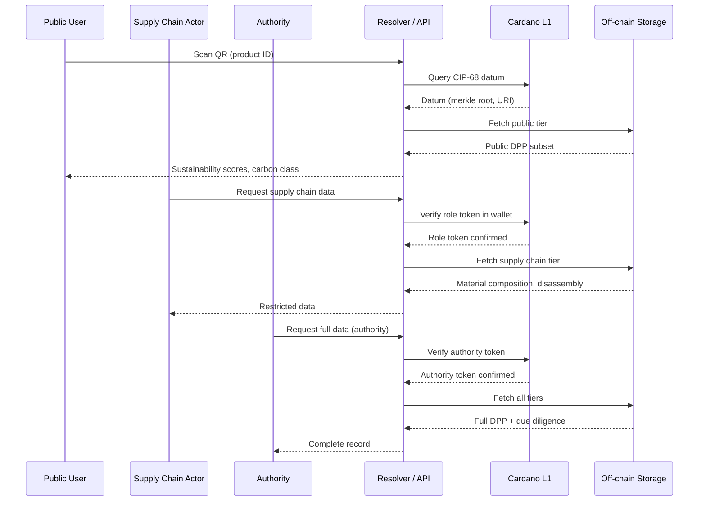

# Access Control

## The challenge

The EU DPP mandates three access tiers ([ESPR Art. 10](../references.md#espr-art10), [Battery Reg. Art. 77(3)](../references.md#bat-art77-3)):

| Level | Actors | Data |
|-------|--------|------|
| Public | Consumers | Basic identity, sustainability scores, carbon class |
| Supply chain | Recyclers, repairers, distributors | Material composition, disassembly instructions, spare parts |
| Authorities | Customs, market surveillance | Full data including due diligence, conformity tests |

On Cardano, **all on-chain data is inherently public**. Anyone can query UTxOs. This means the tiered access model must be enforced for off-chain data, with on-chain mechanisms providing authorization proofs.

## Pattern: on-chain authorization, off-chain access control



## Plutus validator logic

The eUTxO model provides three inputs to a validator:

- **Datum** — the current state (DPP anchor data)
- **Redeemer** — the action being performed (update, transfer, revoke)
- **ScriptContext** — full transaction view (inputs, outputs, signatories, time)

### Write access control

```
validateDPPUpdate :: DPPDatum -> DPPRedeemer -> ScriptContext -> Bool
validateDPPUpdate datum redeemer ctx = case redeemer of
    UpdateData newMerkleRoot ->
        -- Only the issuer can update
        txSignedBy ctx (issuerPkh datum)
        && outputDatumHas newMerkleRoot
        && referenceNFTPreserved

    TransferOwnership newOwner ->
        -- Current owner signs + new owner receives user token
        txSignedBy ctx (issuerPkh datum)

    RevokePassport ->
        -- Authority token must be present in transaction inputs
        hasAuthorityToken ctx
```

### Role tokens

Different supply chain roles hold specific native tokens minted under controlled policies:

| Role | Token | Grants |
|------|-------|--------|
| Manufacturer | `DPP_MANUFACTURER` | Create and update DPP records |
| Recycler | `DPP_RECYCLER` | Read material composition, end-of-life data |
| Repairer | `DPP_REPAIRER` | Read disassembly instructions, spare parts |
| Authority | `DPP_AUTHORITY` | Read all data, revoke passports |

The off-chain API checks whether the requester's wallet holds the appropriate role token before serving restricted data.

## Encrypted off-chain data

For confidential fields (trade secrets, proprietary manufacturing details):

1. Data encrypted with a symmetric key
2. Key shares distributed to authorized parties via their public keys
3. On-chain: only the hash of the encrypted blob
4. Decryption requires the party's private key + the distributed key share
