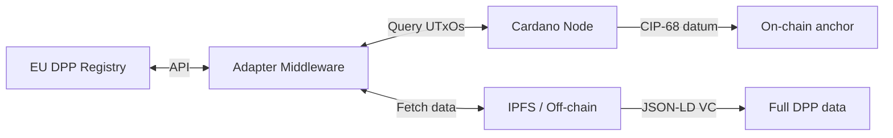

# EU Integration

## EU DPP Registry

The ESPR (Art. 13) mandates a centralized EU DPP registry by **19 July 2026**. The registry:

- Stores **lookup references** (unique product/operator/facility identifiers), not full product data
- Provides APIs for data exchange
- Acts as a resolver: identifier in → DPP data location out

A Cardano-based DPP must expose data through the registry's API. This requires a **middleware adapter**:



The EU has not mandated any specific storage technology. Blockchain-based DPPs are permitted as long as they satisfy the registry's interoperability requirements.

## GS1 standards alignment

The EU aligns with GS1 for product identification. Cardano DPP standards explicitly support GS1 Digital Link.

| Standard | Role | Cardano mapping |
|----------|------|-----------------|
| GS1 Digital Link | URI-based product identifier | Encoded in CIP-68 datum `productId` field |
| GS1 GTIN | Global Trade Item Number | Token name or datum field |
| GS1 EPCIS 2.0 | Supply chain event data (ISO/IEC 19987) | Off-chain event records, hashes anchored on-chain |
| GS1 Web Vocabulary | Product attribute semantics | JSON-LD context in off-chain VC |

### GS1 Digital Link flow

```
Product QR: https://id.gs1.org/01/4012345000015/21/BPC001
    → GS1 Resolver
    → Cardano CIP-68 UTxO lookup (by GTIN)
    → Datum contains Merkle root + off-chain URI
    → Fetch full DPP from IPFS
```

## UNTP alignment

The UN Transparency Protocol is the primary cross-sector DPP format. Cardano integration:

| UNTP requirement | Cardano implementation |
|-----------------|----------------------|
| W3C Verifiable Credential (VCDM 2.0) | VC issued via did:prism, hash anchored on CIP-68 |
| JSON-LD structured data | Off-chain storage, follows CIP-100 JSON-LD pattern |
| did:web (minimum DID method) | Dual: did:web for UNTP compliance + did:prism for Cardano anchoring |
| Traceability events | Hydra L2 for high-frequency events, batch-settled to L1 |
| Conformity claims | Signed VCs from accredited bodies, hashes on-chain |

## Data carrier requirements

The product's physical data carrier (QR code) must link to the DPP. Two resolution paths:

1. **Direct**: QR → resolver → Cardano query → datum → off-chain fetch
2. **GS1**: QR → GS1 Digital Link → GS1 resolver → Cardano adapter → data

Both must return data within seconds. The resolver layer abstracts the blockchain — consumers don't need to know Cardano is involved.

## Customs and market surveillance

EU customs will use DPP data for automated import checks. The adapter middleware must support:

- Bulk queries (customs checking a shipment of products)
- Real-time availability (products cannot be delayed at the border)
- Standardized response format (whatever the EU registry API specifies)
- Authority-level access (full data including due diligence)

## Open questions

1. **EU registry API specification** — not yet finalized. Cardano adapter design depends on it.
2. **Blockchain acceptance** — the EU has not explicitly endorsed or rejected blockchain-based DPPs. The regulation is technology-neutral.
3. **Data sovereignty** — some member states may have concerns about product data being anchored on a public blockchain, even if only hashes are stored on-chain.
4. **Long-term availability** — the EU requires DPP data to be available for the entire product lifetime. Cardano's blockchain is permanent, but off-chain storage (IPFS) needs pinning guarantees.
