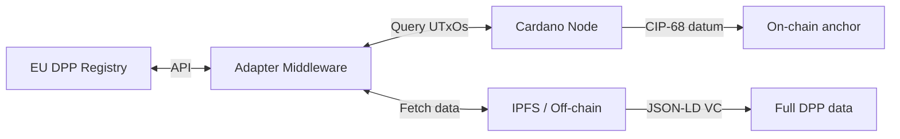
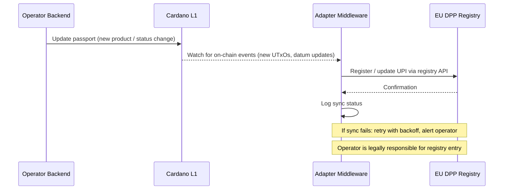

# EU Integration

## EU DPP Registry

The [ESPR](../references.md#reg-espr) ([Art. 13](../references.md#espr-art13)) mandates a centralized EU DPP registry by **19 July 2026**. The registry:

- Stores **lookup references** (unique product/operator/facility identifiers), not full product data
- Provides APIs for data exchange
- Acts as a resolver: identifier in → DPP data location out

A Cardano-based DPP must expose data through the registry's API. This requires a **middleware adapter**:



The EU has not mandated any specific storage technology. Blockchain-based DPPs are permitted as long as they satisfy the registry's interoperability requirements.

## [GS1](../references.md#gs1-digital-link) standards alignment

The EU aligns with GS1 for product identification. Cardano DPP standards explicitly support [GS1 Digital Link](../references.md#gs1-digital-link).

| Standard | Role | Cardano mapping |
|----------|------|-----------------|
| GS1 Digital Link | URI-based product identifier | Encoded in CIP-68 datum `productId` field |
| GS1 GTIN | Global Trade Item Number | Token name or datum field |
| GS1 EPCIS 2.0 | Supply chain event data (ISO/IEC 19987) | Off-chain event records, hashes anchored on-chain |
| GS1 Web Vocabulary | Product attribute semantics | JSON-LD context in off-chain VC |

### GS1 Digital Link flow

```
Product QR: https://id.gs1.org/01/4012345000015/21/BPC001
    → GS1 Resolver
    → Cardano CIP-68 UTxO lookup (by GTIN)
    → Datum contains Merkle root + off-chain URI
    → Fetch full DPP from IPFS
```

## [UNTP](../references.md#untp) alignment

The [UN Transparency Protocol](../references.md#untp) is the primary cross-sector DPP format. Cardano integration:

| UNTP requirement | Cardano implementation |
|-----------------|----------------------|
| W3C Verifiable Credential (VCDM 2.0) | VC issued via did:prism, hash anchored on CIP-68 |
| JSON-LD structured data | Off-chain storage, follows CIP-100 JSON-LD pattern |
| did:web (minimum DID method) | Dual: did:web for UNTP compliance + did:prism for Cardano anchoring |
| Traceability events | Hydra L2 for high-frequency events, batch-settled to L1 |
| Conformity claims | Signed VCs from accredited bodies, hashes on-chain |

## Data carrier requirements

The product's physical data carrier (QR code) must link to the DPP. Two resolution paths:

1. **Direct**: QR → resolver → Cardano query → datum → off-chain fetch
2. **GS1**: QR → GS1 Digital Link → GS1 resolver → Cardano adapter → data

Both must return data within seconds. The resolver layer abstracts the blockchain — consumers don't need to know Cardano is involved.

## Customs and market surveillance

EU customs will use DPP data for automated import checks. The adapter middleware must support:

- Bulk queries (customs checking a shipment of products)
- Real-time availability (products cannot be delayed at the border)
- Standardized response format (whatever the EU registry API specifies)
- Authority-level access (full data including due diligence)

## Compliance risk: registry synchronization

A product with a technically perfect DPP on Cardano is **legally non-compliant** if its Unique Product Identifier is not registered in the EU Central Registry. Products without registry entries can be seized at the border.

The adapter middleware must therefore be **actively synchronized**, not just passively queryable:



The adapter must handle:

- **Initial registration** — when a new product passport is minted on-chain, the UPI must be registered in the EU registry before the product is placed on the market
- **Status updates** — repurposing, waste declaration, recycling cessation must propagate to the registry
- **Failure recovery** — if the registry API is down, the adapter must queue and retry; the operator must not place products on the market until sync is confirmed
- **Audit trail** — the adapter should log all registry interactions for compliance evidence

## EBSI and eIDAS 2.0

The EU operates two digital infrastructure initiatives sometimes confused with DPPs:

- **EBSI** (European Blockchain Services Infrastructure) — a permissioned blockchain for cross-border public services (diploma verification, business registries, trusted data sharing). It is **not** the DPP registry and the ESPR does not reference it.
- **eIDAS 2.0** — the EU Digital Identity Wallet for citizens. It concerns personal identity, not product identification. The ESPR does not reference eIDAS for DPPs.

Neither EBSI nor eIDAS is mandated for DPP infrastructure. The ESPR's technology-neutral approach means any system satisfying the registry API can be used. However, if future implementing acts reference EBSI or eIDAS wallets for authority access, a Cardano-based system would need a bridge.

## Off-chain data persistence (insolvency protection)

[ESPR Art. 11](../references.md#reg-espr) requires DPP service providers to ensure data remains available even if the economic operator becomes insolvent. For a Cardano-based system:

- **On-chain data is permanent** — the Merkle root, operator identity, and product identifiers survive any individual party's insolvency
- **Off-chain data is vulnerable** — if the operator's MPFS node goes down and no backup exists, the full passport data is lost (the on-chain hash becomes unresolvable)

Mitigation strategies:

| Strategy | Cost | Trust model |
|----------|------|-------------|
| **IPFS pinning service** (Pinata, web3.storage) | ~$0.10-0.50/GB/month | Relies on pinning provider |
| **Arweave** (permanent storage) | ~$5 per GB (one-time) | Decentralized, permanent |
| **IAGON** (Cardano-native decentralized storage) | Varies | Aligned ecosystem |
| **Mandatory escrow backup** (per ESPR Art. 11) | Part of compliance cost | Independent third-party holds copy |
| **Multi-operator replication** | Free (if supply chain partners each pin) | Distributed across participants |

**Recommendation**: require at least two independent off-chain storage providers. IPFS with content-addressing ensures that if *anyone* pins the data, it's retrievable by its CID. The on-chain hash guarantees integrity regardless of which provider serves it.

## Transaction pattern privacy

On a public blockchain, transaction patterns can reveal business intelligence:

| Observable pattern | What it reveals |
|-------------------|----------------|
| Frequency of operator's trie updates | Production cadence / volume |
| Number of leaves added per update | Batch sizes |
| Timing of status changes | Supply chain velocity |

Mitigations:

- **Batch updates at fixed intervals** (e.g., daily regardless of volume) — hides whether 10 or 10,000 products were added
- **Merkle proofs for selective disclosure** — already in the architecture; a verifier sees only the product they query, not the full trie
- **Hydra L2 for high-frequency events** — events within a Hydra head are not visible on L1 until settlement
- **Future: ZK proofs** — Hyperledger Identus supports AnonCreds for zero-knowledge credential proofs; Cardano's Plutus V3 adds BLS12-381 primitives for ZK-friendly curves

!!! note "Not unique to blockchain"
    Centralized DPP platforms have the same risk — the platform operator sees all data. The difference is who can observe: on a public chain it's anyone; on a centralized platform it's the operator. Neither is inherently better — the threat models differ.

## Open questions

1. **EU registry API specification** — not yet finalized. Cardano adapter design depends on it. The adapter architecture above is based on the expected resolver model (Art. 13).
2. **Blockchain acceptance** — the EU has not explicitly endorsed or rejected blockchain-based DPPs. The regulation is technology-neutral.
3. **Data sovereignty** — some member states may have concerns about product data being anchored on a public blockchain, even if only hashes are stored on-chain.
4. **Cost predictability** — while current costs are very low (~$18/year per operator), ADA price volatility could affect long-term budgeting. At 10x current ADA price, costs would be ~$180/year per operator — still trivial for industrial use but worth monitoring. Hydra L2 further reduces cost sensitivity.
