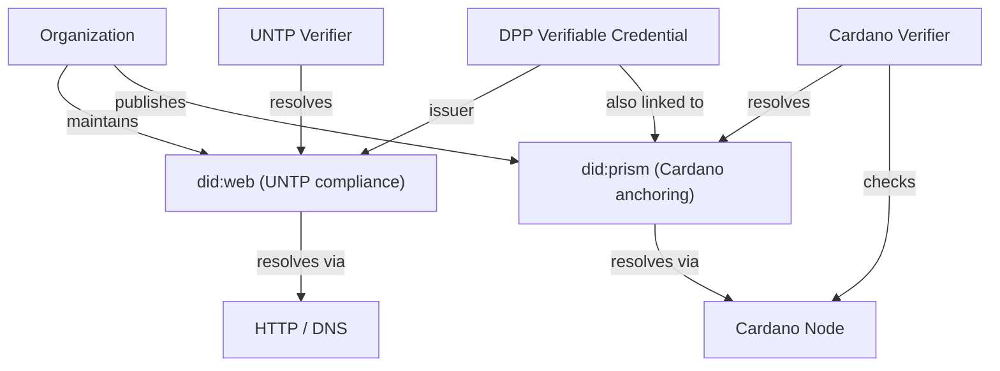

# Identity: did:prism and Verifiable Credentials

## did:prism

The `did:prism` method is Cardano's W3C-registered DID method. Identity operations (Create, Update, Deactivate) are encoded as Protocol Buffer messages, signed, batched, and published as metadata in Cardano transactions under label **21325**.

| Property | Value |
|----------|-------|
| W3C registered | Yes (March 2023) — [W3C DID Registry](../references.md#did-prism-w3c) |
| Metadata label | 21325 |
| Finality depth | 112 block confirmations (~37 minutes) |
| Long-form DIDs | Supported (usable before on-chain anchoring) |
| DID Document timestamps | From Cardano block metadata |

### Advantages over did:web

| | did:web | did:prism |
|-|--------|-----------|
| Trust root | DNS (centralized) | Cardano blockchain (decentralized) |
| Tamper evidence | None (DNS can be hijacked) | On-chain anchoring |
| Availability | Depends on web server | Immutable once confirmed |
| Resolution | HTTP GET | Cardano node query |
| UNTP compliance | Required (minimum) | Supplementary |

## Hyperledger Identus

Formerly Atala PRISM. IOG contributed it to Hyperledger Labs as "Open Enterprise Agent" in October 2023; the community renamed it [Hyperledger Identus](../references.md#identus) and it was promoted to Hyperledger Project (Incubation) in April 2024 ([announcement](https://www.lfdecentralizedtrust.org/blog/announcing-hyperledger-identus-a-new-decentralized-identity-applications-project)).

Implements:

- **W3C DID Core** (did:prism)
- **W3C VC-JWT** (Verifiable Credentials with JWT proof)
- **Hyperledger AnonCreds** (zero-knowledge credential proofs)
- **DIDComm V2** (peer-to-peer encrypted messaging)

Open source: [github.com/hyperledger-identus](https://github.com/hyperledger-identus)

**NeoPRISM**: A Rust reimplementation of the PRISM node/VDR indexer, under active development.

## Integration with UNTP DPP

The [UNTP](../references.md#untp) mandates `did:web` as the minimum DID method for organizational identifiers. A bridge pattern supports both:

A `did:prism` driver for the Universal Resolver was funded through Catalyst (Fund 8 and Fund 10), though integration into the main resolver repository has not been confirmed as of March 2026.

## DPP as Verifiable Credential

A Cardano-anchored DPP follows this flow:

1. Manufacturer creates a DPP as a **UNTP-conformant W3C VC** in JSON-LD
2. VC is signed using the manufacturer's `did:prism` key
3. Hash of the VC is anchored on Cardano via CIP-68 reference NFT
4. Full VC stored on IPFS
5. `did:prism` DID Document references the manufacturer's identity
6. Verifier resolves the DID, fetches the VC, checks the signature, and verifies the on-chain hash
