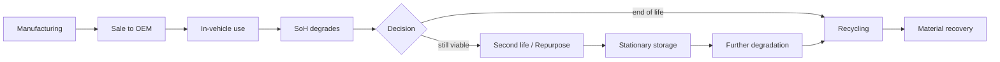
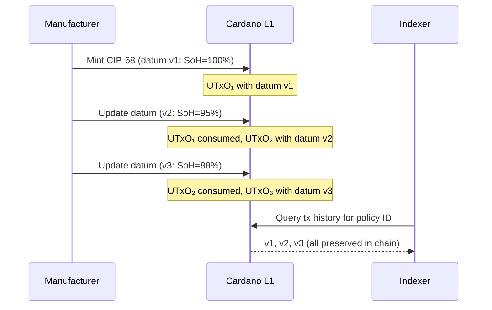
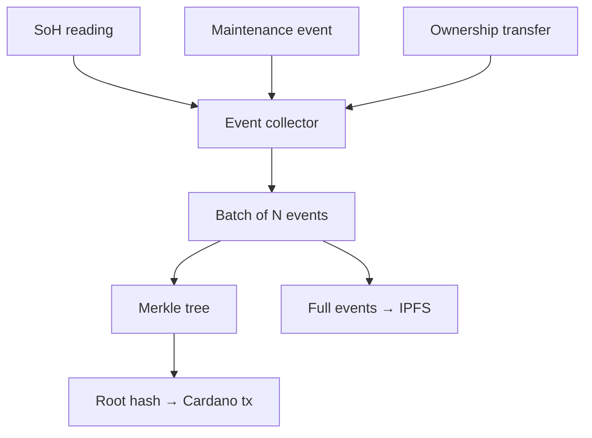
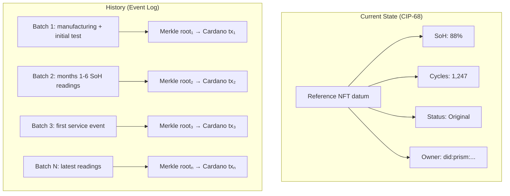

# Battery Lifecycle on Cardano

## The problem

A battery passport is a **living document**. Article 77(2) of Regulation 2023/1542 requires it to contain "information specific to the individual battery, **including resulting from the use of that battery**."

This means the passport must be updated throughout the battery's life:

At each stage, the passport must record:

| Event | Who updates | Data changed |
|-------|-----------|-------------|
| Manufacturing | Manufacturer | Initial creation — all fields |
| Carbon footprint declaration | Manufacturer | LCA data, performance class |
| Sale / ownership transfer | Seller → buyer | Operator information |
| Periodic SoH update | BMS / service provider | State of Health, cycle count, energy throughput |
| Repair / maintenance | Service provider | Event log, parts replaced |
| Status change | New operator | Original → Repurposed / Remanufactured |
| End of life | Recycler | Status → Waste, material recovery data |

## History requirements

The regulation requires that historical data remain accessible. Annex XIII Section 4 includes "remaining capacity" and "capacity fade" — these only make sense if tracked over time, not just as a snapshot.

Three approaches on Cardano:

### 1. Chain history (implicit)

Every CIP-68 datum update consumes the old UTxO and creates a new one. The old datum is not in the current UTxO set but **exists in the transaction history**.

**Pros**: Simple, no extra cost, full history on-chain.
**Cons**: Requires a chain indexer to reconstruct history. Not directly queryable from the UTxO set — only the latest state is.

### 2. Event log pattern (CF standard)

Lifecycle events are collected off-chain, batched periodically, and a Merkle root of the batch is anchored on-chain.

**Pros**: Cost-efficient (~0.25 ADA per batch of many events), tamper-evident history, off-chain data can be large.
**Cons**: Events are not individually on-chain — only roots. Requires trust in the off-chain event store (mitigated by IPFS content-addressing).

### 3. Hybrid: current state + event log

Combine both: CIP-68 datum holds the **current state** (latest SoH, current owner, status). A separate event log anchors the **full history**.

This is the most complete approach and likely what a production system would use:

- **QR scan → CIP-68 datum** gives you the current state instantly
- **Event log** provides the full auditable history
- **Chain history** serves as a backup / cross-check

## Who can update?

The Plutus validator controlling the CIP-68 reference NFT enforces update permissions:

| Actor | Proof | Allowed operations |
|-------|-------|-------------------|
| Manufacturer | Signing key (issuerPkh in datum) | All updates, initial creation |
| Authorized service provider | Role token (`DPP_SERVICE`) | SoH updates, maintenance events |
| New owner (on transfer) | Transaction signed by both parties | Ownership field update |
| Recycler | Role token (`DPP_RECYCLER`) | Status → Waste, material recovery |
| Authority | Role token (`DPP_AUTHORITY`) | Revocation, compliance flags |

The validator can also enforce **invariants**:

- SoH can only decrease (or stay the same after recalibration)
- Cycle count can only increase
- Status transitions follow a valid state machine (Original → Repurposed → Waste, never Waste → Original)

## Hydra for high-frequency updates

EV batteries in active use generate telemetry data continuously. Writing every voltage/temperature reading to L1 is impractical and unnecessary. Pattern:

1. **BMS telemetry** streams to an off-chain collector
2. Collector aggregates readings into periodic SoH snapshots (e.g., monthly)
3. Snapshots are batched and Merkle-rooted via L1 event log
4. For real-time applications (fleet management, grid balancing), a **Hydra Head** between the BMS operator and the DPP service can process high-frequency events with sub-second latency
5. Hydra settles to L1 periodically
