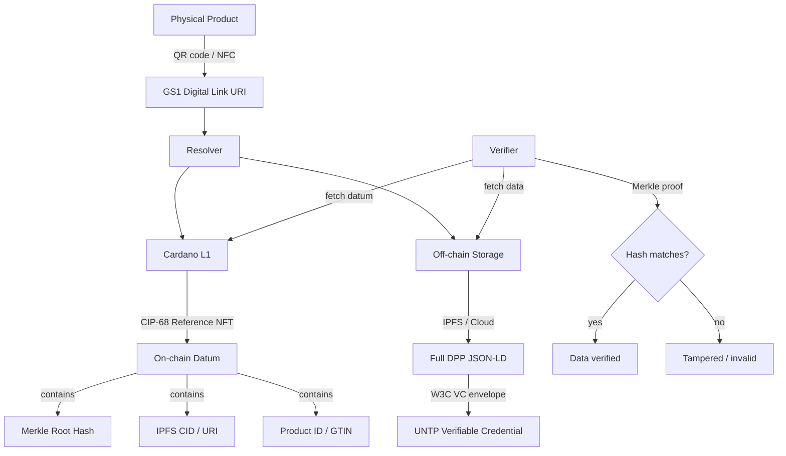

# Cardano Feasibility Overview

## Summary

Storing EU Digital Product Passports on Cardano is technically feasible. The Cardano Foundation is already building an official DPP solution with open-source standards, active pilots, and a monthly working group.

The core pattern: **anchor hashes and identifiers on-chain, store full DPP data off-chain**.

## Architecture

## Why Cardano

| Property | Benefit for DPP |
|----------|----------------|
| **eUTxO model** | Each product's DPP is a discrete UTxO — naturally maps to per-product records |
| **Native multi-asset** | DPP tokens are first-class citizens, no ERC-721-style contract overhead |
| **CIP-68 updatable datums** | DPP data evolves over product lifecycle (repairs, ownership, SoH updates) |
| **did:prism** | W3C DID method anchored on Cardano — stronger assurance than did:web |
| **Hydra L2** | High-throughput channel for real-time lifecycle events |
| **Formal verification** | Aiken/Plutus validators can be formally verified for compliance logic |
| **Low fees** | $0.01-0.13 per product at current prices |

## Key components

1. **[On-chain storage](storage.md)** — CIP-68 tokens, datum structure, metadata labels
2. **[Access control](access-control.md)** — Plutus validators, role tokens, tiered visibility
3. **[Identity](identity.md)** — did:prism, Hyperledger Identus, W3C VC integration
4. **[Cost analysis](costs.md)** — per-product and at-scale economics
5. **[Scalability](scalability.md)** — L1 throughput, Hydra L2, batching patterns
6. **[EU integration](eu-integration.md)** — registry, GS1, UNTP interoperability
7. **[Existing work](existing-work.md)** — Cardano Foundation DPP standards, pilots

## Cardano Foundation DPP Standards

The Cardano Foundation maintains an official open-source repository:

- **Repository**: [github.com/cardano-foundation/cardano-dpp-standards](https://github.com/cardano-foundation/cardano-dpp-standards)
- **Validator language**: Aiken
- **Token standard**: CIP-68
- **Data structure**: Merkle Trees (default) or Merkle Patricia Tries
- **Pilots**: Textiles, EV batteries (with LW3 / Hydra)
