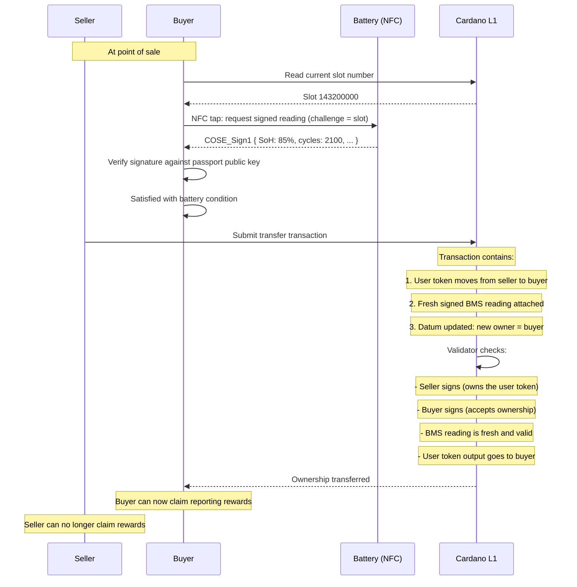
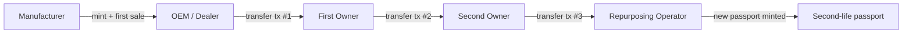

# Ownership Transfer

## The idea

The CIP-68 user token represents ownership of the battery. Only the current holder of this token can claim rewards for submitting signed BMS readings. When the battery changes hands, the token transfers — and with it, the right and incentive to report.

This means:

- You can't scan someone else's battery and claim their rewards
- Every sale is an on-chain event with a verifiable handover record
- Both buyer and seller are incentivized to do a fresh NFC reading at the moment of transfer

## The transfer ritual



## What the transfer transaction does

A single atomic transaction:

| Action | Effect |
|--------|--------|
| **User token moves** seller → buyer | Reporting right transfers |
| **CIP-68 datum updated** | New owner public key hash recorded |
| **Fresh BMS reading attached** | Baseline condition at handover, signed by BMS hardware |
| **Both parties sign** | Mutual consent — neither can be forced |

The fresh reading at transfer serves as:

- **Proof of condition at sale** — if a dispute arises later, the on-chain reading proves what the battery's state was at handover
- **Baseline for the new owner** — future readings are compared against this starting point
- **SoH verification for the buyer** — they see the real condition before accepting

## Smart contract logic

```
TransferValidator:
  Datum:
    batteryId    : ByteString
    ownerPkh     : PubKeyHash     -- current owner
    bmsPublicKey : ByteString
    lastCounter  : Integer
    ...

  Redeemer: TransferOwnership
    newOwnerPkh  : PubKeyHash
    bmsReading   : ByteString     -- COSE_Sign1 fresh reading

  Validation:
    - Current owner (ownerPkh) signs the transaction
    - New owner (newOwnerPkh) signs the transaction
    - User token output goes to newOwnerPkh address
    - BMS reading is valid COSE_Sign1 (signature, freshness, plausibility)
    - Output datum has ownerPkh = newOwnerPkh
    - Reference NFT is preserved at script address
```

## Reporting authorization

The reporting contract checks ownership before releasing rewards:

```
ReportingValidator:
  Redeemer: SubmitSignedReading
    reading : ByteString    -- COSE_Sign1

  Validation:
    - ... (all existing checks: signature, freshness, counter, plausibility)
    - Submitter holds the user token for this battery
    - OR submitter's PubKeyHash matches ownerPkh in the datum
    - Release reward to submitter
```

This means:

| Actor | Holds user token? | Can submit readings? | Can claim rewards? |
|-------|------------------|---------------------|--------------------|
| Current owner | Yes | Yes | Yes |
| Previous owner | No (transferred) | No | No |
| Random person | No | Can do NFC tap, but can't claim reward | No |
| Manufacturer | No (unless they retain a separate role) | Via delegation if needed | No |

Anyone can physically tap the NFC and get a signed reading — the BMS doesn't check who's tapping. But only the token holder can submit it on-chain for a reward. The reading itself is still publicly verifiable regardless.

## Ownership history

Every transfer transaction is on-chain. The full ownership history is reconstructable:



Each transfer includes a timestamped, BMS-signed condition snapshot. This creates an unbroken chain:

- Battery minted at SoH 100%
- Sold to first owner at SoH 98% (slot 140000000)
- Sold to second owner at SoH 85% (slot 143200000)
- Repurposed at SoH 72% (slot 145000000)

No party can dispute what the condition was at each handover.

## Incentive alignment

| Party | Incentive at transfer |
|-------|----------------------|
| **Buyer** | Wants a fresh reading to verify condition before paying |
| **Seller** | Wants a fresh reading to prove they didn't damage it after sale |
| **Manufacturer** | Gets a fresh data point without any effort |
| **Market** | Gets transparent, verifiable battery condition history |

The transfer ritual is self-enforcing — both parties want the reading for their own protection.

## Value-add summary

This is the fourth genuine blockchain value-add in the design:

| # | Value | What Cardano provides |
|---|-------|----------------------|
| 1 | Tamper-evident history | Manufacturer can't alter past readings |
| 2 | Trustless incentive coordination | Smart contract guarantees reward for valid signed readings |
| 3 | On-chain commitment as trusted clock | Minted commitment UTxO proves intent to read at a specific moment — prevents replay and stockpiling |
| 4 | Ownership-gated reporting | Token transfer = reporting right transfer, atomic handover with signed condition proof |
| **5** | **Single-use challenge (eUTxO)** | **Commitment UTxO is consumed on reading submission — one commitment, one reading, no cherry-picking** |
