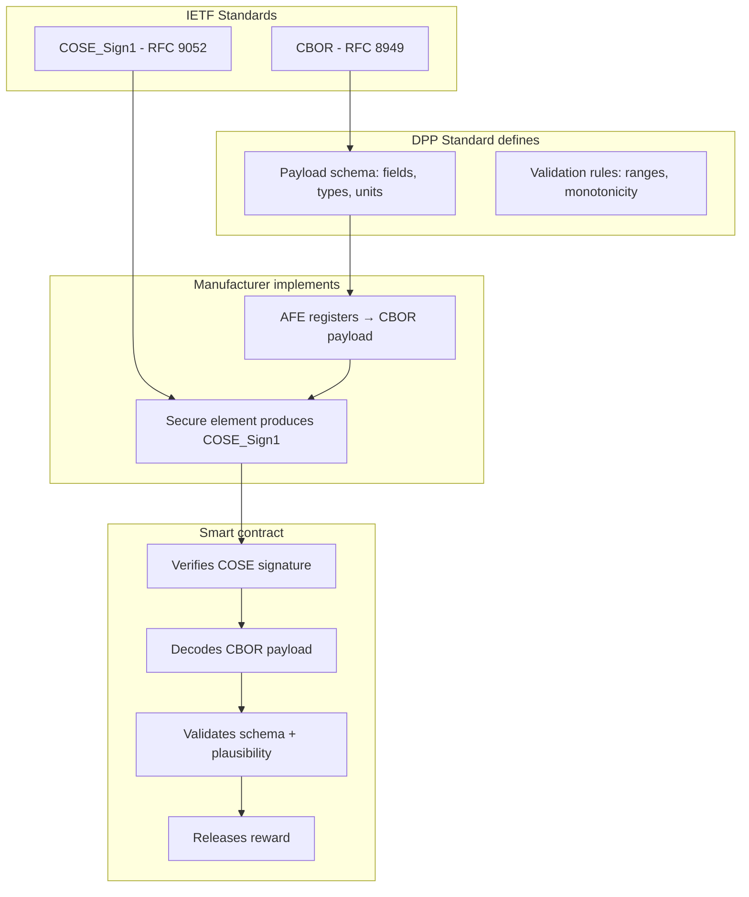

# Payload Standard

## Why semantics matter

A signed blob of raw bytes is useless. The smart contract must be able to:

- Decode the payload
- Verify that all required fields are present
- Check that values are within physically valid ranges
- Compare against previous readings (SoH can't increase, cycles can't decrease)
- Reject malformed or nonsensical submissions

This requires a **fixed, standardized payload schema** that every BMS manufacturer implements identically.

## Why CBOR

The payload encoding is **CBOR** (Concise Binary Object Representation, [RFC 8949](https://www.rfc-editor.org/rfc/rfc8949)). The signing envelope is **COSE_Sign1** ([RFC 9052](https://www.rfc-editor.org/rfc/rfc9052)).

Both are IETF standards, not blockchain-specific. They're already used across the industry:

| Standard / Protocol | Uses CBOR/COSE |
|--------------------|---------------|
| **Cardano ledger** | CBOR throughout — transactions, datums, metadata |
| **WebAuthn / FIDO2** | CBOR for attestation objects, COSE for signatures |
| **SUIT firmware updates** (RFC 9019) | CBOR manifest, COSE signatures |
| **Matter / Thread** (smart home) | CBOR for device commissioning |
| **LwM2M** (IoT device management) | CBOR as alternative to TLV |
| **EU Digital COVID Certificate** | CBOR + COSE_Sign1 |
| **ISO 18013-5** (mobile driving licence) | CBOR + COSE |

### Why not JSON

| Concern | JSON | CBOR |
|---------|------|------|
| Size | Large (string keys, verbose) | Compact (integer keys, binary) |
| Determinism | No (key order, whitespace, number format) | Yes (RFC 8949 §4.2 Core Deterministic Encoding) |
| Signing | Must canonicalize first (JCS, RFC 8785) | Deterministic encoding = sign directly |
| MCU implementation | String handling, malloc | Integer-only, fixed-size buffers |
| Cardano compatibility | Needs conversion | Native |
| Floating point | Default for numbers | Integer-only by choice |

Deterministic encoding is essential for signing: the same data must always produce the same bytes, so the hash is stable. CBOR guarantees this. JSON doesn't.

## COSE_Sign1 envelope

The entire signed reading is a [COSE_Sign1](https://www.rfc-editor.org/rfc/rfc9052#section-4.2) structure:

```
COSE_Sign1 = [
  protected   : bstr,    ; CBOR-encoded { 1: -7 }  (alg: ES256)
  unprotected : {},      ; empty
  payload     : bstr,    ; CBOR-encoded BMS reading
  signature   : bstr     ; ECDSA-P256 signature
]
```

This is the same structure used in the EU Digital COVID Certificate, mobile driving licences, and FIDO2 attestations. It's not an invention — it's a direct application of an existing standard.

### Protected header

```cbor-diagnostic
{
  1: -7    ; Algorithm: ES256 (ECDSA w/ SHA-256 on P-256 curve)
}
```

Or for Cardano-native curve:

```cbor-diagnostic
{
  1: -8    ; Algorithm: EdDSA (Ed25519)
}
```

### Signature computation

Per RFC 9052, the signature is computed over the `Sig_structure`:

```
Sig_structure = [
  "Signature1",       ; context string
  protected,          ; protected header bytes
  h'',                ; external_aad (empty)
  payload             ; CBOR-encoded BMS reading
]
```

The secure element signs `SHA-256(CBOR(Sig_structure))`.

## Payload schema

The payload inside the COSE_Sign1 envelope is a CBOR map:

```cbor-diagnostic
{
  1: h'...',           ; battery_id (unique identifier, ByteString)
  2: 142857000,        ; challenge (Cardano slot number, unsigned int)
  3: 4891,             ; monotonic_counter (strictly increasing, unsigned int)
  4: {                 ; state (map of measurements)
    1: 8800,           ;   soh_bp (State of Health, basis points 0-10000)
    2: 7200,           ;   soc_bp (State of Charge, basis points 0-10000)
    3: 1247,           ;   cycle_count (unsigned int)
    4: 352000,         ;   remaining_capacity_mah (milliamp-hours)
    5: 400000,         ;   nominal_capacity_mah (milliamp-hours)
    6: 38920,          ;   voltage_mv (pack voltage, millivolts)
    7: 0,              ;   current_ma (signed int, positive = charging)
    8: 22,             ;   temp_min_c (signed int, Celsius)
    9: 25,             ;   temp_max_c (signed int, Celsius)
    10: 48750000,      ;   energy_throughput_wh (watt-hours cumulative)
    11: 96,            ;   cell_count (number of cells in series)
    12: [              ;   cell_voltages_mv (array, one per cell, optional)
        3310, 3312, 3308, 3311, ...
      ]
  },
  5: 1                 ; schema_version (unsigned int)
}
```

### Design choices

**Integer-only, fixed units.** No floating point. SoH is in basis points (88.00% = 8800), voltage in millivolts, capacity in milliamp-hours. This makes CBOR encoding deterministic and smart contract validation simple — Plutus works with integers natively. MCU firmware doesn't need float libraries.

**CBOR integer keys.** Not string keys. Keeps the payload small (important for NFC transfer and on-chain cost). The key-to-field mapping is defined by the standard.

**Core Deterministic Encoding (RFC 8949 §4.2).** All implementations must use deterministic encoding — integer keys sorted numerically, shortest-form integers, no indefinite-length encoding. This ensures every BMS producing the same data produces the same bytes.

**Mandatory fields.** Every reading must include state map keys 1-11. Key 12 (cell voltages) is optional — it makes the payload much larger but provides the most detailed view.

### Payload size

| Variant | CBOR payload | Full COSE_Sign1 |
|---------|-------------|----------------|
| Without cell voltages | ~80-120 bytes | ~160-200 bytes |
| With 96 cell voltages | ~280-350 bytes | ~360-430 bytes |

Both fit comfortably in an NFC NDEF message (~64 KB max) and a Cardano transaction (~16 KB max).

## Complete example

A COSE_Sign1 BMS reading in CBOR diagnostic notation:

```cbor-diagnostic
18(                                    ; COSE_Sign1 tag
  [
    h'a10126',                         ; protected: { 1: -7 } (ES256)
    {},                                ; unprotected: empty
    h'a501....',                       ; payload: CBOR-encoded BMS reading
    h'304502...'                       ; signature: ECDSA-P256
  ]
)
```

The phone app receives this as a single NDEF record via NFC tap. It can:

1. Verify the COSE signature locally (using the public key from the passport)
2. Display the decoded battery state to the user
3. Submit the entire COSE_Sign1 object to the Cardano smart contract

## Validation rules

The smart contract (or an off-chain verifier) checks:

### Structural validation

| Rule | Check |
|------|-------|
| Valid COSE_Sign1 structure | Four-element array with correct types |
| Protected header contains known algorithm | ES256 (-7) or EdDSA (-8) |
| All mandatory payload fields present | Keys 1-11 in state map |
| Correct types | All values are integers, cell_voltages is an array |
| Schema version recognized | Must be a known version |
| Battery ID matches datum | The battery_id in the payload matches the CIP-68 datum |

### Freshness validation

| Rule | Check |
|------|-------|
| Challenge is recent | `challenge ≤ current_slot` and `current_slot - challenge < max_age` |
| Counter is advancing | `monotonic_counter > last_accepted_counter` |

### Physical plausibility

| Rule | Check | Rationale |
|------|-------|-----------|
| SoH in range | 0 ≤ soh_bp ≤ 10000 | Can't be negative or over 100% |
| SoH non-increasing | soh_bp ≤ previous soh_bp | Batteries don't heal |
| Cycles non-decreasing | cycle_count ≥ previous cycle_count | Cycles can't go backwards |
| Voltage in range | Chemistry-dependent (e.g., 2500-4200 mV/cell) | Outside range = damaged or fake |
| Temperature in range | -40 ≤ temp ≤ 80 | Outside operating range |
| Capacity ≤ nominal | remaining ≤ nominal | Can't exceed design capacity |
| Cell count matches | Matches passport's registered count | Physical config can't change |

### COSE signature validation

| Rule | Check |
|------|-------|
| Reconstruct Sig_structure | Per RFC 9052 §4.4 |
| Verify signature | `verifyEcdsaSecp256k1Signature(bms_key, hash(Sig_structure), signature)` |
| Public key matches | bms_key matches the key registered in the CIP-68 datum |

## Separation of concerns



The manufacturer is the only party that needs to understand the AFE hardware. They convert proprietary register readings into the standard CBOR format. The COSE envelope and ECDSA signing are handled by the secure element using off-the-shelf libraries. Everything downstream — NFC transport, phone app, smart contract — is hardware-agnostic.

## On-chain vs off-chain validation

Full CBOR decoding and COSE verification in a Plutus validator is feasible but expensive. Two approaches:

### Option A: Full on-chain validation

The validator parses the COSE_Sign1, reconstructs the Sig_structure, verifies the signature, decodes the payload, and checks plausibility. Plutus has built-in ECDSA verification (`verifyEcdsaSecp256k1Signature`), so the signature check is cheap. CBOR decoding of a small payload (~120 bytes) is feasible within Plutus execution limits.

Per-cell voltage validation for 96 cells would be expensive and can be deferred.

### Option B: Off-chain verification with on-chain proof

An off-chain verifier runs all checks and submits a compact proof. The contract only verifies:

1. COSE signature (built-in, cheap)
2. Challenge freshness (slot comparison)
3. Monotonic counter (integer comparison)
4. Hash of the full COSE_Sign1 object (proving the verifier saw the same data)

### Recommendation

Start with **Option A for core checks** (COSE signature, freshness, counter, SoH monotonicity) and **Option B for detailed checks** (per-cell voltages, temperature ranges). Core checks prevent the most important fraud scenarios.

## Versioning

The `schema_version` field allows the standard to evolve:

- Version 1: Core fields (SoH, SoC, cycles, voltage, temp, capacity)
- Version 2: Could add impedance data, charging power limits, etc.

The smart contract's datum stores accepted schema versions. Old readings remain valid under their version. The COSE protected header's algorithm field similarly allows cryptographic agility.

## Standards reuse summary

| Layer | Standard | Status |
|-------|----------|--------|
| Binary encoding | CBOR (RFC 8949) | IETF, widely deployed |
| Deterministic encoding | RFC 8949 §4.2 | IETF |
| Signing envelope | COSE_Sign1 (RFC 9052) | IETF, used in EU DCC, mDL, FIDO2 |
| Signature algorithm | ES256 / EdDSA | IANA COSE Algorithms registry |
| On-chain verification | Plutus built-in ECDSA/Ed25519 | Cardano native |
| NFC transport | NDEF (NFC Forum) | NFC Forum, universal phone support |

Nothing is invented. The payload schema (field definitions and validation rules) is the only new thing. Everything else is existing, proven standards.
