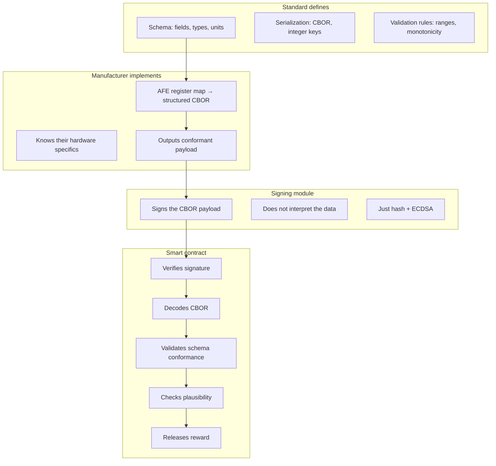

# Payload Standard

## Why semantics matter

A signed blob of raw bytes is useless. The smart contract must be able to:

- Decode the payload
- Verify that all required fields are present
- Check that values are within physically valid ranges
- Compare against previous readings (SoH can't increase, cycles can't decrease)
- Reject malformed or nonsensical submissions

This requires a **fixed, standardized payload schema** that every BMS manufacturer implements identically.

## Schema

The signed payload is CBOR-encoded (Concise Binary Object Representation — the native encoding on Cardano). Every signed BMS reading must conform to this structure:

```cbor-diagnostic
{
  1: h'...',           ; battery_id (unique identifier, ByteString)
  2: 142857000,        ; challenge (Cardano slot number, unsigned int)
  3: 4891,             ; monotonic_counter (strictly increasing, unsigned int)
  4: {                 ; state (map of measurements)
    1: 8800,           ;   soh_bp (State of Health, basis points 0-10000)
    2: 7200,           ;   soc_bp (State of Charge, basis points 0-10000)
    3: 1247,           ;   cycle_count (unsigned int)
    4: 352000,         ;   remaining_capacity_mah (milliamp-hours)
    5: 400000,         ;   nominal_capacity_mah (milliamp-hours)
    6: 38920,          ;   voltage_mv (pack voltage, millivolts)
    7: 0,              ;   current_ma (signed int, positive = charging)
    8: 22,             ;   temp_min_c (signed int, Celsius)
    9: 25,             ;   temp_max_c (signed int, Celsius)
    10: 48750000,      ;   energy_throughput_wh (watt-hours cumulative)
    11: 96,            ;   cell_count (number of cells in series)
    12: [              ;   cell_voltages_mv (array, one per cell)
        3310, 3312, 3308, 3311, ...
      ]
  },
  5: 1                 ; schema_version (unsigned int)
}
```

### Design choices

**Integer-only, fixed units.** No floating point. SoH is in basis points (88.00% = 8800), voltage in millivolts, capacity in milliamp-hours. This makes CBOR encoding deterministic and smart contract validation simple — Plutus works with integers natively.

**CBOR integer keys.** Not string keys. Keeps the payload small (important for NFC transfer and on-chain cost). The key-to-field mapping is defined by the standard.

**Mandatory fields.** Every reading must include fields 1-11 of the state map. Field 12 (cell voltages) is optional — it makes the payload much larger but provides the most detailed view.

### Payload size

| Variant | Size |
|---------|------|
| Without cell voltages | ~80-120 bytes |
| With 96 cell voltages (2 bytes each) | ~280-350 bytes |

Both fit comfortably in an NFC NDEF message (~64 KB max) and a Cardano transaction (~16 KB max).

## Validation rules

The smart contract (or an off-chain verifier submitting a proof) checks:

### Structural validation

| Rule | Check |
|------|-------|
| All mandatory fields present | Keys 1-11 in state map |
| Correct types | All values are integers, cell_voltages is an array |
| Schema version recognized | Must be a known version |
| Battery ID matches datum | The battery_id in the payload matches the CIP-68 datum |

### Freshness validation

| Rule | Check |
|------|-------|
| Challenge is recent | `challenge ≤ current_slot` and `current_slot - challenge < max_age` |
| Counter is advancing | `monotonic_counter > last_accepted_counter` |

### Physical plausibility

| Rule | Check | Rationale |
|------|-------|-----------|
| SoH in range | 0 ≤ soh_bp ≤ 10000 | Can't be negative or over 100% |
| SoH non-increasing | soh_bp ≤ previous soh_bp | Batteries don't heal |
| Cycles non-decreasing | cycle_count ≥ previous cycle_count | Cycles can't go backwards |
| Voltage in range | chemistry-dependent (e.g., 2500-4200 mv/cell for Li-ion) | Outside this range, battery is damaged or data is fake |
| Temperature in range | -40 ≤ temp ≤ 80 | Outside operating range |
| Capacity ≤ nominal | remaining_capacity_mah ≤ nominal_capacity_mah | Can't have more than nominal |
| Cell count matches | cell_count matches passport's registered cell count | Can't change the battery's physical configuration |

### Signature validation

| Rule | Check |
|------|-------|
| Signature is valid | `verifyEcdsaSecp256k1Signature(bms_public_key, hash(cbor_payload), signature)` |
| Public key matches | bms_public_key matches the key registered in the CIP-68 datum |

## Separation of concerns



The manufacturer is the only party that needs to understand the AFE hardware. They convert proprietary register readings into the standard CBOR format. Everything downstream — signing, NFC transport, smart contract validation — is hardware-agnostic.

## On-chain vs off-chain validation

Full CBOR decoding and validation in a Plutus validator is expensive (execution units). Two approaches:

### Option A: Full on-chain validation

The validator decodes the CBOR, checks every field, verifies the signature. This is the most trustless but costs more execution units per transaction.

Feasible for the core checks (signature + freshness + SoH monotonicity). Per-cell voltage validation for 96 cells would be expensive and could be deferred to off-chain.

### Option B: Off-chain verification with on-chain proof

An off-chain verifier decodes the full payload, runs all checks, and submits a compact proof to the smart contract. The contract only verifies:

1. The ECDSA signature (built-in Plutus function, cheap)
2. The challenge freshness (slot comparison, cheap)
3. The monotonic counter (integer comparison, cheap)
4. A hash of the full payload (proving the verifier saw the same data)

Detailed plausibility checks happen off-chain. This is cheaper but requires trusting the verifier — or using multiple independent verifiers.

### Recommendation

Start with **Option A for core checks** (signature, freshness, counter, SoH monotonicity) and **Option B for detailed checks** (per-cell voltages, temperature ranges). The core checks are sufficient to prevent the most important fraud scenarios (replayed readings, fabricated SoH).

## Versioning

The `schema_version` field allows the standard to evolve:

- Version 1: Core fields (SoH, SoC, cycles, voltage, temp, capacity)
- Version 2: Could add impedance data, charging power limits, etc.
- Version N: Future fields as the regulation evolves

The smart contract's datum stores the set of accepted schema versions. Old readings remain valid under their schema version. New versions are added by updating the datum.
