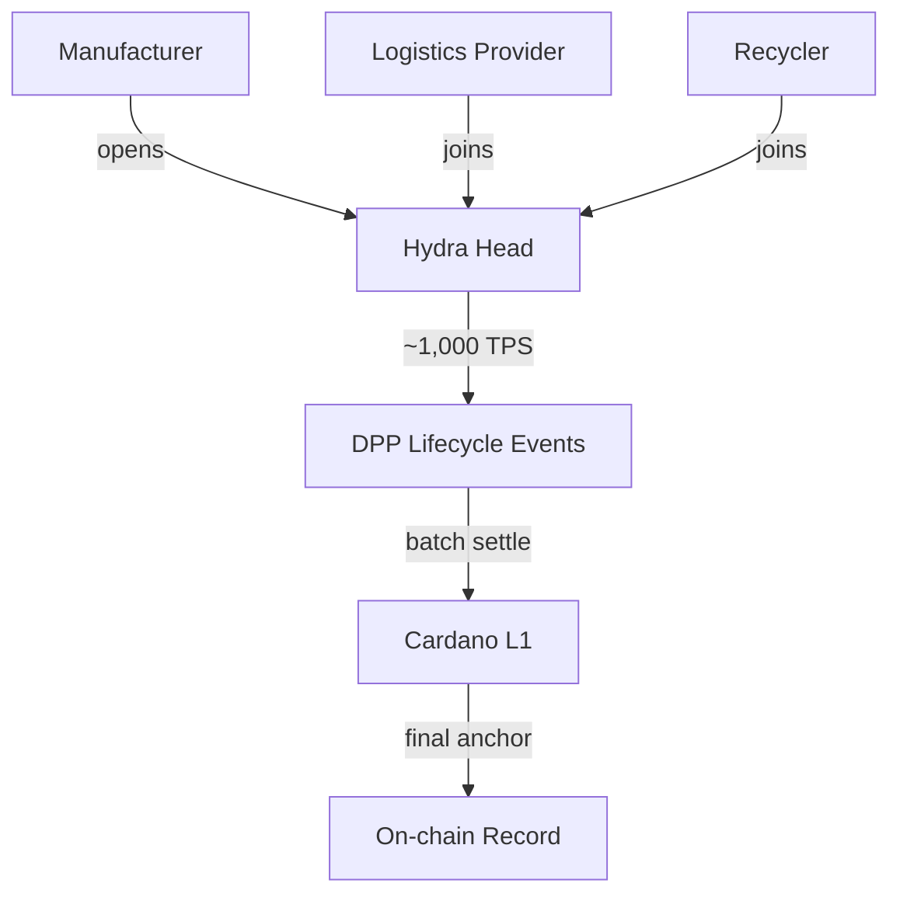

# Scalability

## Layer 1 throughput

| Parameter | Value |
|-----------|-------|
| Block time | 20 seconds |
| Max block size | 90,112 bytes (~90 KB) |
| Simple TPS | ~9-18 |
| Batched TPS (multi-output) | ~40-70 effective |
| Annual capacity (15 TPS sustained) | ~473 million transactions |

With batching (30 products per transaction), L1 can register **~14 billion products/year** — far more than the EU market requires.

The bottleneck is not throughput but **cost**: at scale, individual L1 transactions become expensive compared to L2.

## Layer 2: Hydra

| Property | Value |
|----------|-------|
| TPS per Hydra Head | ~1,000 |
| Demonstrated peak | 1 million TPS (1,000 heads, gaming qualifier 2024) |
| Latency | Sub-second within a head |
| Settlement | Periodic batch commits to L1 |

### DPP use cases for Hydra

- **Real-time SoH updates** for EV batteries (voltage, temperature, cycle count)
- **Supply chain event logging** (warehouse transfers, quality checks)
- **High-frequency manufacturing** (one event per product per station on the line)
- **Batch settlement** — aggregate events into a single L1 transaction periodically

LW3's DPP platform explicitly uses Hydra for EV battery supply chain tracking with CIP-68 tokenization.

## Future improvements

| Enhancement | Impact |
|------------|--------|
| **Ouroboros Leios** (Input Endorsers) | Significant L1 throughput increase |
| **Block size increases** (governance) | Currently 90 KB, incrementally adjustable |
| **CIP-150** (Block Data Compression) | Higher effective block capacity |
| **Mithril** | Fast chain sync for light clients / verifiers |

## Volume requirements

The EU produces roughly:

- ~3 million EV batteries/year (growing)
- ~6 billion textile items/year
- Hundreds of millions of electronic devices/year

For batteries (first DPP mandate, Feb 2027): L1 batching is sufficient.
For textiles and electronics at full scale: Hydra or equivalent L2 is required.

| Sector | Annual volume | L1 feasible? | L2 needed? |
|--------|--------------|-------------|-----------|
| Batteries | ~3M | Yes (batched) | Optional |
| Iron & steel | ~50M products | Yes (batched) | Recommended |
| Textiles | ~6B items | No | Yes |
| Electronics | ~500M devices | Possible (batched) | Recommended |
| Construction | ~100M products | Yes (batched) | Optional |
