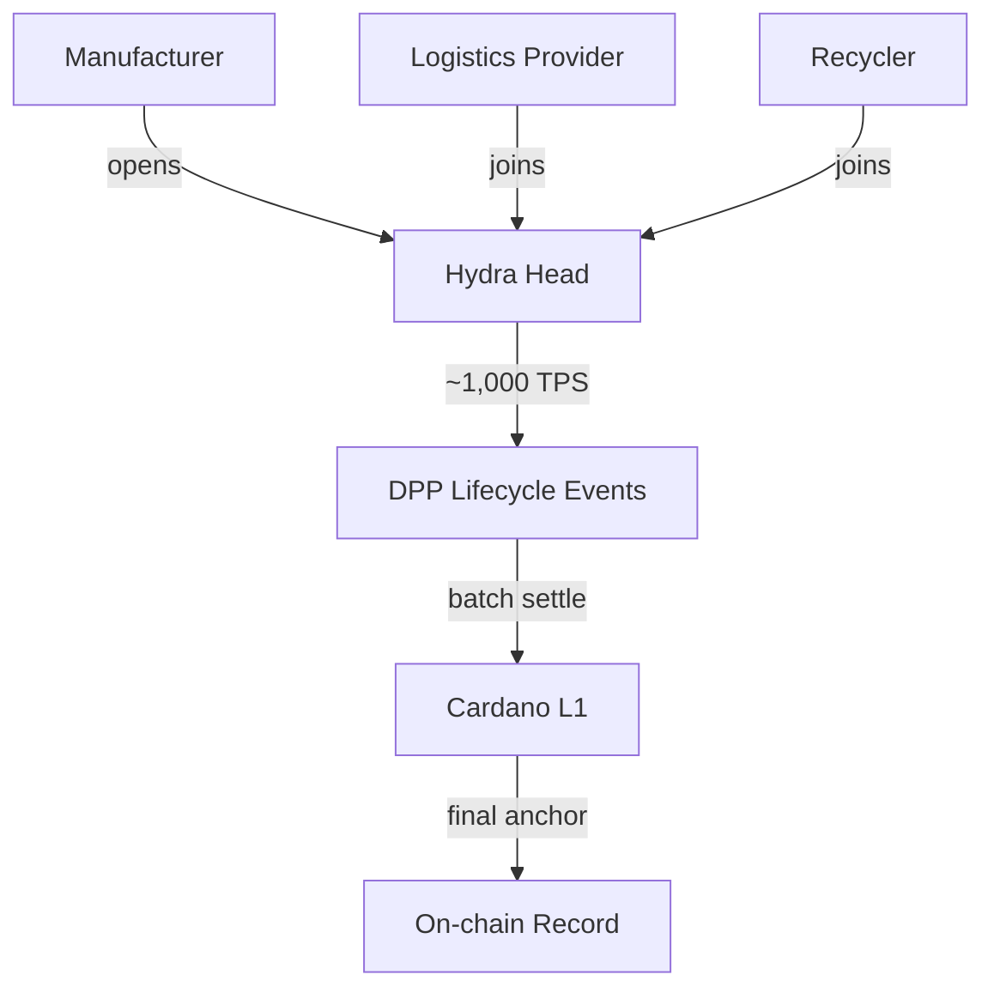

# Scalability

## Layer 1 throughput

Protocol parameters from [Cardano network documentation](../references.md#cardano-params). Values as of March 2026; subject to on-chain governance.

| Parameter | Value |
|-----------|-------|
| Block time | 20 seconds |
| Max block size | 90,112 bytes (~90 KB) |
| Simple TPS | ~9-18 |
| Batched TPS (multi-output) | ~40-70 effective |
| Annual capacity (15 TPS sustained) | ~473 million transactions |

With batching (30 products per transaction), L1 can register **~14 billion products/year** — far more than the EU market requires.

The bottleneck is not throughput but **cost**: at scale, individual L1 transactions become expensive compared to L2.

## Layer 2: [Hydra](../references.md#hydra)

| Property | Value |
|----------|-------|
| TPS per Hydra Head | ~1,000 |
| Demonstrated peak | 1 million TPS (1,000 heads, gaming qualifier 2024) |
| Latency | Sub-second within a head |
| Settlement | Periodic batch commits to L1 |

### DPP use cases for Hydra

- **Real-time SoH updates** for EV batteries (voltage, temperature, cycle count)
- **Supply chain event logging** (warehouse transfers, quality checks)
- **High-frequency manufacturing** (one event per product per station on the line)
- **Batch settlement** — aggregate events into a single L1 transaction periodically

[LW3](../references.md#lw3)'s DPP platform explicitly uses Hydra for EV battery supply chain tracking with [CIP-68](../references.md#cip-68) tokenization.

## Future improvements

| Enhancement | Impact |
|------------|--------|
| **Ouroboros Leios** (Input Endorsers) | Significant L1 throughput increase |
| **Block size increases** (governance) | Currently 90 KB, incrementally adjustable |
| **CIP-150** (Block Data Compression) | Higher effective block capacity |
| [**Mithril**](../references.md#mithril) | Fast chain sync for light clients / verifiers |

## DPP granularity

The granularity of a DPP — whether it covers a product model, a production batch, or an individual unit — varies by sector and is defined in sector-specific regulation or delegated acts.

| Level | Meaning | Example |
|-------|---------|---------|
| `model` | One DPP per product design | A t-shirt model, a paint formula |
| `batch` | One DPP per production batch | A factory run of 10,000 units |
| `item` | One DPP per individual unit | An EV battery with unique serial and SoH tracking |

### Batteries: item-level (confirmed)

The Battery Regulation (EU) 2023/1542 is explicit. Article 77(1):

> "**each** LMT battery, **each** industrial battery with a capacity greater than 2 kWh and **each** electric vehicle battery placed on the market or put into service shall have an electronic record ('battery passport')."

Article 77(2) confirms each passport contains both model-level data and "information specific to the **individual battery**, including resulting from the use of that battery" — State of Health, charging cycles, operating conditions.

This makes sense: each battery degrades differently, so item-level tracking is necessary.

### All other sectors: delegated acts decide (not yet defined)

ESPR Article 9(2)(d) states that delegated acts shall specify:

> "**whether the digital product passport is to be established at model, batch or item level**, and the definition of such levels"

As of March 2026, no ESPR delegated acts have been adopted. The granularity for every non-battery sector is **not yet legally defined**. Expected levels based on industry analysis:

| Sector | Delegated act status | Expected granularity | Reasoning |
|--------|---------------------|---------------------|-----------|
| Batteries | **Adopted** (Reg. 2023/1542) | **Item** | Unique degradation, SoH tracking |
| Iron & steel | Pending (~2026) | Likely batch (per heat/lot) | Bulk material, batch production |
| Textiles | Pending (~2027) | Likely batch or model | Commodity items, no unique serial |
| Tyres | Pending (~2027) | Unknown | DOT codes exist but regulation unclear |
| Electronics | Pending (~2029) | Likely mixed | Item for phones (serials exist), model for cables |
| Construction | Pending (CPR + ESPR) | Likely model or batch | Bulk/commodity products |

### UNTP: issuer/regulator decides

The UNTP spec supports all three levels via the `granularityLevel` property but does not prescribe which to use. It is purely descriptive — declaring what level a given passport was issued at.

## Volume requirements

| Sector | Granularity | Estimated DPPs/year | L1 feasibility |
|--------|------------|--------------------:|----------------|
| Batteries (EV + industrial + LMT) | Item | ~4-5M | Comfortable |
| Iron & steel | Batch | ~100k-1M | Trivial |
| Textiles | Model/batch | ~100k-1M | Trivial |
| Tyres | Unknown | Unknown | Depends on granularity |
| Electronics | Mixed | ~100k-1M | Trivial to comfortable |
| Construction | Model/batch | ~100k-500k | Trivial |

Batteries are the only confirmed item-level sector and produce ~4-5M DPPs/year — well within L1 capacity. All other sectors, if batch/model level, are trivially L1.

Hydra L2 becomes relevant for **lifecycle events** — real-time SoH updates on millions of individual batteries, or high-frequency supply chain event logging — not for initial DPP registration.
