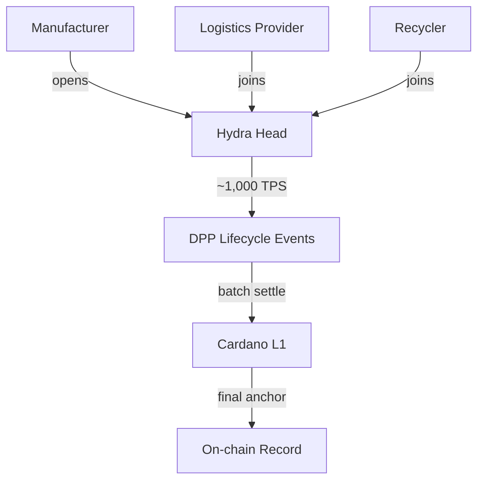

# Scalability

## Layer 1 throughput

| Parameter | Value |
|-----------|-------|
| Block time | 20 seconds |
| Max block size | 90,112 bytes (~90 KB) |
| Simple TPS | ~9-18 |
| Batched TPS (multi-output) | ~40-70 effective |
| Annual capacity (15 TPS sustained) | ~473 million transactions |

With batching (30 products per transaction), L1 can register **~14 billion products/year** — far more than the EU market requires.

The bottleneck is not throughput but **cost**: at scale, individual L1 transactions become expensive compared to L2.

## Layer 2: Hydra

| Property | Value |
|----------|-------|
| TPS per Hydra Head | ~1,000 |
| Demonstrated peak | 1 million TPS (1,000 heads, gaming qualifier 2024) |
| Latency | Sub-second within a head |
| Settlement | Periodic batch commits to L1 |

### DPP use cases for Hydra

- **Real-time SoH updates** for EV batteries (voltage, temperature, cycle count)
- **Supply chain event logging** (warehouse transfers, quality checks)
- **High-frequency manufacturing** (one event per product per station on the line)
- **Batch settlement** — aggregate events into a single L1 transaction periodically

LW3's DPP platform explicitly uses Hydra for EV battery supply chain tracking with CIP-68 tokenization.

## Future improvements

| Enhancement | Impact |
|------------|--------|
| **Ouroboros Leios** (Input Endorsers) | Significant L1 throughput increase |
| **Block size increases** (governance) | Currently 90 KB, incrementally adjustable |
| **CIP-150** (Block Data Compression) | Higher effective block capacity |
| **Mithril** | Fast chain sync for light clients / verifiers |

## DPP granularity

A DPP is **not per individual item** — it is per product model or batch. The UNTP `granularityLevel` field makes this explicit:

| Level | Meaning | Example |
|-------|---------|---------|
| `model` | One DPP per product design | A t-shirt model, a paint formula |
| `batch` | One DPP per production batch | A factory run of 10,000 units |
| `item` | One DPP per individual unit | An EV battery with unique serial and SoH tracking |

Item-level DPPs are required for **EV batteries** (each has a unique serial, State of Health tracking, and lifecycle history). For most other sectors — textiles, electronics, construction, steel — the DPP is at model or batch level.

## Volume requirements

Estimated number of **DPP records** (not items) per sector:

| Sector | DPP granularity | Estimated DPPs/year | L1 feasibility |
|--------|----------------|--------------------:|----------------|
| EV batteries | Item | ~3M | Comfortable |
| Industrial batteries | Item | ~1M | Comfortable |
| Iron & steel | Batch | ~100k-1M | Trivial |
| Textiles | Model/batch | ~100k-1M | Trivial |
| Electronics | Model/batch | ~100k-500k | Trivial |
| Construction | Model/batch | ~100k-500k | Trivial |

All sectors fit comfortably on L1 with simple individual transactions. Batching and High Throughput patterns are optimizations, not requirements.

Hydra L2 becomes relevant for **lifecycle events** — real-time SoH updates on millions of EV batteries, or supply chain event logging at high frequency — not for initial DPP registration.
