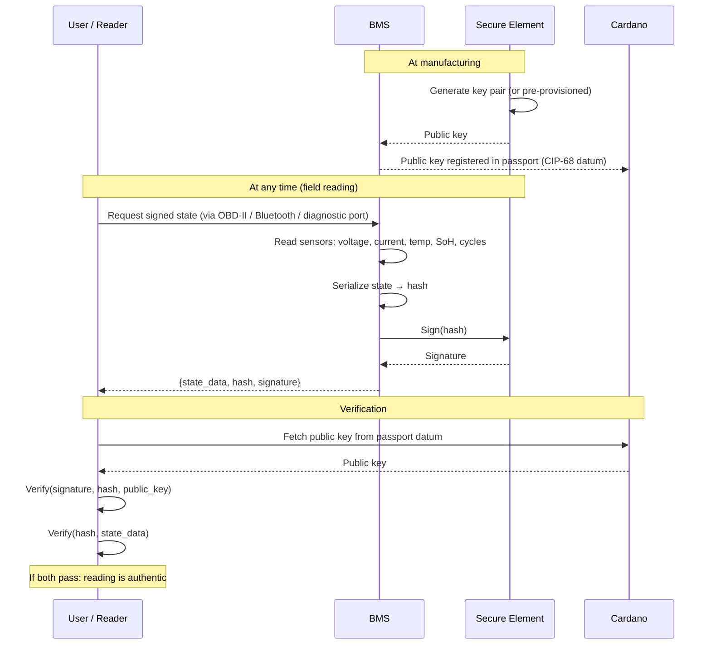
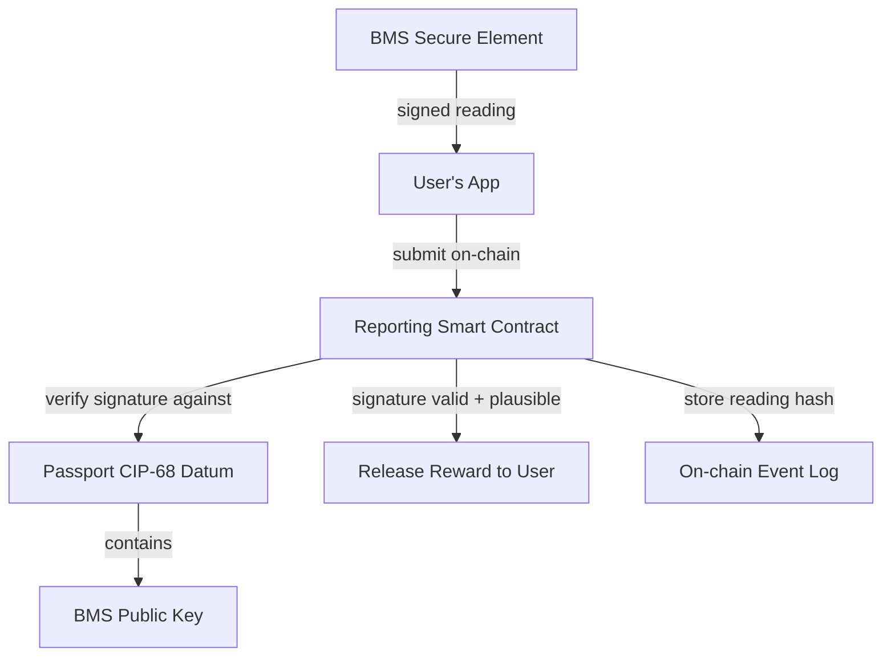
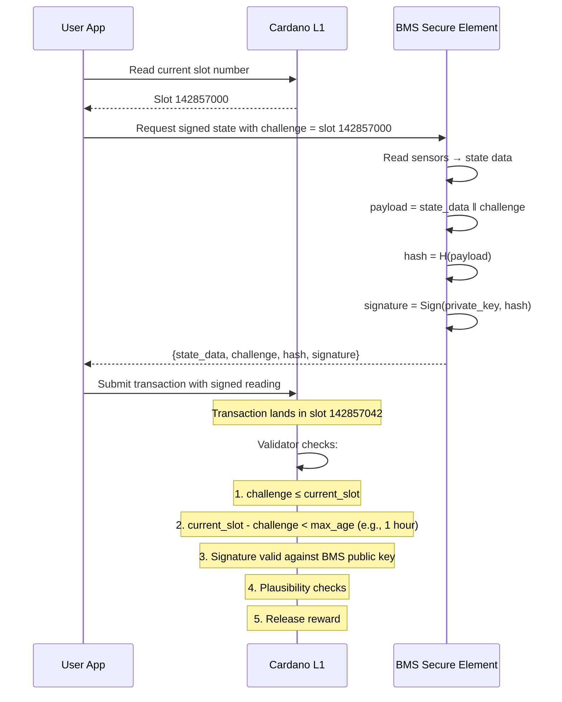

# Signed BMS Readings

## The idea

Every BMS contains a secure element with a private key that never leaves the chip. Anyone with physical access can request a **signed hash of the current battery state**. The signature proves the reading came from that specific BMS hardware, not from a human or a software system.

## Protocol



## What the signature proves

| Claim | Proven? | Why |
|-------|---------|-----|
| This data came from this specific BMS hardware | Yes | Only this secure element has the private key |
| The data was not modified after leaving the BMS | Yes | Hash mismatch would break the signature |
| The data was produced at the claimed time | Partially | Timestamp is BMS-reported, not independently verified |
| The underlying sensor readings are physically accurate | No | A faulty or manipulated analog front-end still signs garbage |

The secure element proves **authenticity** (this BMS produced this data) and **integrity** (nobody changed it). It does not prove **accuracy** (the sensors might be wrong or tampered with at the analog level). But analog sensor tampering requires physical modification of the BMS board — a much higher bar than software manipulation.

## Hardware cost

The cost of adding this capability is negligible for automotive BMS:

| Component | Cost at 100k volume |
|-----------|-------------------|
| Secure element (ATECC608B / OPTIGA Trust M) | $0.50-0.70 |
| Passives (caps, resistors) | $0.01 |
| **Total BOM addition** | **$0.51-0.71** |

| Application | BMS cost | Signing cost | Impact |
|------------|----------|-------------|--------|
| EV battery | $200-400 | $0.55 | 0.1-0.3% |
| Industrial ESS | $200-2,000 | $0.55 | 0.03-0.3% |
| E-bike (mid-range) | $20-60 | $0.55 | 1-3% |

Modern automotive MCUs (NXP S32K3, Infineon AURIX TC3xx) already include hardware security modules. For new BMS designs using these MCUs, the crypto capability is already present — it just needs firmware to use it.

One-time NRE (firmware + PCB): $20k-60k, amortized to $0.20-0.60/unit at 100k volume.

Pre-provisioned secure elements (Microchip Trust&GO) come with keys injected at the factory for $0.77/unit — zero PKI infrastructure needed.

## Signed reading format

A BMS signed reading could follow a simple structure:

```json
{
  "battery_id": "urn:eudpp:battery:de:example:2024:001",
  "bms_public_key": "0x04a1b2c3...",
  "timestamp": 1735689600,
  "state": {
    "soh_percent": 88,
    "soc_percent": 72,
    "cycle_count": 1247,
    "capacity_ah": 352,
    "nominal_capacity_ah": 400,
    "voltage_v": 389.2,
    "current_a": 0.0,
    "temp_min_c": 22,
    "temp_max_c": 25,
    "energy_throughput_kwh": 48750
  },
  "hash": "0x5bd2e1f4...",
  "signature": "0x304502210..."
}
```

The hash covers the serialized `state` object. The signature is ECDSA over the hash, produced by the secure element's private key.

## Who can request a signed reading

Anyone with physical access to the BMS interface:

| Actor | Access method | Use case |
|-------|-------------|----------|
| Vehicle owner | OBD-II adapter + app | Routine reporting for incentive rewards |
| Used battery buyer | OBD-II adapter at point of sale | Verify seller's SoH claims before purchase |
| Service center | Diagnostic tool | Maintenance records with authenticated state |
| Repurposing operator | Direct BMS connection | Assess second-life viability |
| Recycler | Direct BMS connection | Document end-of-life condition |
| Market surveillance | Diagnostic tool | Compliance audit |

No internet connection required. No manufacturer backend in the loop. The reading is self-contained and independently verifiable against the public key in the on-chain passport.

## Integration with Cardano

The signed reading feeds into the [incentive reporting model](incentives.md):



The smart contract can verify the BMS signature on-chain (or more practically, a verifier off-chain submits a proof). This means:

- The manufacturer doesn't need to trust the user — the BMS signed it
- The user doesn't need to trust the manufacturer — the reward is guaranteed by the contract
- Third parties don't need to trust either — the signature is publicly verifiable

## Challenge-response: blockchain as trusted clock

The BMS has no trusted clock. Its internal RTC can drift or be set to a wrong value. But we don't need to trust the BMS's clock — **the blockchain provides the timestamp**.

### The problem with BMS timestamps

A signed reading with a BMS-reported timestamp proves nothing about *when* the reading was taken. A dishonest actor could:

- Request a reading when the battery is in good condition
- Store the signed result
- Replay it months later when the battery has degraded, to fake a higher SoH

### Challenge-response protocol

The reader includes a **challenge** in the signing request — a value that the BMS could not have known in advance. The BMS signs the state data together with the challenge. This binds the reading to a specific moment.



### What the challenge proves

| Attack | Without challenge | With challenge |
|--------|------------------|---------------|
| **Replay old reading** | Possible — old signed reading is still valid | Blocked — challenge slot is too old, validator rejects |
| **Pre-compute future readings** | Possible — sign once, submit later | Blocked — BMS can't predict future slot numbers |
| **Forge timestamp** | Easy — BMS clock is settable | Irrelevant — timestamp comes from the blockchain |
| **Delay submission** | Undetectable | Detectable — gap between challenge slot and submission slot |

The `max_age` parameter (e.g., 200 slots = ~1 hour) defines how fresh a reading must be. The validator rejects anything older. This means:

- The reading was produced **after** the challenge slot (BMS had to see the challenge)
- The reading was submitted **within max_age** of being produced
- The blockchain's own slot progression serves as the trusted clock

### Why this needs a blockchain

This is a genuine blockchain value-add, not just "hash anchoring":

- **The challenge must come from a source neither party controls.** Cardano's slot number is determined by the Ouroboros protocol — no single party can manipulate it.
- **The timestamp is consensus-derived.** It's not a server clock that the manufacturer controls, not a BMS clock that the user controls. It's the chain's own time.
- **Freshness is enforced on-chain.** The validator is a smart contract — it can't be bypassed or bribed.

A centralized server could issue challenges too, but then you trust the server operator. The blockchain makes the challenge protocol **trustless**.

### Signed reading format (with challenge)

```json
{
  "battery_id": "urn:eudpp:battery:de:example:2024:001",
  "challenge": 142857000,
  "state": {
    "soh_percent": 88,
    "soc_percent": 72,
    "cycle_count": 1247,
    "capacity_ah": 352,
    "voltage_v": 389.2,
    "current_a": 0.0,
    "temp_min_c": 22,
    "temp_max_c": 25,
    "monotonic_counter": 4891
  },
  "hash": "0x5bd2e1f4...",
  "signature": "0x304502210..."
}

```

The `monotonic_counter` is a strictly increasing value maintained by the secure element. Even without a trusted clock, it guarantees ordering: reading 4891 came after reading 4890. Combined with the on-chain slot timestamps of each submission, this produces a trustworthy timeline.

## On-chain signature verification

ECDSA signature verification is possible in Plutus (Cardano supports `verifyEcdsaSecp256k1Signature` as a built-in). If the BMS uses secp256k1 (like Bitcoin/Ethereum) or ed25519 (like Cardano native), the signature can be verified directly in the smart contract validator.

```
ReportingValidator:
  Datum:
    batteryId     : ByteString
    bmsPublicKey  : ByteString     -- registered at manufacturing
    lastCounter   : Integer        -- monotonic counter from last accepted reading
    rewardPerRead : Integer
    maxAgeSlots   : Integer        -- e.g., 200 slots (~1 hour)

  Redeemer: SubmitSignedReading
    reading    : ByteString      -- serialized state data including challenge + counter
    signature  : ByteString      -- BMS signature over hash(reading)

  Validation:
    - Extract challenge slot from reading
    - challenge ≤ current_slot
    - current_slot - challenge < maxAgeSlots
    - Extract monotonic_counter from reading
    - monotonic_counter > lastCounter (strictly increasing)
    - verifyEcdsaSecp256k1Signature(bmsPublicKey, hash(reading), signature) == True
    - Plausibility checks (SoH ≤ previous, cycles ≥ previous)
    - Update lastCounter in output datum
    - Release reward to submitter
```

This is a significant upgrade over unsigned user reports — the smart contract doesn't just check that a user submitted something plausible, it verifies that the BMS hardware itself produced the data, recently, in response to a fresh challenge.

## What this changes

| Without signed BMS | With signed BMS |
|-------------------|-----------------|
| User self-reports readings — low trust | BMS signs readings — hardware-level trust |
| Manufacturer could fake data | Manufacturer can't forge BMS signatures (no private key access after provisioning) |
| Plausibility checks only (SoH can't increase) | Cryptographic verification + plausibility |
| Trust requires multiple independent sources | Single reading is independently verifiable |
| Buyer must trust seller's claims | Buyer requests fresh signed reading at point of sale |

## Open questions

1. **Standardization**: No standard exists for BMS signed readings. A CIP (Cardano Improvement Proposal) or an industry standard (SAE, ISO) would be needed to define the format, key algorithm, and serialization.
2. **Key lifecycle**: What happens when a BMS module is replaced? The new module has a different key. The passport must be updated to register the new public key.
3. **Timestamp trust**: Solved by the challenge-response protocol — the blockchain provides the trusted clock, not the BMS. The monotonic counter provides ordering within the BMS.
4. **Analog front-end trust**: The secure element signs whatever the BMS firmware gives it. If the analog measurement ICs are tampered with (replaced with a device that outputs false voltage readings), the signature is valid but the data is wrong. This requires physical board modification — a much higher bar than software tampering, but not impossible.
5. **Regulatory adoption**: The EU Battery Regulation does not currently require signed BMS readings. A delegated act or implementing act could mandate this, especially as the BMS-to-passport data gap becomes more apparent.
