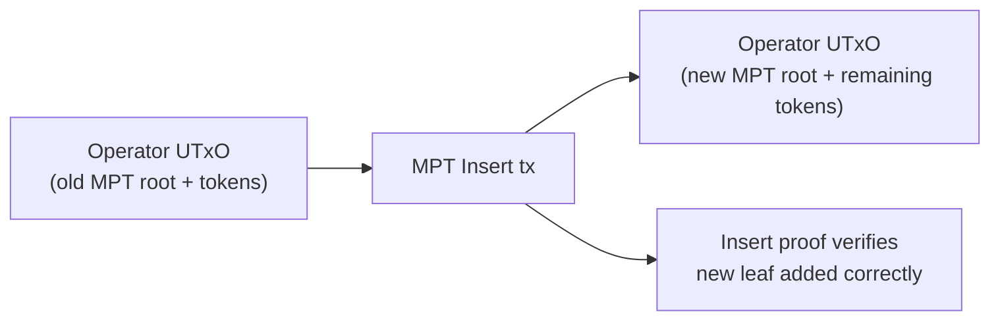
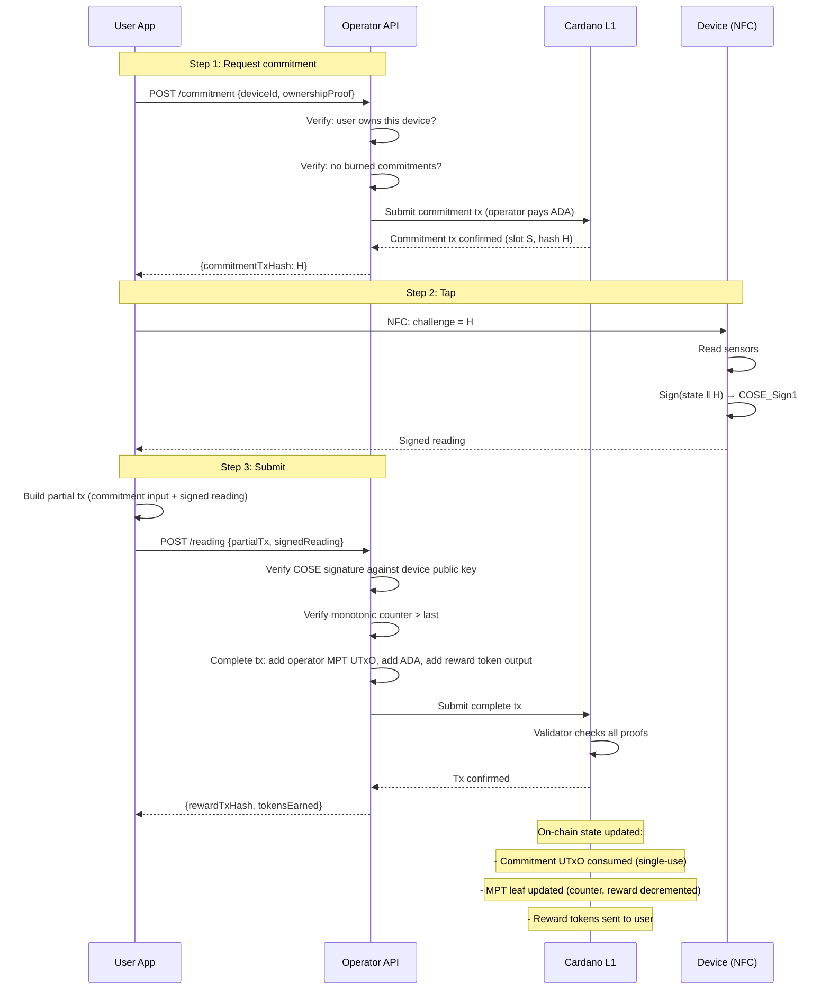
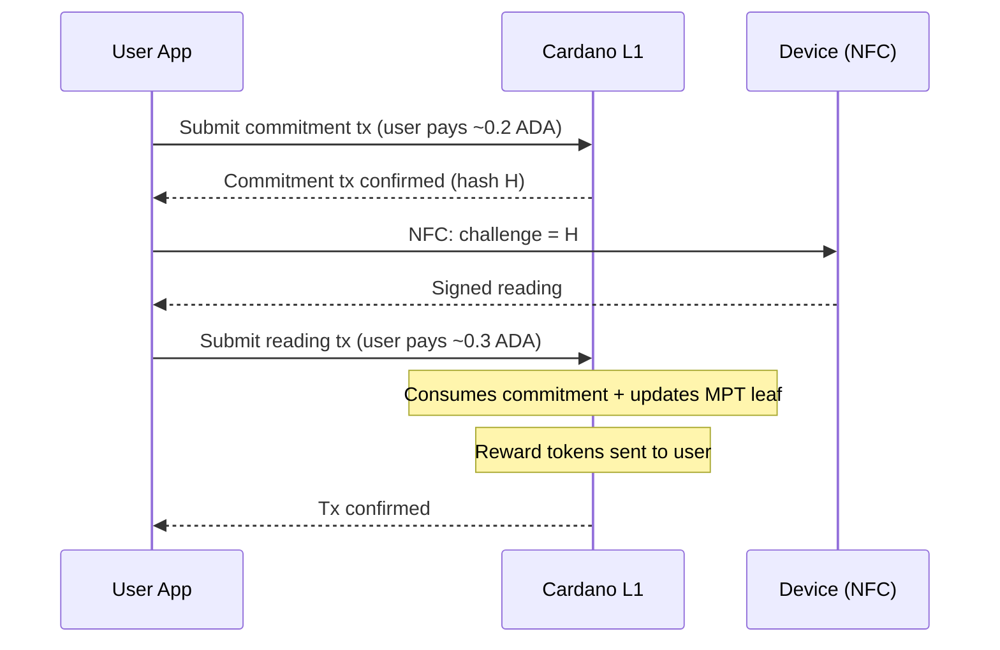
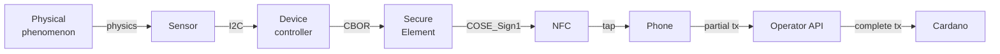

# Signed Sensor Readings Protocol

## The pattern

Any physical product with at least one sensor and a secure element can produce cryptographically signed readings that are verifiable on Cardano. The protocol is not specific to any product category — batteries are the first application because the [Battery Regulation](../regulation.md) creates the regulatory demand.

The foundational assumption: **the user is the transport layer**. The device has no internet connection. The user has physical access to the device and an incentive (reward) to carry signed readings from the device to the chain.

## Components

| Component | Role | Product-agnostic? |
|-----------|------|-------------------|
| **Sensor(s)** | Measures physical state (voltage, temperature, pressure, depth, humidity, vibration...) | Sensor type varies by product |
| **Secure element** | Holds private key, signs readings (ECDSA) | Yes — same chip for any product |
| **NFC interface** | Delivers signed reading to user's phone, powered by NFC field | Yes — same chip for any product |
| **COSE_Sign1 envelope** | Signing format ([RFC 9052](../../references.md#rfc9052)) | Yes — standard envelope |
| **CBOR payload** | Structured reading data ([RFC 8949](../../references.md#rfc8949)) | Schema varies by product |
| **Operator MPT** | Merkle Patricia Trie holding device registry + reward pools | Yes — same MPFS infrastructure |
| **Commit-tap-submit** | On-chain challenge protocol | Yes — same validator logic |
| **Operator reward tokens** | Native tokens redeemable with the operator | Yes — same minting pattern |
| **Ownership token** | Gates who can request funded commitments | Yes — same CIP-68 pattern |

The **only product-specific part** is the CBOR payload schema — which fields, which units, which plausibility checks. Everything else is reusable.

## Hardware: signing module

Two chips on the device board, connected via I2C:

| Chip | Role | Cost (1M vol) |
|------|------|--------------|
| NXP NTAG 5 Link | NFC interface, I2C master, energy harvesting | $0.35 |
| Infineon OPTIGA Trust M | Secure element, ECDSA-P256, pre-provisioned keys | $0.40 |
| NFC antenna + passives | | $0.06 |
| **Total** | | **$0.81** |

The module is powered entirely by the phone's NFC field. No battery, no internet, no wiring beyond I2C to the device's existing sensor bus.

See [NFC Hardware](../sectors/batteries/nfc-hardware.md) for the detailed bill of materials, energy budget analysis, and alternative chip options.

## Device registration

The operator registers each device by inserting a leaf into their MPT. This is the first on-chain action for any device.

### MPT leaf structure

```
DeviceLeaf {
  publicKey       : ByteString    -- device secure element public key
  rewardRemaining : Integer       -- operator tokens remaining for this device
  rewardPerRead   : Integer       -- operator tokens paid per valid reading
  lastCounter     : Integer       -- monotonic counter from last accepted reading (0 at registration)
  schemaVersion   : Integer       -- which CBOR payload schema this device uses
  metadata        : ByteString    -- product-specific (battery model, tyre DOT, etc.)
}
```

### Registration transaction



The operator:

1. Mints reward tokens (or draws from an existing pool)
2. Inserts a new leaf into their MPT: key = device public key hash, value = `DeviceLeaf`
3. The Aiken validator verifies the MPT insert proof
4. The new UTxO holds the updated root hash + the operator's token pool (including the newly allocated device reward)

The device's public key is now on-chain, linked to a reward budget. Anyone can verify it exists by querying the operator's MPT with a Merkle proof.

## Reward tokens

Rewards are **operator-issued native tokens**, not ADA. Each operator defines a minting policy and decides what their tokens are worth.

| Property | Design |
|----------|--------|
| **Issuer** | The operator (manufacturer/brand) |
| **Value** | Defined by operator (e.g., "10 tokens = free service", "50 tokens = €5 discount on next purchase") |
| **Redemption** | Off-chain, at point of sale, via operator's portal — operator's business |
| **Minting** | Operator mints into their MPT UTxO at device registration or top-up |
| **Flow** | On valid reading: operator UTxO → user wallet |

This is a loyalty mechanism, not a payment. The operator creates tokens at negligible cost and redeems them as discounts on future purchases — bringing the customer back.

## The protocol: two paths

### Cooperative path (user pays zero ADA)

The operator funds all transactions. The user only needs a signing key and the phone app.



### Adversarial path (user pays own ADA)

If the operator refuses to cooperate (won't fund commitments, won't submit readings), the user can do everything directly on-chain. This is the escape hatch that keeps the operator honest.



The user spends ~0.5 ADA per reading but receives reward tokens. This path is always available — the on-chain validator doesn't care who submitted the transaction, only that the proofs are valid.

### Burned commitment policy

The operator tracks commitment usage to prevent abuse:

| Situation | Operator response |
|-----------|------------------|
| User requests commitment, taps, submits → all good | Fund next commitment |
| User requests commitment, never submits | Strike 1 — fund next commitment with warning |
| User burns N commitments without submitting | Refuse to fund — user must self-fund via adversarial path |
| User self-funds and submits valid reading | Reset strike counter — user is acting in good faith |

This is off-chain policy, not on-chain enforcement. The operator's API tracks behavior. The on-chain protocol doesn't know or care about strikes — it only validates proofs.

## On-chain validator

A single reading submission transaction does all of this atomically:

```
ReadingValidator (Aiken):

  -- Inputs
  Consumes: commitment UTxO (proves freshness)
  References: operator MPT UTxO (current root)

  -- Redeemer
  SubmitReading {
    coseSign1      : ByteString     -- full COSE_Sign1 from device
    mptProof       : MerkleProof    -- proof that device leaf exists in operator's MPT
    updatedLeaf    : DeviceLeaf     -- new leaf value (counter incremented, reward decremented)
    mptUpdateProof : MerkleProof    -- proof that update is valid
  }

  -- Validation (all must pass)
  1. Commitment UTxO is consumed in this tx
  2. Commitment slot + maxAge ≥ current slot (fresh)
  3. Extract commitment tx hash from COSE payload challenge field
  4. Commitment tx hash matches the consumed UTxO
  5. mptProof verifies device leaf exists under operator's current root
  6. COSE_Sign1 signature valid against leaf.publicKey
  7. Extract monotonic counter from reading: must be > leaf.lastCounter
  8. updatedLeaf.lastCounter = reading counter
  9. updatedLeaf.rewardRemaining = leaf.rewardRemaining - leaf.rewardPerRead
  10. updatedLeaf.rewardRemaining ≥ 0 (reward pool not exhausted)
  11. mptUpdateProof verifies the root transition (old root → new root with updated leaf)
  12. Operator output UTxO has new root hash
  13. Reward tokens (leaf.rewardPerRead) appear in a user output
  14. Submitter holds ownership token for this device (or is the operator)
  15. Product-specific plausibility checks per schemaVersion

  -- Outputs
  Produces: operator UTxO (new MPT root, less reward tokens)
  Produces: user UTxO (reward tokens)
```

## Signing format: COSE_Sign1

Every signed reading is a [COSE_Sign1](../../references.md#rfc9052) structure — the same signing envelope used in the EU Digital COVID Certificate, mobile driving licences (ISO 18013-5), and WebAuthn/FIDO2.

```
COSE_Sign1 = [
  protected   : bstr,    -- { 1: -7 } = ES256
  unprotected : {},
  payload     : bstr,    -- CBOR-encoded sensor reading
  signature   : bstr     -- ECDSA-P256 signature
]
```

### Payload structure (generic)

```cbor-diagnostic
{
  1: h'...',           -- device_id (public key hash, ByteString)
  2: h'...',           -- challenge (commitment tx hash, ByteString)
  3: 4891,             -- monotonic_counter (strictly increasing, unsigned int)
  4: { ... },          -- state (sensor readings — schema varies by product)
  5: 1                 -- schema_version (unsigned int)
}
```

Fields 1-3 and 5 are the same for every product. Field 4 (state) is product-specific:

| Product | Field 4 contents |
|---------|-----------------|
| Battery | SoH, SoC, cycle count, voltage, current, temperature, cell voltages |
| Tyre (commercial) | Tread depth, casing condition, retread count |
| Cold chain | Temperature history, humidity |
| Industrial equipment | Vibration signature, operating hours |

CBOR with deterministic encoding (RFC 8949 §4.2) — integer-only values, integer keys, no floats. See [Battery Payload Standard](../sectors/batteries/payload-standard.md) for the complete battery-specific schema.

## Trust chain



| Link | Trust basis | Weakness |
|------|------------|----------|
| Phenomenon → Sensor | Physics | Sensor failure or physical tampering |
| Sensor → Controller | I2C bus on PCB | Compromised firmware could substitute readings |
| Controller → SE | I2C, CBOR format | SE signs whatever controller gives it |
| SE → signature | Private key in tamper-resistant hardware | Key extraction (expensive, destructive) |
| Phone → Operator API | HTTPS | Operator could refuse (user escalates to adversarial path) |
| Operator → Cardano | Tx submission | Operator could delay (user escalates to adversarial path) |
| Signature → on-chain | Plutus built-in ECDSA verification | Correctness of validator code |

**Root of trust**: the secure element vendor's key provisioning process.

**Weakest link**: controller → SE boundary. Mitigated by schema validation, plausibility checks, and cross-referencing with independent measurements.

**Cooperation assumption**: the cooperative path trusts the operator to submit transactions promptly. The adversarial path removes this assumption at the cost of ADA.

## Future: CIP-118 (nested transactions)

[CIP-118](../../references.md#cip118) introduces **nested transactions** in the Dijkstra ledger era. It is actively being implemented — CIP merged January 2026, ledger code landing Q1-Q2 2026, testnet expected H1 2026.

With CIP-118, the cooperative path becomes fully trustless:

1. User creates a **sub-transaction**: "here's my signed reading, send me reward tokens"
2. Sub-transaction is **not balanced** (no ADA for fees)
3. Any batcher (operator or third party) wraps it in a **top-level transaction** providing ADA
4. A [CIP-112](../../references.md#cip112) **guard script** at the top level enforces the terms: valid reading → tokens must flow to user
5. One atomic on-chain transaction. User holds zero ADA.

This eliminates the need for the operator API as a trust intermediary. The user creates a sub-transaction, broadcasts it to a mempool-like coordination layer, and any willing batcher (the operator, a third-party relayer, or a DEX-style aggregator) completes it.

Until CIP-118 is deployed, the cooperative + adversarial dual-path design provides equivalent functionality with a slightly weaker trust model.

## Incentive alignment summary

| Actor | Cooperates | Defects |
|-------|-----------|---------|
| **User** | Gets free commitment + free submission + reward tokens | Burns commitments → loses free funding, must self-fund |
| **Operator** | Gets fresh device data + customer loyalty + DPP compliance | Refuses valid readings → user escalates, operator gets no data |
| **Device** | Produces signed readings when tapped | N/A — hardware, no agency |

Both parties have skin in the game. The cooperative path is cheaper for everyone. The adversarial path exists as the escape hatch that keeps both honest.

## Applicability

This protocol is foundational for signing IoT sensor data wherever:

- The device has at least one sensor
- A secure element can be added to the board (~$0.81)
- A user has physical access and an incentive to report
- The reading needs to be verifiable and timestamped

Batteries are the first concrete application. The protocol itself is product-agnostic — the only adaptation needed for a new product category is defining the CBOR payload schema (field 4) and the associated plausibility checks.
