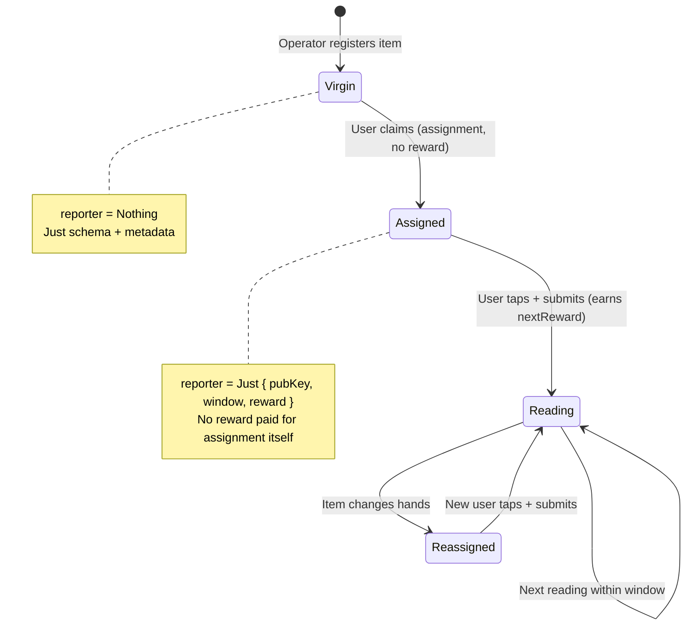
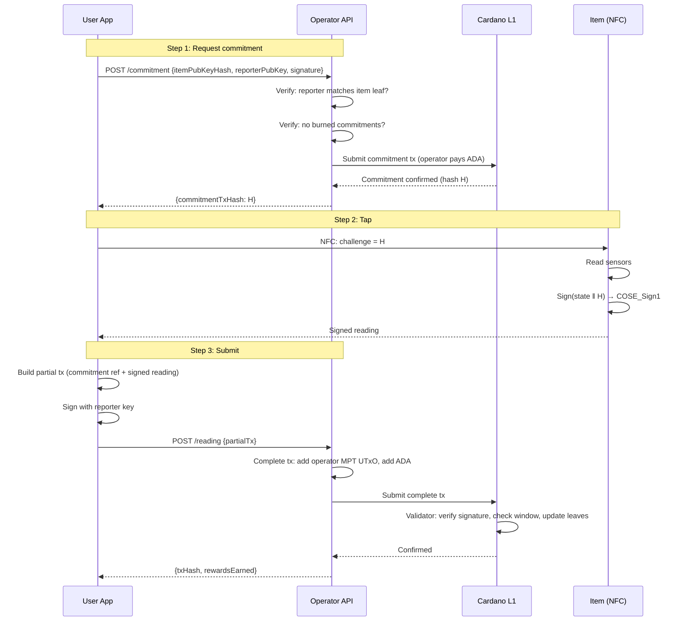
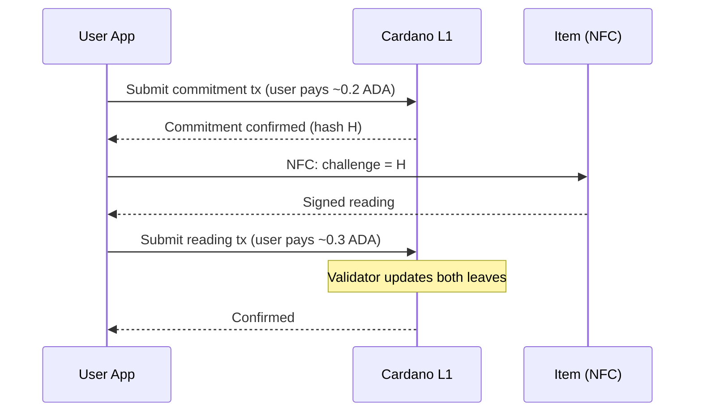
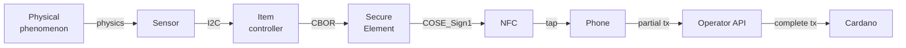

# Signed Sensor Readings Protocol

## The pattern

Any physical product with at least one sensor and a secure element can produce cryptographically signed readings that are verifiable on Cardano. The protocol is not specific to any product category — batteries are the first application because the [Battery Regulation](../regulation.md) creates the regulatory demand.

The foundational assumption: **the user is the transport layer**. The item has no internet connection. The user has physical access to the item and an incentive (reward) to carry signed readings from the item to the chain.

## Components

| Component | Role | Product-agnostic? |
|-----------|------|-------------------|
| **Sensor(s)** | Measures physical state (voltage, temperature, pressure, depth, humidity, vibration...) | Sensor type varies by product |
| **Secure element** | Holds private key, signs readings (ECDSA) | Yes — same chip for any product |
| **NFC interface** | Delivers signed reading to user's phone, powered by NFC field | Yes — same chip for any product |
| **COSE_Sign1 envelope** | Signing format ([RFC 9052](../../references.md#rfc9052)) | Yes — standard envelope |
| **CBOR payload** | Structured reading data ([RFC 8949](../../references.md#rfc8949)) | Schema varies by product |
| **Operator MPT** | Merkle Patricia Trie holding item registry + reporter rewards | Yes — same MPFS infrastructure |
| **Commit-tap-submit** | On-chain challenge protocol | Yes — same validator logic |
| **Operator reward tokens** | Native tokens redeemable with the operator | Yes — same minting pattern |

The **only product-specific part** is the CBOR payload schema — which fields, which units, which plausibility checks. Everything else is reusable.

## Hardware: signing module

Two chips on the item's board, connected via I2C:

| Chip | Role | Cost (1M vol) |
|------|------|--------------|
| NXP NTAG 5 Link | NFC interface, I2C master, energy harvesting | $0.35 |
| Infineon OPTIGA Trust M | Secure element, ECDSA-P256, pre-provisioned keys | $0.40 |
| NFC antenna + passives | | $0.06 |
| **Total** | | **$0.81** |

The module is powered entirely by the phone's NFC field. No battery, no internet, no wiring beyond I2C to the item's existing sensor bus.

See [NFC Hardware](../sectors/batteries/nfc-hardware.md) for the detailed bill of materials, energy budget analysis, and alternative chip options.

## Data model

The operator's MPT contains two types of leaves, distinguished by their key:

### Item leaf

```
-- MPT key: hash(itemPubKey)

ItemLeaf {
  schemaVersion   : Integer
  metadata        : ByteString            -- product-specific (battery model, tyre DOT, etc.)
  reporter        : Maybe ReporterAssignment
}

ReporterAssignment {
  reporterPubKey  : ByteString
  nextWindowSlot  : Integer               -- earliest slot for next valid reading
  nextReward      : Integer               -- reward for the next reading (always > 0)
}
```

### Reporter leaf

```
-- MPT key: hash(reporterPubKey)

ReporterLeaf {
  rewardsAccumulated : Integer
}
```

### Lifecycle



| Step | Item leaf change | Reporter leaf change | Reward paid? |
|------|-----------------|---------------------|-------------|
| **Registration** | Created with `reporter = Nothing` | — | No |
| **Assignment** | `reporter = Just { reporterPubKey, nextWindowSlot, nextReward }` | — | No — assignment is free |
| **First reading** | `nextWindowSlot` and `nextReward` updated by contract | Created with `rewardsAccumulated = nextReward` | Yes |
| **Subsequent readings** | `nextWindowSlot` and `nextReward` updated by contract | `rewardsAccumulated += nextReward` | Yes |
| **Transfer** | `reporter` updated to new user's key | Old reporter's leaf untouched — rewards preserved | No — new assignment is free |

Key properties:

- **Virgin items** have no reporter. Anyone can claim them.
- **Assignment pays nothing** — the user is just registering as the reporter for this item.
- **Every reading pays** — `nextReward` is always > 0.
- **Rewards belong to the reporter, not the item** — when the item changes hands, the old reporter keeps their accumulated rewards.
- **The contract decides the next window and reward** — the operator's business logic determines the schedule and payment for each subsequent reading.

## Reward tokens

Rewards are **operator-issued native tokens**, not ADA.

| Property | Design |
|----------|--------|
| **Issuer** | The operator (manufacturer/brand) |
| **Value** | Defined by operator (e.g., "10 tokens = free service", "50 tokens = €5 discount on next purchase") |
| **Accumulation** | Tracked in `ReporterLeaf.rewardsAccumulated` — no on-chain token movement to user |
| **Redemption** | Off-chain, at point of sale — user proves ownership of reporter key, operator checks accumulated balance |

The user never holds on-chain tokens or ADA. Their rewards are a counter in the MPT, redeemable by proving they own the reporter key.

## User identity: no wallet needed

The user needs only a **key pair** — generated in the phone app, never touches the chain as a UTxO.

| What the user has | Where it lives |
|-------------------|---------------|
| Key pair (public + private) | Phone app |
| Reporter public key registered in item leaf | On-chain (in operator's MPT) |
| Accumulated rewards | On-chain (in operator's MPT, reporter leaf) |

The user has **no UTxOs, no ADA, no tokens**. Their public key appears in two places in the MPT (item leaf as `reporterPubKey`, reporter leaf as the key). The operator pays all transaction fees.

Redemption is off-chain: the user signs a message with their reporter key, the operator verifies it and checks the on-chain `rewardsAccumulated` balance.

## The protocol: two paths

### Cooperative path (user pays zero ADA)

The operator funds all transactions. The user only needs their key pair and the phone app.



### Adversarial path (user pays own ADA)

If the operator refuses to cooperate, the user can do everything directly on-chain. This is the escape hatch.



The user spends ~0.5 ADA but their rewards still accumulate in the reporter leaf. The on-chain validator doesn't care who submitted the transaction — only that the proofs are valid.

### Burned commitment policy

The operator tracks commitment usage off-chain:

| Situation | Operator response |
|-----------|------------------|
| Commitment requested, reading submitted | Fund next commitment |
| Commitment requested, never submitted | Strike — warn user |
| N commitments burned | Refuse to fund — user must self-fund via adversarial path |
| User self-funds and submits valid reading | Reset strikes — user is acting in good faith |

This is off-chain policy. The on-chain protocol doesn't know about strikes.

## On-chain validator

A reading submission transaction atomically updates two MPT leaves:

```
ReadingValidator (Aiken):

  Redeemer: SubmitReading {
    coseSign1        : ByteString     -- COSE_Sign1 from item
    itemProof        : MerkleProof    -- item leaf exists
    reporterProof    : MerkleProof    -- reporter leaf exists (or insert proof if first reading)
    updatedItemLeaf  : ItemLeaf       -- new item leaf value
    updatedReporter  : ReporterLeaf   -- new reporter leaf value
    mptTransition    : MerkleProof    -- proves old root → new root with both updates
  }

  Validation:

  -- Commitment
  1. Commitment UTxO consumed in this tx
  2. Commitment slot + maxAge ≥ current slot
  3. Commitment tx hash matches challenge in COSE payload

  -- Item leaf
  4. itemProof verifies leaf exists under current MPT root
  5. item leaf has reporter = Just assignment (not virgin)
  6. COSE_Sign1 signature valid against itemPubKey (the MPT key)
  7. current slot ≥ assignment.nextWindowSlot (reading is within window)
  8. updatedItemLeaf.reporter.nextWindowSlot and nextReward set by contract logic
  9. updatedItemLeaf.reporter.reporterPubKey unchanged

  -- Reporter leaf
  10. Reporter key = hash(assignment.reporterPubKey)
  11. If first reading: reporter leaf is an MPT insert (rewardsAccumulated = assignment.nextReward)
  12. If subsequent: updatedReporter.rewardsAccumulated = old + assignment.nextReward
  13. Transaction signed by reporterPubKey

  -- MPT transition
  14. mptTransition proves old root → new root with both leaf updates
  15. Operator output UTxO has new root hash

  -- Product-specific
  16. CBOR payload conforms to schemaVersion
  17. Plausibility checks per product type
```

## Signing format: COSE_Sign1

Every signed reading is a [COSE_Sign1](../../references.md#rfc9052) structure — the same signing envelope used in the EU Digital COVID Certificate, mobile driving licences (ISO 18013-5), and WebAuthn/FIDO2.

```
COSE_Sign1 = [
  protected   : bstr,    -- { 1: -7 } = ES256
  unprotected : {},
  payload     : bstr,    -- CBOR-encoded sensor reading
  signature   : bstr     -- ECDSA-P256 signature
]
```

### Payload structure

```cbor-diagnostic
{
  1: h'...',           -- item_id (item public key hash, ByteString)
  2: h'...',           -- challenge (commitment tx hash, ByteString)
  3: { ... },          -- state (sensor readings — schema varies by product)
  4: 1                 -- schema_version (unsigned int)
}
```

Fields 1, 2, and 4 are the same for every product. Field 3 (state) is product-specific:

| Product | Field 3 contents |
|---------|-----------------|
| Battery | SoH, SoC, cycle count, voltage, current, temperature, cell voltages |
| Tyre (commercial) | Tread depth, casing condition, retread count |
| Cold chain | Temperature history, humidity |
| Industrial equipment | Vibration signature, operating hours |

CBOR with deterministic encoding (RFC 8949 §4.2) — integer-only values, integer keys, no floats. See [Battery Payload Standard](../sectors/batteries/payload-standard.md) for the complete battery-specific schema.

## Trust chain



| Link | Trust basis | Weakness |
|------|------------|----------|
| Phenomenon → Sensor | Physics | Sensor failure or physical tampering |
| Sensor → Controller | I2C bus on PCB | Compromised firmware could substitute readings |
| Controller → SE | I2C, CBOR format | SE signs whatever controller gives it |
| SE → signature | Private key in tamper-resistant hardware | Key extraction (expensive, destructive) |
| Phone → Operator API | HTTPS | Operator could refuse (user escalates to adversarial path) |
| Operator → Cardano | Tx submission | Operator could delay (user escalates to adversarial path) |
| Signature → on-chain | Plutus built-in ECDSA verification | Correctness of validator code |

**Root of trust**: the secure element vendor's key provisioning process.

**Weakest link**: controller → SE boundary. Mitigated by schema validation, plausibility checks, and cross-referencing with independent measurements.

## Future: CIP-118 (nested transactions)

[CIP-118](../../references.md#cip118) introduces **nested transactions** in the Dijkstra ledger era. Actively being implemented — CIP merged January 2026, ledger code landing Q1-Q2 2026.

With CIP-118, the cooperative path becomes fully trustless:

1. User creates a **sub-transaction**: "here's my signed reading"
2. Sub-transaction is **not balanced** (no ADA for fees)
3. Any batcher (operator or third party) wraps it in a **top-level transaction** providing ADA
4. A [CIP-112](../../references.md#cip112) **guard script** enforces the terms
5. One atomic on-chain transaction. User holds zero ADA. No operator API needed.

Until CIP-118 is deployed, the cooperative + adversarial dual-path design provides equivalent functionality.

## Incentive alignment

| Actor | Cooperates | Defects |
|-------|-----------|---------|
| **User** | Gets free commitments + readings + accumulated rewards | Burns commitments → loses free funding |
| **Operator** | Gets fresh item data + customer loyalty + DPP compliance | Refuses readings → user escalates, operator gets no data |

Both parties have skin in the game. The cooperative path is free for the user. The adversarial path exists as the escape hatch that keeps both honest.

## Applicability

This protocol is foundational for signing IoT sensor data wherever:

- A physical item has at least one sensor
- A secure element can be added (~$0.81)
- A user has physical access and an incentive to report
- The reading needs to be verifiable and timestamped

Batteries are the first concrete application. The protocol is product-agnostic — the only adaptation for a new product category is defining the CBOR payload schema (field 3) and the associated plausibility checks.
