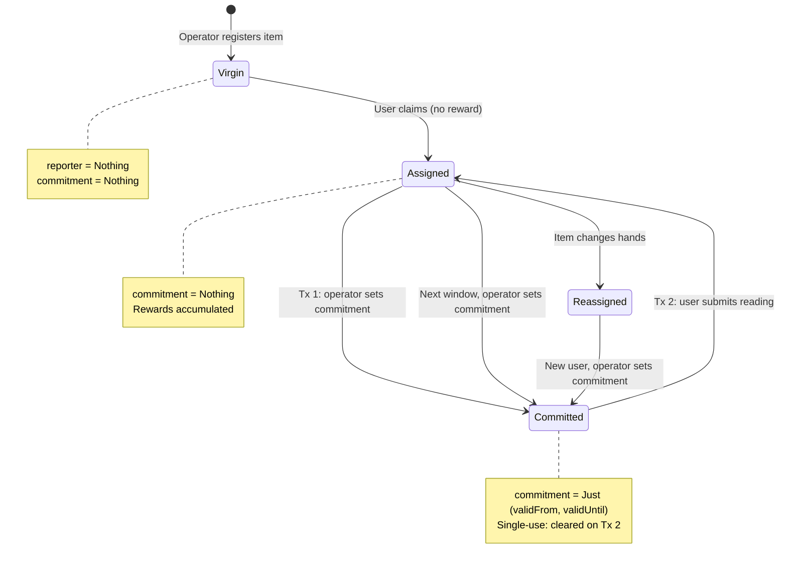
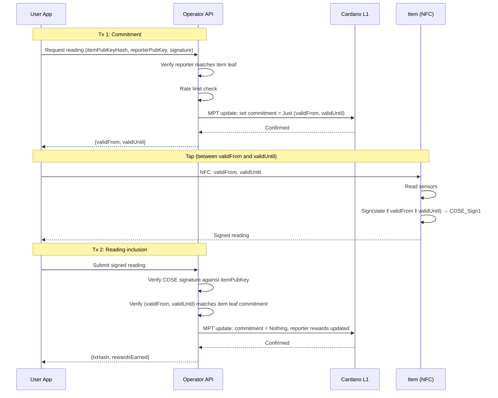
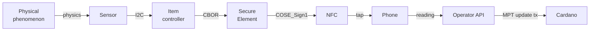

# Signed Sensor Readings Protocol

## The pattern

Any physical product with at least one sensor and a secure element can produce cryptographically signed readings that are verifiable on Cardano. The protocol is not specific to any product category — batteries are the first application because the [Battery Regulation](../regulation.md) creates the regulatory demand.

The foundational assumption: **the user is the transport layer**. The item has no internet connection. The user has physical access to the item and an incentive (reward) to carry signed readings from the item to the chain.

## Components

| Component | Role | Product-agnostic? |
|-----------|------|-------------------|
| **Sensor(s)** | Measures physical state (voltage, temperature, pressure, depth, humidity, vibration...) | Sensor type varies by product |
| **Secure element** | Holds private key, signs readings (ECDSA) | Yes — same chip for any product |
| **NFC interface** | Delivers signed reading to user's phone, powered by NFC field | Yes — same chip for any product |
| **COSE_Sign1 envelope** | Signing format ([RFC 9052](../../references.md#rfc9052)) | Yes — standard envelope |
| **CBOR payload** | Structured reading data ([RFC 8949](../../references.md#rfc8949)) | Schema varies by product |
| **Operator MPT** | Merkle Patricia Trie holding item registry + reporter rewards | Yes — same MPFS infrastructure |
| **Operator reward tokens** | Native tokens redeemable with the operator | Yes — same minting pattern |

The **only product-specific part** is the CBOR payload schema — which fields, which units, which plausibility checks. Everything else is reusable.

## Hardware: signing module

Two chips on the item's board, connected via I2C:

| Chip | Role | Cost (1M vol) |
|------|------|--------------|
| NXP NTAG 5 Link | NFC interface, I2C master, energy harvesting | $0.35 |
| Infineon OPTIGA Trust M | Secure element, ECDSA-P256, pre-provisioned keys | $0.40 |
| NFC antenna + passives | | $0.06 |
| **Total** | | **$0.81** |

The module is powered entirely by the phone's NFC field. No battery, no internet, no wiring beyond I2C to the item's existing sensor bus.

See [NFC Hardware](../sectors/batteries/nfc-hardware.md) for the detailed bill of materials, energy budget analysis, and alternative chip options.

## Data model

The operator's MPT contains two types of leaves, distinguished by their key.

### Item leaf

```
-- MPT key: hash(itemPubKey)

ItemLeaf {
  schemaVersion   : Integer
  metadata        : ByteString            -- product-specific (battery model, tyre DOT, etc.)
  reporter        : Maybe ReporterAssignment
  commitment      : Maybe Commitment      -- set by operator (Tx 1), cleared on reading (Tx 2)
}

Commitment {
  validFrom       : Integer               -- slot: reading accepted from this slot
  validUntil      : Integer               -- slot: reading rejected after this slot
}

ReporterAssignment {
  reporterPubKey  : ByteString
  nextReward      : Integer               -- reward for the next reading (always > 0)
}
```

### Reporter leaf

```
-- MPT key: hash(reporterPubKey)

ReporterLeaf {
  rewardsAccumulated : Integer
}
```

### Lifecycle



| Step | What happens | Tx? | Who pays? |
|------|-------------|-----|-----------|
| **Registration** | Item leaf created: `reporter = Nothing, commitment = Nothing` | Yes (MPT insert) | Operator |
| **Assignment** | `reporter = Just { pubKey, reward }` | Yes (MPT update) | Operator |
| **Tx 1: Commitment** | `commitment = Just (validFrom, validUntil)` | Yes (MPT update) | Operator |
| **Tx 2: Reading** | `commitment = Nothing`, reporter leaf rewards updated | Yes (MPT update) | Operator |
| **Transfer** | `reporter` changed to new user's key | Yes (MPT update) | Operator |

Key properties:

- **Virgin items** have no reporter and no commitment.
- **Assignment pays nothing** — the user is registering as reporter, not earning.
- **Every reading pays** — `nextReward` is always > 0.
- **Rewards belong to the reporter, not the item** — old reporter keeps accumulated rewards on transfer.
- **Commitment is single-use** — created in Tx 1, cleared in Tx 2. Cannot be reused.
- **Commitment has a validity window** — `validFrom ≤ currentSlot ≤ validUntil`. Outside this range it's inert even if still in the leaf.
- **Rate limiting** — the operator decides when to create the next commitment. A burned commitment (never consumed) just sits inert until the operator overwrites it with the next one.

## Reward tokens

Rewards are **operator-issued native tokens**, not ADA.

| Property | Design |
|----------|--------|
| **Issuer** | The operator (manufacturer/brand) |
| **Value** | Defined by operator (e.g., "10 tokens = free service", "50 tokens = €5 discount on next purchase") |
| **Accumulation** | Tracked in `ReporterLeaf.rewardsAccumulated` — no on-chain token movement to user |
| **Redemption** | Off-chain, at point of sale — user proves ownership of reporter key, operator checks accumulated balance |

The user never holds on-chain tokens or ADA. Rewards are a counter in the MPT, redeemable by proving ownership of the reporter key.

## User identity: no wallet needed

The user needs only a **key pair** — generated in the phone app, never touches the chain as a UTxO.

| What the user has | Where it lives |
|-------------------|---------------|
| Key pair (public + private) | Phone app |
| Reporter public key registered in item leaf | On-chain (in operator's MPT) |
| Accumulated rewards | On-chain (in operator's MPT, reporter leaf) |

The user has **no UTxOs, no ADA, no tokens**. The operator pays all transaction fees.

Redemption is off-chain: the user signs a message with their reporter key, the operator verifies it and checks the on-chain `rewardsAccumulated` balance.

## The protocol (cooperative path)

Two transactions per reading, both paid by the operator. The user pays nothing.



### What each transaction does

**Tx 1 — Commitment (operator → chain):**

- Consumes operator's MPT UTxO (old root)
- Produces operator's MPT UTxO (new root) with `commitment = Just (validFrom, validUntil)` in the item leaf
- Cost: ~0.2 ADA tx fee, 0 locked ADA

**Tx 2 — Reading inclusion (operator → chain):**

- Consumes operator's MPT UTxO (old root)
- Produces operator's MPT UTxO (new root) with:
    - Item leaf: `commitment = Nothing`
    - Reporter leaf: `rewardsAccumulated += nextReward` (insert if first reading)
- Cost: ~0.2-0.3 ADA tx fee, 0 locked ADA

### What the commitment prevents

The commitment binds the reading to a specific time window. Without it, a user could:

- Tap the item today (good state), hold the signed reading, submit it months later (item degraded)
- The signed reading would still be valid because the item key signed it

With the commitment:

- The item signs `(validFrom, validUntil, state)` — binding the reading to a specific window
- The validator checks: COSE payload `validFrom` and `validUntil` match the commitment in the leaf
- The validator checks: `validFrom ≤ currentSlot ≤ validUntil`
- Tx 2 clears the commitment — the reading cannot be submitted twice
- A reading from a different window fails because the slots don't match the leaf

### Single-use guarantee

The commitment is single-use by construction:

1. **Tx 1** creates it (`Nothing → Just (validFrom, validUntil)`)
2. **Tx 2** destroys it (`Just (validFrom, validUntil) → Nothing`)

Between Tx 1 and Tx 2, exactly one reading can be submitted. After Tx 2, the commitment is gone. A second tap produces a signed reading that references a commitment no longer in the leaf — the validator rejects it.

### Burned commitment

If the user requests a commitment (Tx 1) but never submits a reading, the commitment sits in the leaf past `validUntil`. It's inert — no reading can use it because `currentSlot > validUntil`. The operator simply sets a new commitment when the next reading is due. No cleanup needed — the old commitment is overwritten.

The operator's only cost for a burned commitment is the wasted Tx 1 fee (~0.2 ADA). No ADA is locked.

## Cost per reading

| | Per reading | Notes |
|-|-------------|-------|
| **Tx fees** | ~0.4-0.5 ADA (~$0.10-0.13) | 2 transactions, operator pays both |
| **Locked ADA** | 0 | No separate UTxOs, MPT UTxO is permanent |
| **Reward cost** | Operator-defined tokens | Not ADA — loyalty points redeemed at next purchase |

### At scale

| Items | Reading frequency | Readings/year | Annual tx fees |
|-------|------------------|---------------|---------------|
| 1,000 | Monthly | 12,000 | ~6,000 ADA (~$1,500) |
| 10,000 | Monthly | 120,000 | ~60,000 ADA (~$15,000) |
| 100,000 | Monthly | 1,200,000 | ~600,000 ADA (~$150,000) |
| 1,000,000 | Monthly | 12,000,000 | ~6,000,000 ADA (~$1,500,000) |

For a €50 item over a 5-year lifetime with monthly readings: 60 readings × ~$0.12 = **~$7 in tx fees**. That's ~14% of the item price. Acceptable for high-value items (batteries, commercial tyres), challenging for low-value items.

!!! note "Future optimization"
    [CIP-118](../../references.md#cip118) (nested transactions, expected H1-H2 2026) would allow batching multiple readings into a single top-level transaction, significantly reducing per-reading fees. L2 solutions (Hydra) could reduce costs further but introduce operational complexity. These are future design options, not current protocol requirements.

## On-chain validator

The reading validator checks the MPT transition:

```
ReadingValidator (Aiken):

  Redeemer: SubmitReading {
    coseSign1        : ByteString     -- COSE_Sign1 from item
    itemProof        : MerkleProof    -- item leaf exists
    reporterProof    : MerkleProof    -- reporter leaf exists (or insert proof if first reading)
    updatedItemLeaf  : ItemLeaf       -- new item leaf value
    updatedReporter  : ReporterLeaf   -- new reporter leaf value
    mptTransition    : MerkleProof    -- proves old root → new root with both updates
  }

  Validation:

  -- Commitment
  1. Item leaf has commitment = Just (validFrom, validUntil)
  2. COSE payload fields validFrom and validUntil match the leaf commitment
  3. validFrom ≤ currentSlot ≤ validUntil

  -- Item signature
  4. itemProof verifies leaf exists under current MPT root
  5. COSE_Sign1 signature valid against itemPubKey (the MPT key)

  -- Reporter authorization
  6. Item leaf has reporter = Just assignment
  7. Transaction signed by assignment.reporterPubKey

  -- Leaf transitions
  8. updatedItemLeaf.commitment = Nothing (cleared — single use)
  9. updatedItemLeaf.reporter.reporterPubKey unchanged
  10. Reporter key = hash(assignment.reporterPubKey)
  11. If first reading: reporter leaf is MPT insert (rewardsAccumulated = assignment.nextReward)
  12. If subsequent: updatedReporter.rewardsAccumulated = old + assignment.nextReward

  -- MPT
  13. mptTransition proves old root → new root with both leaf updates
  14. Operator output UTxO has new root hash

  -- Product-specific
  15. CBOR payload conforms to schemaVersion
  16. Plausibility checks per product type
```

## Signing format: COSE_Sign1

Every signed reading is a [COSE_Sign1](../../references.md#rfc9052) structure — the same signing envelope used in the EU Digital COVID Certificate, mobile driving licences (ISO 18013-5), and WebAuthn/FIDO2.

```
COSE_Sign1 = [
  protected   : bstr,    -- { 1: -7 } = ES256
  unprotected : {},
  payload     : bstr,    -- CBOR-encoded sensor reading
  signature   : bstr     -- ECDSA-P256 signature
]
```

### Payload structure

```cbor-diagnostic
{
  1: h'...',           -- item_id (item public key hash, ByteString)
  2: 142857000,        -- valid_from (slot, from commitment)
  3: 142900000,        -- valid_until (slot, from commitment)
  4: { ... },          -- state (sensor readings — schema varies by product)
  5: 1                 -- schema_version (unsigned int)
}
```

The item signs over `(itemPubKey, validFrom, validUntil, state, schemaVersion)`. The validator checks fields 2 and 3 match the commitment in the leaf and that `currentSlot` is within range.

Fields 1-3 and 5 are the same for every product. Field 4 (state) is product-specific:

| Product | Field 3 contents |
|---------|-----------------|
| Battery | SoH, SoC, cycle count, voltage, current, temperature, cell voltages |
| Tyre (commercial) | Tread depth, casing condition, retread count |
| Cold chain | Temperature history, humidity |
| Industrial equipment | Vibration signature, operating hours |

CBOR with deterministic encoding (RFC 8949 §4.2) — integer-only values, integer keys, no floats. See [Battery Payload Standard](../sectors/batteries/payload-standard.md) for the complete battery-specific schema.

## Trust chain



| Link | Trust basis | Weakness |
|------|------------|----------|
| Phenomenon → Sensor | Physics | Sensor failure or physical tampering |
| Sensor → Controller | I2C bus on PCB | Compromised firmware could substitute readings |
| Controller → SE | I2C, CBOR format | SE signs whatever controller gives it |
| SE → signature | Private key in tamper-resistant hardware | Key extraction (expensive, destructive) |
| Phone → Operator API | HTTPS | Operator could delay (see adversarial path below) |
| Operator → Cardano | Tx submission | Operator is the oracle — they control the MPT |

**Root of trust**: the secure element vendor's key provisioning process.

**Weakest link**: controller → SE boundary. Mitigated by schema validation, plausibility checks, and cross-referencing with independent measurements.

## Adversarial path

!!! warning "Open design problem"
    In the cooperative path, the operator controls the MPT and submits all transactions. If the operator refuses to process a valid reading, the user currently has no on-chain recourse — the operator is the oracle for their own MPT.

    Possible future approaches:

    - **MPFS request mechanism**: user creates a request UTxO that the operator is contractually obligated to process (locks ~1.5 ADA until processed)
    - **Timeout escalation**: if the operator doesn't process a request within N slots, the user can trigger a penalty or move to a different operator
    - **CIP-118 nested transactions**: user creates a sub-transaction that any batcher can wrap, removing the need for operator cooperation

    This is deferred. The cooperative path is sufficient for the initial design where operators have a business incentive to process readings (they need the data for DPP compliance).

## Future: CIP-118 (nested transactions)

[CIP-118](../../references.md#cip118) introduces **nested transactions** in the Dijkstra ledger era. Actively being implemented — CIP merged January 2026, ledger code landing Q1-Q2 2026.

With CIP-118, the user could create a sub-transaction containing the signed reading, and any batcher (operator or third party) wraps it in a top-level transaction providing ADA. A [CIP-112](../../references.md#cip112) guard script enforces the terms. This would eliminate the need for operator cooperation on the submission side, though the commitment phase still requires the operator to update their MPT.

## Applicability

This protocol is foundational for signing IoT sensor data wherever:

- A physical item has at least one sensor
- A secure element can be added (~$0.81)
- A user has physical access and an incentive to report
- The reading needs to be verifiable and timestamped

Batteries are the first concrete application. The protocol is product-agnostic — the only adaptation for a new product category is defining the CBOR payload schema (field 3) and the associated plausibility checks.
