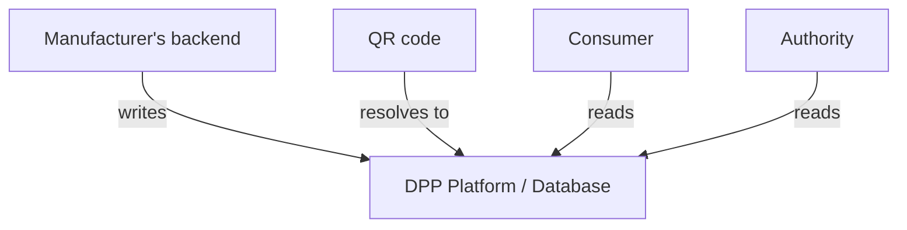
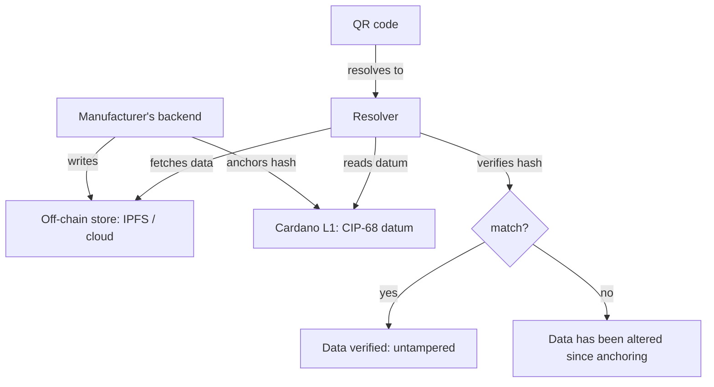

# Passport State

## What is the state?

The battery passport state is the complete set of data fields defined in Annex XIII of Regulation 2023/1542. It divides into:

| Category | Examples | Changes? | Source |
|----------|----------|----------|--------|
| **Product identity** | Manufacturer, model, chemistry, serial number | Never | Manufacturer (at production) |
| **Carbon footprint** | kgCO2e/kWh, performance class, LCA study | Once (declared) | Manufacturer (LCA process) |
| **Recycled content** | % cobalt, lithium, nickel, lead from recycled sources | Once (declared) | Manufacturer (supply chain) |
| **Material composition** | Hazardous substances, critical raw materials | Never | Manufacturer (at production) |
| **Performance specs** | Rated capacity, voltage, energy density | Never | Manufacturer (at production) |
| **Dynamic performance** | SoH, capacity fade, cycle count, energy throughput | **Continuously** | BMS (hardware in the battery) |
| **Status** | Original / Repurposed / Remanufactured / Waste | **On events** | Economic operator (decision) |
| **Due diligence** | Supply chain audit reports | Periodically | Manufacturer / auditor |
| **Conformity** | CE marking, test certificates | Once | Notified body / manufacturer |

Most of the passport is **write-once at manufacturing**. The part that changes is:

1. **BMS-sourced telemetry** → dynamic performance data (SoH, cycles)
2. **Lifecycle events** → status changes, ownership transfers, maintenance, end-of-life

## Who changes the state and how?

### Event 1: Manufacturing (passport creation)

```
Actor:   Manufacturer
Trigger: Battery produced and tested
Data:    All static fields + initial SoH (100%)
```

The manufacturer's production system generates the complete initial passport and assigns the unique identifier. This is the only moment where the bulk of the data is written.

### Event 2: Daily SoH updates (telemetry)

```
Actor:   BMS → Vehicle telematics → Manufacturer's cloud
Trigger: Continuous (aggregated daily per Recital 46)
Data:    SoH, remaining capacity, cycle count, energy throughput
```


The BMS is the **hardware source of truth**. It doesn't know about passports — it just measures the battery. The vehicle's telematics system relays readings to the manufacturer's cloud, which processes them into passport-compatible format.

**Who is the actor?** The manufacturer's automated backend. No human is involved. It's a pipeline: `BMS → telematics → cloud → passport store`.

**How often?** The regulation says "at least daily." In practice, telematics systems typically report on every drive cycle or on a fixed interval (hours). The manufacturer's backend aggregates and publishes.

### Event 3: Service / maintenance

```
Actor:   Authorized service provider (delegated by manufacturer)
Trigger: Customer brings battery/vehicle for service
Data:    Maintenance record, parts replaced, diagnostic results
```

The service provider logs the event in the manufacturer's dealer management system, which propagates to the passport backend. The service provider doesn't directly write to the passport — they write to the manufacturer's system, which updates the passport.

### Event 4: Sale / ownership transfer

```
Actor:   Seller and buyer (mediated by manufacturer's system)
Trigger: Battery or vehicle changes hands
Data:    Operator information field updated
```

The regulation requires the passport to reflect the current "economic operator." On a private sale, the new owner registers with the manufacturer (like registering a vehicle). The manufacturer's backend updates the passport.

### Event 5: Repurposing (new passport)

```
Actor:   New economic operator (repurposing company)
Trigger: Battery removed from original application for second-life use
Data:    NEW passport created, linked to original
```

This is the only event where **a different party creates a passport**. The repurposing operator becomes the new economic operator and must:

1. Create a new passport for the repurposed battery
2. Link it to the original passport
3. Take over responsibility for keeping it up-to-date

The original passport is not deleted — it becomes historical.

### Event 6: End of life

```
Actor:   Waste operator / recycler
Trigger: Battery declared waste
Data:    Status → Waste, then material recovery data
```

### Event 7: Recycling (passport cessation)

```
Actor:   Recycler
Trigger: Battery has been recycled
Data:    Passport ceases to exist (Art. 77(6b))
```

## Where is the state stored?

The regulation does not prescribe a storage technology. It requires:

- Accessible via QR code
- Data accurate, complete, up-to-date
- Tiered access (public / restricted / authority)
- Available for the battery's lifetime
- Independent third-party backup (even if manufacturer goes bankrupt)

### Without blockchain



The manufacturer controls the data. They can alter historical records. The third-party backup requirement mitigates this, but doesn't prevent manipulation before backup.

### With Cardano



Cardano adds one thing: **tamper evidence**. The hash anchored on-chain at time T proves the passport data existed in that exact form at time T. If the manufacturer later alters the off-chain data, the hash won't match.

This matters for:

- **Used battery buyers**: verifying that the SoH history hasn't been inflated
- **Authorities**: auditing that data wasn't changed after the fact
- **Insurance**: confirming battery condition at a specific date
- **Disputes**: proving what the passport said at any point in time

## State summary

| Event | Actor | Trigger | Frequency | What changes |
|-------|-------|---------|-----------|-------------|
| Creation | Manufacturer | Production | Once | Everything (initial state) |
| SoH update | Manufacturer backend (from BMS) | Automated | Daily | Dynamic performance |
| Service | Service provider → manufacturer | Per visit | Occasional | Maintenance log |
| Ownership transfer | Seller/buyer → manufacturer | Per sale | Rare | Operator info |
| Repurposing | New operator | Business decision | Once | New passport (linked) |
| End of life | Waste operator | Declaration | Once | Status → Waste |
| Recycling | Recycler | Completion | Once | Passport ceases |

**The manufacturer's backend is the single writer for the entire first life.** Other actors (service providers, BMS) feed data into the manufacturer's system, which is the sole entity that assembles and publishes the passport state. The blockchain anchor is downstream — it doesn't change who writes, it adds a verifiable timestamp to what was written.
