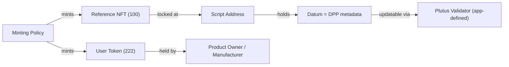

# On-Chain Storage

## Transaction metadata

Cardano transactions can carry arbitrary metadata as [CBOR](../references.md#cbor)-encoded key-value maps.

| Constraint | Value |
|-----------|-------|
| Max transaction size | 16,384 bytes (16 KB) |
| Max block size | 90,112 bytes (~90 KB) |
| Block time | 20 seconds |
| Max metadata string | 64 bytes (UTF-8) |
| Max metadata bytestring | 64 bytes (hex-encoded) |
| Min transaction fee | ~0.155 ADA |
| Fee per byte | ~0.000044 ADA |

All protocol parameters from [Cardano network documentation](../references.md#cardano-params). Values as of March 2026; subject to on-chain governance.

Metadata labels are registered via [CIP-10](../references.md#cip-10). Relevant existing labels:

| Label | Purpose |
|-------|---------|
| 620 | seedtrace.org supply chain tracing |
| 721 | CIP-25 NFT metadata |
| 867 | CIP-88 token policy registration |
| 1904 | Supply chain verification data |
| 21325 | PRISM Verifiable Data Registry |

A DPP-specific label would need to be registered.

## CIP-25 vs CIP-68

### [CIP-25](../references.md#cip-25) (immutable)

Metadata stored in the minting transaction under label 721. No smart contract required — uses Cardano's native multi-asset ledger. Simple and cheap, but **immutable after mint**.

Not suitable for DPP because passport data evolves over the product lifecycle (repairs, State of Health updates, ownership changes).

### [CIP-68](../references.md#cip-68) (updatable datum format)

CIP-68 is a **naming convention and datum format**, not a protocol or smart contract. It standardizes:

- **Token name prefixes** (per CIP-67): `100` for reference NFT, `222` for user NFT, `333` for FT, `444` for RFT
- **Datum shape**: `[metadata_map, version, extra]` — a CBOR-encoded triple
- **Lookup**: given a user token, strip its label prefix, prepend `100`, find the reference NFT UTxO, read its datum

CIP-68 does **not** standardize validator logic, minting policy constraints, update semantics, or any on-chain enforcement. Those are the application's responsibility.



- **Reference NFT** (prefix `100`): locked at a script address, holds the DPP metadata in its datum
- **User Token** (prefix `222`): held by the product owner/manufacturer, proves ownership

!!! warning "Scalability limitation"
    Each CIP-68 reference NFT requires a UTxO with a min-ADA deposit (~1.5-2 ADA) locked for the product's lifetime. At 1 million products, this means **1.5-2 million ADA locked** just in deposits, plus minting fees. For high-volume sectors (batteries at ~4-5M/year), individual CIP-68 tokens per product are prohibitively expensive. The [CF DPP Blueprint](../references.md#cf-dpp) addresses this with its High Throughput pattern, which batches thousands of products into a single Merkle tree root — **bypassing per-product CIP-68 tokens entirely**.

## Datum structure for DPP

Whether stored in a CIP-68 reference NFT (per-product) or a batch anchor UTxO (high throughput), the on-chain datum should be minimal — a hash anchor, not the full DPP:

```
DPPDatum {
  productId      : ByteString    -- GS1 GTIN or unique ID (omitted in batch mode)
  merkleRoot     : ByteString    -- SHA-256 root of full DPP data tree
  offChainUri    : ByteString    -- IPFS CID or resolver URI
  version        : Integer       -- schema version
  lastUpdated    : POSIXTime     -- last update timestamp
  issuerPkh      : PubKeyHash    -- issuer's public key hash
}
```

Full DPP data (materials, carbon footprint, conformity claims, etc.) lives off-chain on IPFS or enterprise storage. The Merkle root ensures tamper evidence.

## Solution patterns

The [Cardano Foundation DPP Blueprint](../references.md#cf-dpp) defines four patterns. CIP-68 is **one building block** used by some of these patterns — not the architecture itself. The patterns add the actual Aiken validators, Merkle tree logic, batching, and privacy layers that CIP-68 does not provide.

| Pattern | CIP-68 role | On-chain footprint | Cost |
|---------|-------------|-------------------|------|
| **Static Passport Anchor** | Optional (CIP-25 or CIP-68) | 1 UTxO per product | ~0.2 ADA/product |
| **Anchored Proof** | Reference NFT holds Merkle root | 1 UTxO per product, Merkle proof for selective disclosure | ~0.2 ADA/update |
| **Event Log** | Optional for identity token | Append-only datum updates with monotonic index | ~0.25 ADA/batch |
| **High Throughput** | **Not used** — batch Merkle root instead | 1 UTxO per ~10,000 products | ~0.3 ADA/1,000 products |

!!! note "Which pattern for which sector"
    - **Batteries** (item-level, dynamic SoH): Anchored Proof or Event Log — per-product CIP-68 tokens are justified because each battery has unique state, and the user token enables ownership transfer and reporting incentives.
    - **Tyres** (unknown granularity, mostly static): Static Passport Anchor if item-level, High Throughput if batch/model.
    - **Textiles** (batch/model, static): High Throughput — no per-product token needed. One Merkle root anchors an entire production batch.
