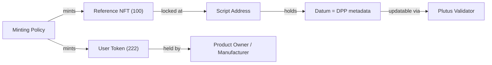

# On-Chain Storage

## Transaction metadata

Cardano transactions can carry arbitrary metadata as CBOR-encoded key-value maps.

| Constraint | Value |
|-----------|-------|
| Max transaction size | 16,384 bytes (16 KB) |
| Max block size | 90,112 bytes (~90 KB) |
| Block time | 20 seconds |
| Max metadata string | 64 bytes (UTF-8) |
| Max metadata bytestring | 64 bytes (hex-encoded) |
| Min transaction fee | ~0.155 ADA |
| Fee per byte | ~0.000044 ADA |

Metadata labels are registered via CIP-10. Relevant existing labels:

| Label | Purpose |
|-------|---------|
| 620 | seedtrace.org supply chain tracing |
| 721 | CIP-25 NFT metadata |
| 867 | CIP-88 token policy registration |
| 1904 | Supply chain verification data |
| 21325 | PRISM Verifiable Data Registry |

A DPP-specific label would need to be registered.

## CIP-25 vs CIP-68

### CIP-25 (immutable)

Metadata stored in the minting transaction under label 721. No smart contract required — uses Cardano's native multi-asset ledger. Simple and cheap, but **immutable after mint**.

Not suitable for DPP because passport data evolves over the product lifecycle (repairs, State of Health updates, ownership changes).

### CIP-68 (updatable)

Uses **two tokens**:



- **Reference NFT** (prefix `100`): locked at a script address, holds the DPP metadata in its datum
- **User Token** (prefix `222`): held by the product owner/manufacturer, proves ownership

The datum is **updatable** — the Plutus validator controls who can modify it and under what conditions. This is the standard recommended by the Cardano Foundation DPP working group.

## Datum structure for DPP

The on-chain datum should be minimal — a hash anchor, not the full DPP:

```
DPPDatum {
  productId      : ByteString    -- GS1 GTIN or unique ID
  merkleRoot     : ByteString    -- SHA-256 root of full DPP data tree
  offChainUri    : ByteString    -- IPFS CID or resolver URI
  version        : Integer       -- schema version
  lastUpdated    : POSIXTime     -- last update timestamp
  issuerPkh      : PubKeyHash    -- issuer's public key hash
}
```

Full DPP data (materials, carbon footprint, conformity claims, etc.) lives off-chain on IPFS or enterprise storage. The Merkle root ensures tamper evidence.

## Solution patterns

The Cardano Foundation DPP standards define four patterns:

| Pattern | Use case | Cost |
|---------|----------|------|
| **Static Passport Anchor** | Stable data, rare updates | ~0.2 ADA/product |
| **Anchored Proof** | Privacy-preserving certificates, Merkle proofs | ~0.2 ADA/update |
| **Event Log** | Append-only lifecycle history, batched events | ~0.25 ADA/batch |
| **High Throughput** | Enterprise scale, sub-second QR responses | ~0.3 ADA/1,000 products |
