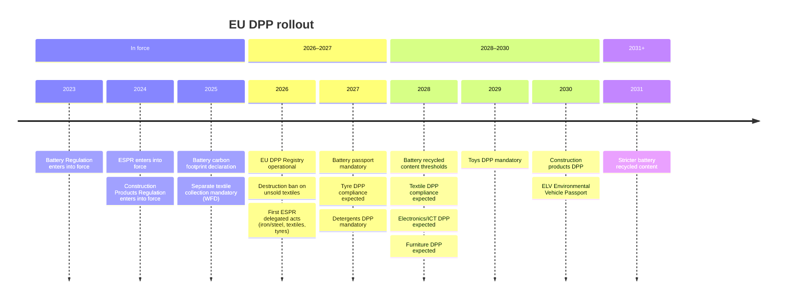

# EU Digital Product Passport on Cardano

Feasibility study for storing EU Digital Product Passports on the Cardano blockchain.

!!! warning "Scope and limitations"
    This is an **architectural exploration**, not compliance guidance. Three layers are clearly separated throughout:

    1. **Regulatory layer** — what the EU mandates (ESPR, Battery Regulation, delegated acts). Cited from EUR-Lex with specific articles.
    2. **Data model layer** — industry schemas (Battery Pass, UNTP, GS1). Not EU mandates — implementations aligned with regulatory requirements.
    3. **Technical implementation layer** — Cardano-specific architecture (MPFS, Aiken, did:prism). **None of this is mandated by any EU regulation.** The EU is technology-neutral.

    Do not use this study for compliance decisions without cross-checking against the [official regulation texts](references.md#eu-regulations).

## The EU DPP roadmap

The European Union is rolling out mandatory Digital Product Passports across virtually all physical products placed on its market. The [ESPR (EU) 2024/1781](references.md#reg-espr) provides the framework; sector-specific regulations and delegated acts define the details.

This study analyses three sectors with the earliest deadlines and deepest Cardano integration potential:

| Sector | Regulation | Deadline | Why it matters | This study |
|--------|-----------|----------|----------------|-----------|
| [**Batteries**](sectors/batteries/index.md) | [(EU) 2023/1542](references.md#reg-battery) | **Feb 2027** | First DPP ever mandated. Item-level. Dynamic SoH data. Strongest blockchain case. | [Regulatory drivers](sectors/batteries/index.md#why-the-eu-wants-to-trace-batteries) · [Architecture](sectors/batteries/architecture.md) |
| [**Tyres**](sectors/tyres/index.md) | ESPR delegated act | ~2027 | #1 microplastics source. 6PPD crisis. Retreading collapse. | [Regulatory drivers](sectors/tyres/index.md#why-the-eu-wants-to-trace-tyres) · [Granularity analysis](sectors/tyres/index.md#granularity-analysis) |
| [**Textiles**](sectors/textiles/index.md) | ESPR delegated act | ~2027-2028 | Forced labour. Greenwashing. Destruction ban. <1% recycling. | [Regulatory drivers](sectors/textiles/index.md#why-the-eu-wants-to-trace-textiles) · [Supply chain](sectors/textiles/index.md#supply-chain-traceability) |

For the full list of upcoming DPP mandates across all sectors, see the [DPP rollout timeline](timeline.md).

## What is a DPP

The Digital Product Passport is a structured data record linked to physical products via a data carrier (QR code, RFID, NFC). It is not a tracking device — it is a **regulatory compliance data infrastructure** that makes six other EU regulations enforceable at product level:

| Regulation | What it requires | DPP role |
|-----------|-----------------|----------|
| [ESPR](references.md#reg-espr) | Ecodesign requirements (durability, recyclability, carbon footprint) | Carries the data per product |
| [CSDDD](references.md#csddd) | Supply chain due diligence (human rights, environment) | Carries product-level evidence |
| [EUDR](references.md#reg-eudr) | Deforestation-free sourcing | Carries traceability to origin |
| [CBAM](references.md#cbam) | Carbon border adjustment for imports | Carries embedded carbon data |
| [Empowering Consumers](references.md#empowering-consumers) | Bans unsubstantiated green claims | Provides verifiable data |
| [WFD revision](references.md#wfd-revision) | EPR eco-modulation for textiles | Data substrate for fee differentiation |

## Why Cardano

The [MPFS infrastructure](references.md#mpfs) (Merkle Patricia Forestry Service) provides production-grade on-chain/off-chain support for per-operator Merkle Patricia Tries with Aiken validators. Each economic operator manages one trie; products are leaves. One on-chain UTxO per operator.

| Property | Benefit for DPP |
|----------|----------------|
| **eUTxO model** | One UTxO per operator — naturally maps to per-operator trie roots |
| **[MPFS](references.md#mpfs) on-chain validators** | Aiken validators verify MPT transition proofs in a single transaction |
| **[did:prism](references.md#did-prism-w3c)** | W3C DID method anchored on Cardano — operator identity |
| **Formal verification** | Aiken validators can be formally verified for compliance logic |
| **Low fees** | ~$18/year per operator for daily root updates (batteries); <$10/year for static sectors |

## Key findings

| Aspect | Assessment |
|--------|-----------|
| **Technical feasibility** | High — MPFS infrastructure, Aiken validators, did:prism cover all requirements |
| **Cost** | ~$18/year per battery operator (daily updates); <$10/year for tyres/textiles |
| **Scalability** | One UTxO per operator — millions of products as MPT leaves, no on-chain bloat |
| **EU compliance** | Technology-neutral regulation; adapter middleware needed for EU registry |
| **Ecosystem maturity** | Early-stage — MPFS is production-grade; DPP Blueprint is docs-only; LW3 is pre-product |

## Contents

**Sector studies** (regulatory drivers → data model → Cardano architecture):

- [Batteries](sectors/batteries/index.md) — critical raw materials, carbon footprint, second-life markets, consumer protection, safe recycling
- [Tyres](sectors/tyres/index.md) — microplastics, 6PPD chemicals, retreading, EUDR, durability, end-of-life
- [Textiles](sectors/textiles/index.md) — waste crisis, forced labour, greenwashing, destruction ban, environmental impact, EPR

**Cardano platform** (shared infrastructure):

- [Overview](cardano/overview.md) — architecture and rationale
- [On-chain storage](cardano/storage.md) — CIP-68, MPFS, datums
- [Access control](cardano/access-control.md) — Plutus validators, role tokens
- [Identity](cardano/identity.md) — did:prism, Identus, Verifiable Credentials
- [Cost analysis](cardano/costs.md) — per-product and at-scale economics
- [Scalability](cardano/scalability.md) — L1, Hydra L2, volume requirements
- [EU integration](cardano/eu-integration.md) — registry, GS1, UNTP
- [Existing work](cardano/existing-work.md) — MPFS, DPP Blueprint, Scantrust pilot

**EU DPP background:**

- [Regulation](regulation.md) — ESPR, Battery Regulation, related directives
- [Timeline](timeline.md) — full sector-by-sector rollout dates
- [Data model](data-model.md) — schemas and formats
- [Access & governance](access.md) — three-tier model, registry, enforcement
- [Pilots](pilots.md) — CIRPASS, Battery Pass, Catena-X
- [References](references.md) — all cited sources
