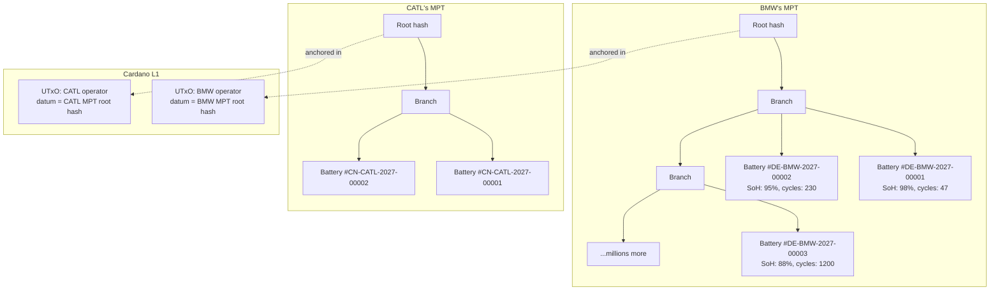
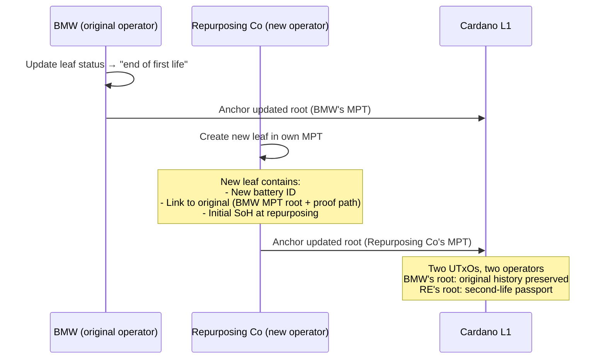
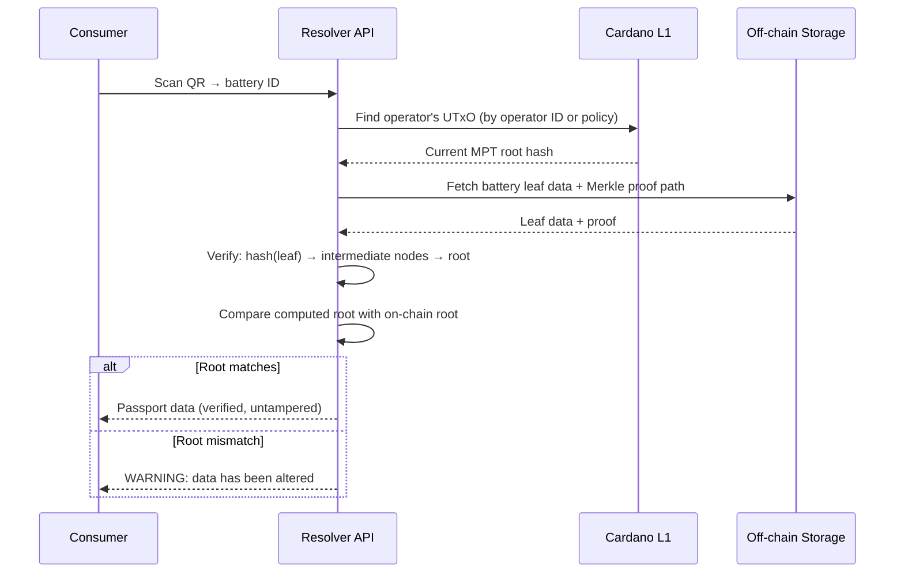
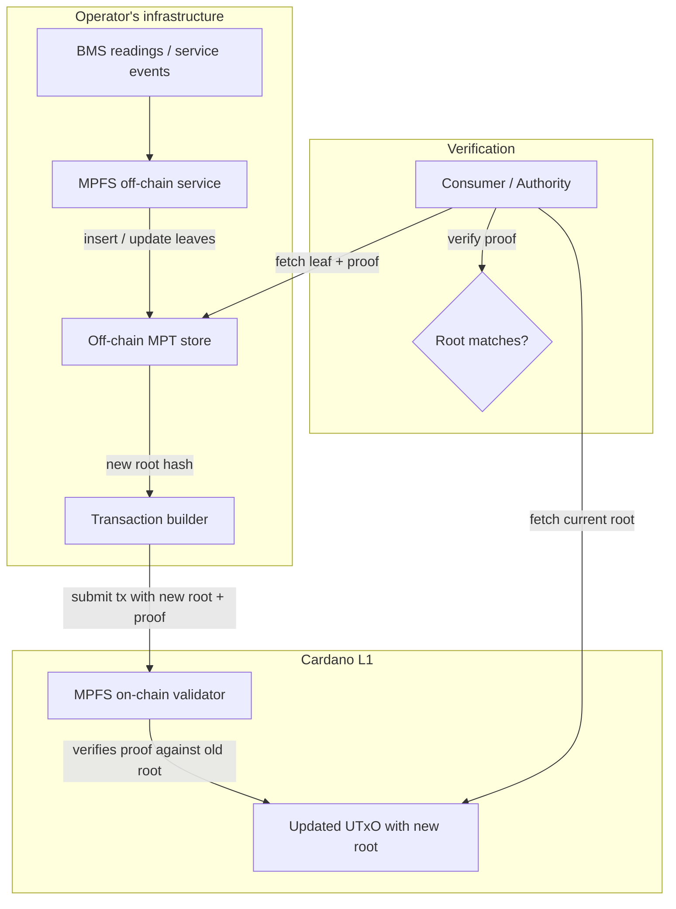
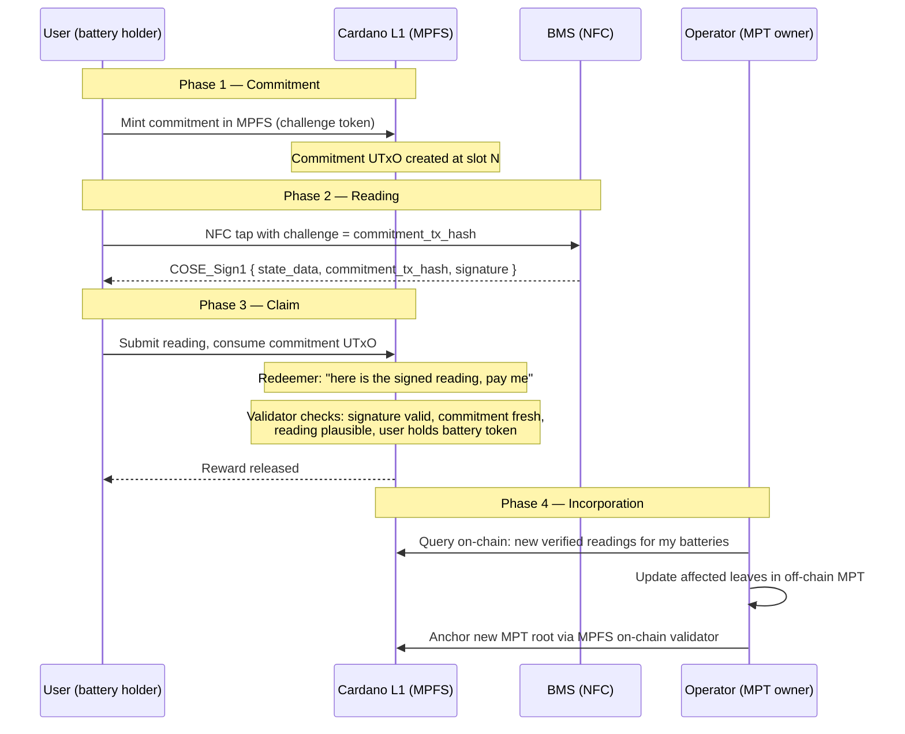
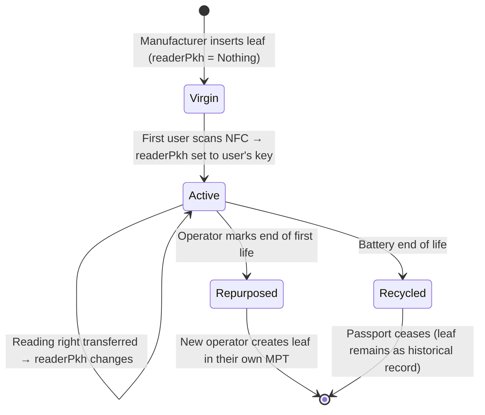

# Battery Passport Architecture

## Why not CIP-68 per battery

CIP-68 is a [datum format and naming convention](../../cardano/storage.md#cip-68-updatable-datum-format), not a scalable architecture. Each CIP-68 reference NFT requires its own UTxO with a min-ADA deposit (~1.5-2 ADA) locked for the battery's lifetime.

| Metric | CIP-68 per battery | Problem |
|--------|-------------------|---------|
| EU batteries/year | ~4-5M | 4-5M new UTxOs per year |
| Locked ADA | ~1.5-2 ADA × 4-5M = **6-10M ADA/year** | Capital locked indefinitely (batteries live 8-15 years) |
| Accumulated after 10 years | **60-100M ADA** locked in deposits | ~$15-25M at current prices, growing every year |
| UTxO set bloat | Millions of reference NFTs | Node memory and chain sync burden |

This is not viable. It treats the blockchain as a database, minting one row per battery.

## The model: one Merkle Patricia Trie per responsible operator

The [Battery Regulation Art. 77(4)](../../references.md#bat-art77-4) assigns responsibility to the **economic operator who places the battery on the EU market** — the manufacturer or importer. This operator is the single writer for the passport throughout its first life.

This maps directly to a **Merkle Patricia Trie (MPT) per operator**:



### On-chain footprint

| Resource | Per-battery CIP-68 | MPT per operator |
|----------|-------------------|-----------------|
| UTxOs on chain | 1 per battery (millions) | **1 per operator** (hundreds) |
| Locked ADA | ~1.5-2 ADA per battery | ~1.5-2 ADA per operator |
| Update cost | ~0.2 ADA per battery update | ~0.2 ADA per root update (any number of batteries) |
| Proof of specific battery | Read UTxO directly | Merkle proof: leaf → root |

A single UTxO per operator, containing the MPT root hash. Updating one battery's SoH means recomputing the path from that leaf to root and submitting the new root on-chain. Cost: one transaction, regardless of whether the operator manages 100 or 10 million batteries.

## Why MPT, not a plain Merkle tree

A plain Merkle tree is append-only — you can prove a leaf exists, but updating a leaf means rebuilding the tree. An MPT (also called Merkle Patricia Forestry in the Cardano ecosystem) supports:

| Operation | Plain Merkle Tree | Merkle Patricia Trie |
|-----------|------------------|---------------------|
| Insert new battery | Rebuild tree | Insert at key, update path to root |
| Update battery SoH | Rebuild tree | Update leaf, recompute path to root |
| Delete (recycling) | Not supported | Remove leaf, recompute path |
| Prove battery exists | Merkle proof (log n) | Merkle proof (log n) |
| Prove battery does NOT exist | Not possible | **Non-membership proof** |
| Key-based lookup | Not supported | Lookup by battery ID (key) |

The non-membership proof is important: an authority can ask "does this battery ID exist in BMW's trie?" and get a cryptographic proof that it doesn't — without revealing any other batteries. This is useful for market surveillance and anti-counterfeiting.

## How it maps to the regulation

### Responsibility = trie ownership

| Regulatory concept | MPT mapping |
|-------------------|------------|
| Economic operator places battery on market | Creates an MPT, anchors root on-chain |
| Legal responsibility for passport accuracy ([Art. 77(4)](../../references.md#bat-art77-4)) | Operator holds the signing key for the UTxO containing their root |
| Battery manufacturing (passport creation) | Insert new leaf into MPT |
| SoH update (daily) | Update leaf data, recompute root, anchor on-chain |
| Service / maintenance | Update leaf with maintenance event |
| Delegation to service provider | Service provider submits leaf update, operator recomputes root |

### Repurposing = new trie, new operator

When a battery is repurposed ([Art. 77(6)(a)](../../references.md#bat-art77-6a)), a new economic operator takes responsibility:



The original battery's history is preserved in BMW's trie (immutable — the old root hashes remain on-chain in the transaction history). The new passport in the repurposer's trie links back to the original via a reference to BMW's root hash and the Merkle proof path.

### Recycling = leaf removal

When a battery is recycled ([Art. 77(6)(b)](../../references.md#bat-art77-6b)), the recycler (if they have a role authorization) updates the leaf status to `Recycled`. The passport "ceases to exist" in regulatory terms, but the on-chain history of root hashes preserves the full audit trail.

## Verification flow

A consumer scans a battery's QR code. The resolver needs to prove the battery's passport data is authentic:



The consumer doesn't need a Cardano wallet or any blockchain knowledge. The resolver does the verification and presents the result.

## Operator identity

Each operator's UTxO is controlled by their signing key. The link between the on-chain UTxO and the real-world legal entity is established via:

- **[did:prism](../../cardano/identity.md)**: The operator's DID Document references their Cardano public key
- **EU DPP Registry**: The operator registers their DPP endpoint (which resolves through the Cardano adapter)
- **GS1 GLN**: The operator's Global Location Number links to their MPT via the resolver

The Aiken validator on the UTxO enforces that only the operator's key (or delegated keys) can update the root.

## Updates via MPFS

The [MPFS infrastructure](../../references.md#mpfs) already solves the trie update problem. The architecture splits into an off-chain service and on-chain validators:



- **Off-chain** ([`cardano-foundation/mpfs`](../../references.md#mpfs)): Haskell HTTP service managing the trie. Handles inserts, updates, deletes, proof generation, transaction building. The operator runs this as part of their passport backend.
- **On-chain** ([`cardano-foundation/cardano-mpfs-onchain`](../../references.md#mpfs-onchain)): Aiken validators that verify MPT transition proofs — given the old root, a proof, and the new root, the validator confirms the transition is valid. This is what locks the operator's UTxO.
- **Cage** ([`cardano-foundation/cardano-mpfs-cage`](../../references.md#mpfs-cage)): Language-agnostic specification of the validator logic with cross-language test vectors, ensuring off-chain and on-chain implementations agree.

### Update flow

1. Operator receives BMS readings / service events throughout the day
2. MPFS off-chain service updates affected leaves in the trie
3. At the chosen cadence (hourly, daily, per business cycle): the service computes the new root and builds a Cardano transaction
4. The on-chain validator verifies the MPT transition proof and accepts the new root
5. One transaction per batch, regardless of how many batteries were updated

At ~0.2 ADA per transaction, daily root updates for an operator with millions of batteries costs **~73 ADA/year** (~$18).

### Concurrent updates

MPFS handles multiple leaf modifications in a single batch natively — the off-chain service applies all mutations to the trie and produces one new root with one transition proof. No contention at the on-chain level because there is exactly one UTxO per operator.

## Signed readings and user incentives

The [challenge-response protocol](signed-bms.md) for signed BMS readings plugs into MPFS via a two-phase on-chain interaction:



### Why the operator incorporates readings

The operator (economic operator who placed the battery on the EU market) is **legally compelled** by [Art. 77(4)](../../references.md#bat-art77-4) to keep the passport accurate and up-to-date. They don't incorporate readings out of goodwill — they do it because:

- The regulation requires it
- The readings are already on-chain (verified, timestamped, signed by BMS hardware)
- Not incorporating them means their MPT diverges from the on-chain evidence
- Market surveillance authorities can compare the operator's MPT leaves against the on-chain reading submissions

The user provides data the operator needs but can't easily obtain (especially for non-connected batteries). The smart contract guarantees the reward. The regulation guarantees incorporation.

### Reward funding

The operator pre-funds a reward pool locked at the MPFS contract address. Each valid reading submission releases a reward to the user. The operator controls:

- Reward amount per reading
- Minimum interval between readings for the same battery
- Which batteries are eligible (all in their MPT, or a subset)

## Reading rights as MPT leaf state

Ownership of the reading right — who is allowed to submit signed readings and claim rewards — is a field in the MPT leaf value, not a separate token. MPFS supports state transitions on leaf values, so transferring the reading right is just another transition on the battery's key.

### Leaf value structure

```
BatteryLeaf {
  batteryId       : ByteString    -- unique battery identifier
  status          : Status        -- Virgin | Active | Repurposed | Recycled
  readerPkh       : Maybe PubKeyHash  -- who can submit readings (Nothing = unclaimed)
  bmsPublicKey    : ByteString    -- registered at manufacturing
  lastSoH         : Integer       -- last known State of Health
  lastCycleCount  : Integer       -- last known cycle count
  lastReadingSlot : Integer       -- slot of last accepted reading
  ...                             -- other passport fields
}
```

### Battery lifecycle through MPT transitions



| Transition | Who initiates | What changes in the leaf |
|-----------|--------------|------------------------|
| **Manufacturing** | Operator | Leaf inserted: status=Virgin, readerPkh=Nothing |
| **First scan** | User (NFC tap) | readerPkh set to user's public key hash |
| **Reading submission** | Current reader | lastSoH, lastCycleCount, lastReadingSlot updated |
| **Transfer reading right** | Current reader | readerPkh changes to new user's key |
| **Repurposing** | Operator | status → Repurposed; new operator creates new leaf in their MPT |
| **Recycling** | Operator | status → Recycled; readerPkh → Nothing |

### Why no separate token

The reading right lives in the MPT leaf because:

- **No locked ADA**: an MPT field costs nothing to maintain (unlike a CIP-68 UTxO with min-ADA deposit)
- **Atomic with passport data**: the reading right and the battery state are in the same leaf, updated in the same transition — no risk of them getting out of sync
- **Transfer is a state transition**: MPFS already handles leaf value transitions; transferring the reading right is just changing one field
- **Verification is a Merkle proof**: to prove you hold the reading right, provide a proof from your leaf to the operator's MPT root

### Transfer on resale

Rare for batteries (you typically don't resell an EV battery separately), but the mechanism exists for the general case. The current reader submits a transition that sets readerPkh to the new user's key. The MPFS on-chain validator verifies that the current reader signed the transaction.

## Open design questions

1. **Proof size at scale**: An MPT proof for a battery in a trie of 10M leaves needs benchmarking against MPFS's actual proof format. The theoretical size (~20 hash nodes, ~640 bytes) is well within limits but should be validated empirically.
