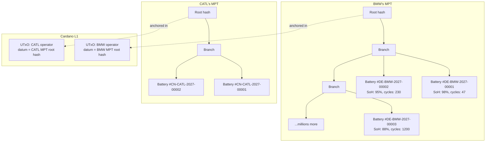
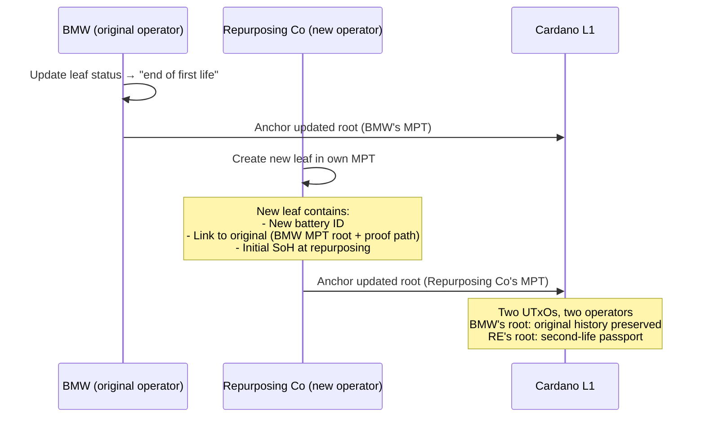
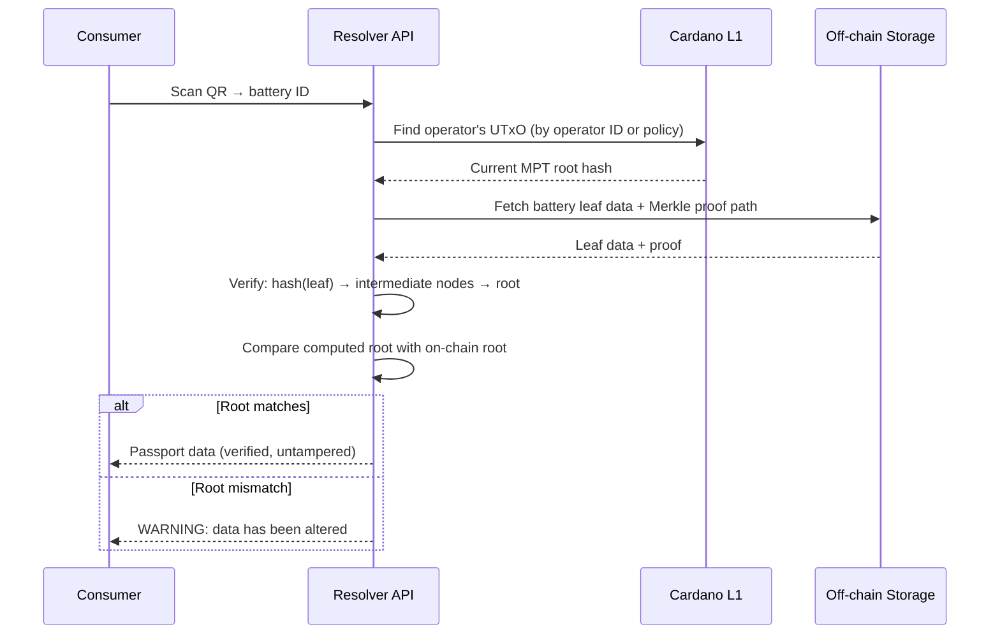

# Battery Passport Architecture

## Why not CIP-68 per battery

CIP-68 is a [datum format and naming convention](../../cardano/storage.md#cip-68-updatable-datum-format), not a scalable architecture. Each CIP-68 reference NFT requires its own UTxO with a min-ADA deposit (~1.5-2 ADA) locked for the battery's lifetime.

| Metric | CIP-68 per battery | Problem |
|--------|-------------------|---------|
| EU batteries/year | ~4-5M | 4-5M new UTxOs per year |
| Locked ADA | ~1.5-2 ADA × 4-5M = **6-10M ADA/year** | Capital locked indefinitely (batteries live 8-15 years) |
| Accumulated after 10 years | **60-100M ADA** locked in deposits | ~$15-25M at current prices, growing every year |
| UTxO set bloat | Millions of reference NFTs | Node memory and chain sync burden |

This is not viable. It treats the blockchain as a database, minting one row per battery.

## The model: one Merkle Patricia Trie per responsible operator

The [Battery Regulation Art. 77(4)](../references.md#bat-art77-4) assigns responsibility to the **economic operator who places the battery on the EU market** — the manufacturer or importer. This operator is the single writer for the passport throughout its first life.

This maps directly to a **Merkle Patricia Trie (MPT) per operator**:

### On-chain footprint

| Resource | Per-battery CIP-68 | MPT per operator |
|----------|-------------------|-----------------|
| UTxOs on chain | 1 per battery (millions) | **1 per operator** (hundreds) |
| Locked ADA | ~1.5-2 ADA per battery | ~1.5-2 ADA per operator |
| Update cost | ~0.2 ADA per battery update | ~0.2 ADA per root update (any number of batteries) |
| Proof of specific battery | Read UTxO directly | Merkle proof: leaf → root |

A single UTxO per operator, containing the MPT root hash. Updating one battery's SoH means recomputing the path from that leaf to root and submitting the new root on-chain. Cost: one transaction, regardless of whether the operator manages 100 or 10 million batteries.

## Why MPT, not a plain Merkle tree

A plain Merkle tree is append-only — you can prove a leaf exists, but updating a leaf means rebuilding the tree. An MPT (also called Merkle Patricia Forestry in the Cardano ecosystem) supports:

| Operation | Plain Merkle Tree | Merkle Patricia Trie |
|-----------|------------------|---------------------|
| Insert new battery | Rebuild tree | Insert at key, update path to root |
| Update battery SoH | Rebuild tree | Update leaf, recompute path to root |
| Delete (recycling) | Not supported | Remove leaf, recompute path |
| Prove battery exists | Merkle proof (log n) | Merkle proof (log n) |
| Prove battery does NOT exist | Not possible | **Non-membership proof** |
| Key-based lookup | Not supported | Lookup by battery ID (key) |

The non-membership proof is important: an authority can ask "does this battery ID exist in BMW's trie?" and get a cryptographic proof that it doesn't — without revealing any other batteries. This is useful for market surveillance and anti-counterfeiting.

## How it maps to the regulation

### Responsibility = trie ownership

| Regulatory concept | MPT mapping |
|-------------------|------------|
| Economic operator places battery on market | Creates an MPT, anchors root on-chain |
| Legal responsibility for passport accuracy ([Art. 77(4)](../references.md#bat-art77-4)) | Operator holds the signing key for the UTxO containing their root |
| Battery manufacturing (passport creation) | Insert new leaf into MPT |
| SoH update (daily) | Update leaf data, recompute root, anchor on-chain |
| Service / maintenance | Update leaf with maintenance event |
| Delegation to service provider | Service provider submits leaf update, operator recomputes root |

### Repurposing = new trie, new operator

When a battery is repurposed ([Art. 77(6)(a)](../references.md#bat-art77-6a)), a new economic operator takes responsibility:

The original battery's history is preserved in BMW's trie (immutable — the old root hashes remain on-chain in the transaction history). The new passport in the repurposer's trie links back to the original via a reference to BMW's root hash and the Merkle proof path.

### Recycling = leaf removal

When a battery is recycled ([Art. 77(6)(b)](../references.md#bat-art77-6b)), the recycler (if they have a role authorization) updates the leaf status to `Recycled`. The passport "ceases to exist" in regulatory terms, but the on-chain history of root hashes preserves the full audit trail.

## Verification flow

A consumer scans a battery's QR code. The resolver needs to prove the battery's passport data is authentic:

The consumer doesn't need a Cardano wallet or any blockchain knowledge. The resolver does the verification and presents the result.

## Operator identity

Each operator's UTxO is controlled by their signing key. The link between the on-chain UTxO and the real-world legal entity is established via:

- **[did:prism](../../cardano/identity.md)**: The operator's DID Document references their Cardano public key
- **EU DPP Registry**: The operator registers their DPP endpoint (which resolves through the Cardano adapter)
- **GS1 GLN**: The operator's Global Location Number links to their MPT via the resolver

The Aiken validator on the UTxO enforces that only the operator's key (or delegated keys) can update the root.

## Update batching

The operator doesn't need to update the on-chain root after every single battery change. They can batch:

1. Receive BMS readings / service events for many batteries throughout the day
2. Update affected leaves in the off-chain MPT
3. Once per day (or per hour, or per business cycle): anchor the new root on-chain

This means one transaction per batch period, regardless of how many batteries were updated. At ~0.2 ADA per transaction, daily root updates for an operator with millions of batteries costs **~73 ADA/year** (~$18).

## Open design questions

1. **MPT implementation**: The CF DPP standards repo mentions both Merkle Trees and Merkle Patricia Tries. The [Aiken MPT library](https://github.com/cardano-foundation/merkle-tree-java) needs evaluation for production readiness.
2. **Proof size**: An MPT proof for a battery in a trie of 10M leaves is ~20 hash nodes (log₂ of depth). At 32 bytes per node, that's ~640 bytes — well within a QR-scannable response but needs benchmarking for on-chain verification.
3. **Concurrent updates**: If the operator updates multiple batteries in the same batch, the MPT must handle concurrent modifications. This is a standard problem with well-known solutions (batch insert/update).
4. **Signed readings integration**: The challenge-response protocol for [signed BMS readings](signed-bms.md) still works — the signed reading is verified and then incorporated into the leaf data before the root update.
5. **Ownership transfer**: The CIP-68 user token concept for ownership transfer needs rethinking in the MPT model. One option: a separate thin token (not CIP-68) that the owner holds, pointing to the battery's key in the operator's MPT. Alternatively, ownership is tracked as a field in the leaf data.
