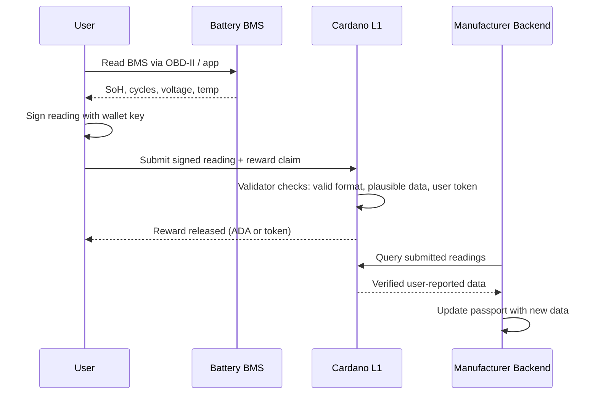
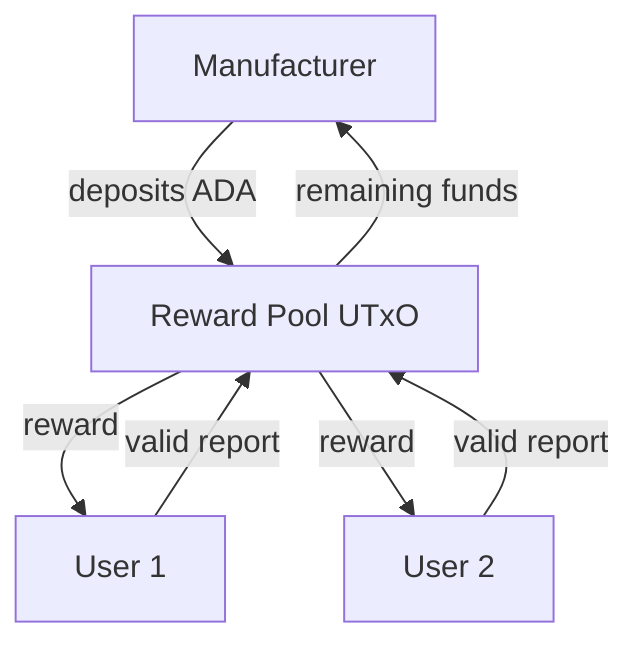

# User Reporting and Incentives

## The problem

The manufacturer is legally responsible for keeping the battery passport up-to-date ([Art. 77(4)](../references.md#bat-art77-4)). But after selling the battery, they have a practical problem: **they no longer have physical access to it**. The BMS contains the data they need, but the regulation doesn't specify how it reaches the passport.

Meanwhile, the user (vehicle owner, fleet operator) **has daily physical access to the battery** and a direct interest in its condition being accurately recorded.

## The opportunity

The manufacturer needs data. The user has the data. A Cardano smart contract can coordinate the exchange: **users report BMS readings and get rewarded for it**.



## Why this works

| Party | Has | Needs | Gets |
|-------|-----|-------|------|
| **Manufacturer** | Legal obligation, passport infrastructure | BMS data from batteries in the field | Fresh readings without running telematics |
| **User** | Physical access to battery, OBD-II port | Incentive to bother reading BMS | Reward (ADA, token, discount, warranty credit) |
| **Buyer (secondary market)** | Need to trust SoH claims | Verified, timestamped condition history | Confidence in purchase decision |

## How the user reports

[Article 14(2)](../references.md#bat-art14-2) requires manufacturers to grant read-only access to BMS data for the purchaser or any third party acting on their behalf — for assessing residual value, reuse, or repurposing. The regulation does not mandate a specific interface (such as OBD); the access method is left to the manufacturer. This means the user has a legal right to read BMS data.

Practical methods:

| Method | Equipment | User effort |
|--------|-----------|-------------|
| **OBD-II adapter + app** | ~€20-50 Bluetooth dongle | Plug in, open app, tap "report" |
| **Manufacturer's own app** | Phone + existing app | Open app, tap "report" (if manufacturer supports it) |
| **Workshop visit** | Nothing (workshop does it) | Passive — reading happens during service |
| **Charging session** | Compatible charger (ISO 15118) | Passive — reading happens during charge |

The lowest-friction option is an **OBD-II Bluetooth adapter + mobile app** that reads BMS parameters and submits them to the smart contract in one tap. The user doesn't need to understand Cardano — the app handles wallet management and transaction submission.

## Smart contract design

### Reporting contract

```
ReportingValidator:
  Datum:
    batteryId     : ByteString     -- links to the CIP-68 passport
    manufacturer  : PubKeyHash     -- who funds the reward pool
    rewardPerRead : Integer        -- ADA per valid submission
    minInterval   : POSIXTime      -- minimum time between reports
    lastReport    : POSIXTime      -- timestamp of last accepted report

  Redeemer: SubmitReading
    reading       : BatteryReading -- SoH, cycles, voltage, temp, timestamp
    userSignature : ByteString     -- signed by user's wallet key

  Validation:
    - Reading format is valid (all fields present, within plausible ranges)
    - Enough time has passed since last report (prevents spam)
    - User holds a valid "battery user" token (linked to this battery)
    - Reward pool has sufficient funds
    - Release reward to user
    - Update lastReport timestamp
```

### Plausibility checks

The validator can enforce basic physical constraints:

- SoH cannot increase between reports (batteries don't heal)
- Cycle count cannot decrease
- Voltage must be within chemistry-specific range (e.g., 2.5V-3.65V per cell for LFP)
- Temperature must be within operating range (-20°C to +60°C)
- Time between readings must be positive and reasonable

These don't prove the data is true, but they catch obvious fraud.

### Reward pool

The manufacturer pre-funds a reward pool locked at the contract address:



The manufacturer decides the reward amount and minimum reporting interval. A reasonable setup might be:

- 1-2 ADA per monthly reading (~€0.25-0.50)
- Minimum 7 days between reports
- Bonus for readings submitted near service milestones

## Trust model

A single user-reported BMS reading is no more trustworthy than the BMS itself — the user could manipulate it. But the system builds trust through **multiple independent signals**:

```mermaid
graph TD
    A[User BMS readings] -->|frequent, low cost| D[Passport Data]
    B[Workshop EIS verification] -->|periodic, high trust| D
    C[Charging session data] -->|passive, medium trust| D

    D --> E{Cross-reference}
    E -->|consistent| F[High confidence]
    E -->|anomalous| G[Flag for investigation]
```



| Data source | Trust level | Frequency | Cost |
|------------|------------|-----------|------|
| **User BMS report** | Low-medium (user-signed, plausibility-checked) | Monthly | Reward cost (~1-2 ADA) |
| **Workshop EIS** | High (independent measurement, certified) | Annually | Workshop fee |
| **Charging session** | Medium (third-party charger, ISO 15118) | Per charge | Free (passive) |
| **Fleet telematics** | Medium (fleet operator's system) | Continuous | Infrastructure cost |

No single source is fully trusted. But if user reports, workshop measurements, and charging data all agree, confidence is high. If a user-reported SoH suddenly diverges from charging session data, it's flagged.

## What Cardano adds

Without Cardano, the manufacturer runs a centralized reporting portal. Users submit data, manufacturer verifies and pays. The manufacturer controls everything — they could ignore reports, alter data, or stop paying.

With Cardano:

- **Reward is guaranteed by the smart contract** — the manufacturer cannot refuse to pay for a valid report
- **Reports are timestamped and immutable** — neither user nor manufacturer can alter historical submissions
- **Cross-referencing is transparent** — anyone can verify the consistency of reports
- **The manufacturer cannot selectively ignore unfavorable readings** — all valid submissions are on-chain
- **Multiple manufacturers can use the same contract** — creating a standard reporting protocol across the industry

## Broader implications

This model generalizes beyond batteries:

- **Tyre tread depth** reported by users via photo + measurement app
- **Appliance energy consumption** reported from smart meters
- **Textile condition** reported at resale (a stretch, but possible for high-value items)

The pattern is: **manufacturer needs field data, user has it, smart contract coordinates the exchange**. The DPP becomes not just a static record but a living dataset fed by its users.
