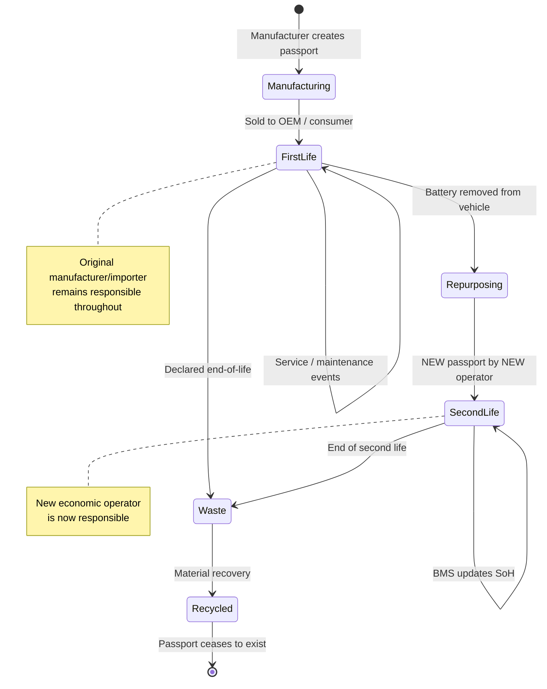
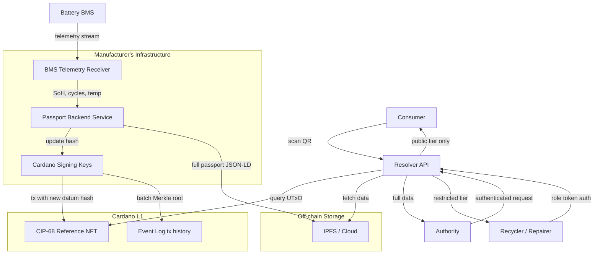
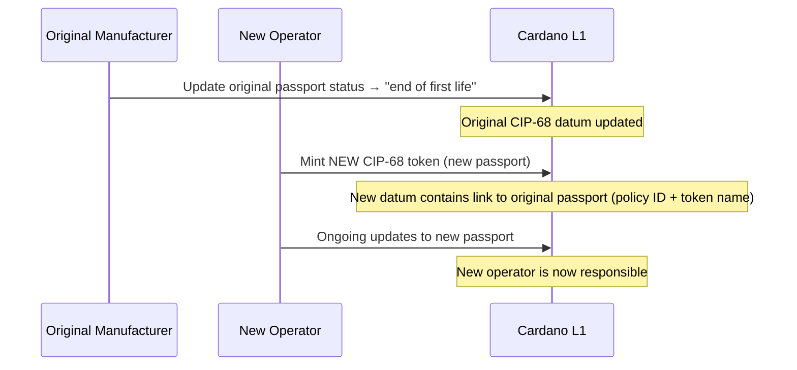

# Battery Passport Lifecycle

## Chain of responsibility

The [Battery Regulation](../../references.md#reg-battery) defines a clear chain of responsibility. The key insight: **the manufacturer/importer who placed the battery on the EU market remains legally responsible for the passport throughout the battery's entire first life** — even after selling it.

The consumer never has write access. They can only read public data via QR scan.

### Regulatory basis

[**Article 77(4)**](../../references.md#bat-art77-4): The economic operator must "ensure that the information in the battery passport is accurate, complete and up-to-date."

[**Recital 94**](../../references.md#bat-rec94): "the responsibility of compliance with the provisions for the battery passport should lie with the economic operator placing the battery on the market" — this persists even when the battery is in someone else's hands.

**Article 3(22):** An "economic operator" includes the manufacturer, importer, distributor, or any person placing the battery on the market. But only the **manufacturer or importer** can "place on the market" (Recital 10).

### The lifecycle

### Responsibility at each stage

| Stage | Responsible party | What they do |
|-------|------------------|-------------|
| **Manufacturing** | Manufacturer | Creates passport, assigns unique ID, affixes QR code |
| **First life (in use)** | Original manufacturer/importer | Keeps data accurate and up-to-date via BMS backend |
| **Service / maintenance** | Manufacturer (can delegate) | Authorized service providers update on manufacturer's behalf |
| **Repurposing** | **New economic operator** | Creates a **new** passport linked to the original |
| **Declared waste** | Producer responsibility org / waste operator | Responsibility transfers |
| **Recycling** | Recycler | Passport **ceases to exist** (Art. 77(6b)) |

### Key rules

- **Delegation, not transfer**: The manufacturer can authorize another operator "to act on their behalf" (Art. 77(4)), but legal responsibility stays with the manufacturer.
- **Repurposing = new product**: A repurposed battery is legally a new product and requires a **new** passport linked to the original (Art. 77(6a)).
- **Consumer = read, no write**: Consumers are in the "general public" access group. No write access — but the passport exists primarily **for them**. A buyer evaluating a used EV battery needs to verify SoH, cycle count, maintenance history, and carbon footprint to make an informed purchasing decision. The blockchain anchoring means this data is tamper-evident: the manufacturer cannot retroactively inflate SoH numbers to sell a degraded battery.
- **BMS feeds the passport**: The BMS records SoH/cycle data. The manufacturer's backend processes it and publishes to the passport. Recital 46: data should be "at least updated daily."
- **End**: "A battery passport shall cease to exist after the battery has been recycled" (Art. 77(6b)).

## Cardano architecture

The write side is manufacturer-operated. But the **read side is where the value lives** — the passport serves multiple audiences making real decisions:

| Actor | What they need from the passport | Why blockchain matters |
|-------|--------------------------------|----------------------|
| **Used battery buyer** | SoH, cycle count, maintenance history, remaining lifetime estimate | Manufacturer can't inflate numbers — data was anchored at a specific time |
| **Repurposing operator** | Detailed SoH curves, material composition, disassembly instructions | Verifiable provenance for second-life assessment |
| **Insurance company** | Battery condition, conformity declarations | Tamper-evident condition records |
| **Fleet manager** | SoH across all vehicles, predictive maintenance | Trusted data from multiple manufacturers in one view |
| **Market surveillance** | Due diligence, conformity, carbon footprint | Immutable audit trail |
| **Recycler** | Chemistry, hazardous substances, disassembly | Accurate material composition for safe processing |

### Actors and their interfaces

### Who holds what

| Actor | Holds | Cardano interaction |
|-------|-------|-------------------|
| **Manufacturer** | CIP-68 user token + signing keys | Submits update transactions, manages off-chain data |
| **Consumer** | Nothing | Scans QR → resolver API → reads public data |
| **Service provider** | Delegated signing key or role token | Submits updates on manufacturer's behalf |
| **New operator (repurposing)** | New CIP-68 user token (new passport) | Mints new passport linked to original |
| **Authority** | Authority credentials | Reads all data via API (no on-chain interaction needed) |
| **Recycler** | Role token | Reads restricted data, marks passport as ceased |

### Transfer on repurposing

When a battery is repurposed, it becomes a new product. On Cardano:

The original passport remains on-chain (immutable history). The new passport references it, preserving the full chain of custody.

### Passport cessation on recycling

When the battery is recycled, the recycler (holding a `DPP_RECYCLER` role token) submits a final transaction:

- Updates the CIP-68 datum status to `Waste` / `Recycled`
- Records material recovery data in the event log
- The passport is no longer "active" but the on-chain record persists as historical evidence

## Data flow: BMS to passport (open problem)

!!! warning "The regulation does not specify this"
    Article 14 requires the BMS to *contain* SoH data. Article 77 requires the passport to *have* SoH data. How data moves from one to the other is completely unspecified. See [Passport State](state.md) for the full analysis.

The data path depends entirely on the battery category and the manufacturer's infrastructure:

| Category | Realistic data path |
|----------|-------------------|
| Connected EVs | BMS → telematics → manufacturer cloud → passport |
| Non-connected EVs | BMS → diagnostic port → service visit → manual upload |
| E-bikes / scooters | BMS → Bluetooth/app? → manufacturer? → passport (unclear) |
| Industrial batteries | BMS → on-site diagnostic tool → manual upload |

For non-connected batteries, the passport may only be updated at discrete events (service visits, inspections, point of sale) rather than continuously.

### On-chain anchoring cadence

The on-chain datum only needs to be updated when the **hash of the off-chain data changes**. A practical cadence depends on how often data actually reaches the passport — which varies by category:

| Data type | Source | Realistic cadence | On-chain? |
|-----------|--------|------------------|-----------|
| SoH snapshot | BMS (however extracted) | Per data availability event | Hash anchor on-chain, full data off-chain |
| Cycle count | BMS | With SoH update | In off-chain data |
| Maintenance event | Service provider | Per visit | Event log batch |
| Ownership change | Sale transaction | Per sale | Datum update |
| Status change | Operator decision | Per event | Datum update |
