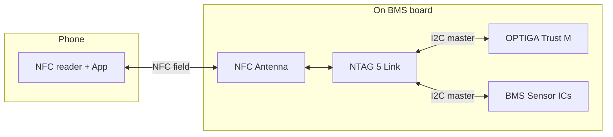
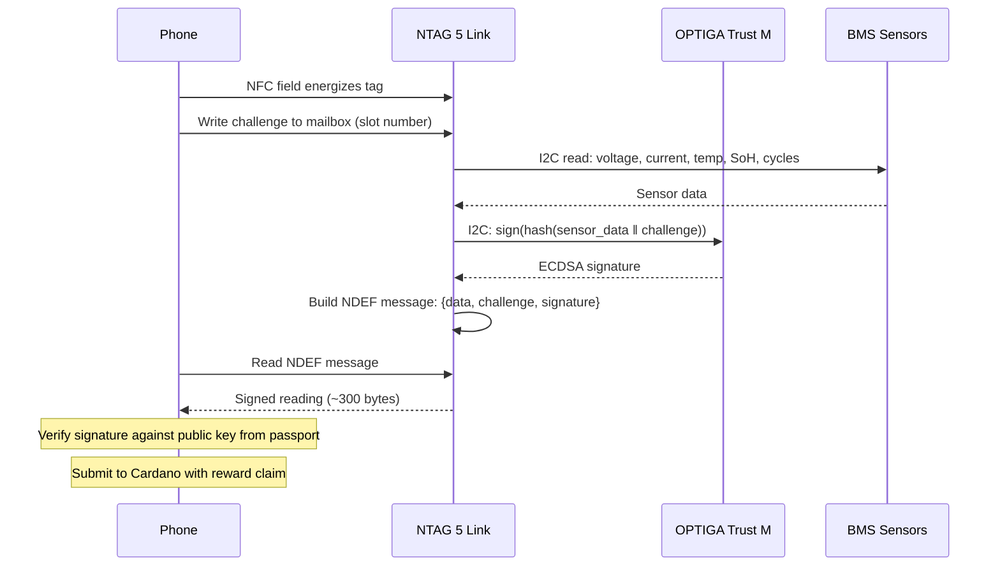

# NFC Hardware for Signed Readings

## Requirements

A standard hardware module that every BMS manufacturer adds to their board:

- **NFC interface** — user taps phone, no dongle needed
- **I2C master** — reads sensor data from the BMS bus
- **Secure element** — signs the reading with a private key
- **Passive power** — energized by the phone's NFC field, no battery needed
- **Standard protocol** — same for every battery, every manufacturer

## Recommended architecture

No single chip does all of this today. The cleanest solution is two chips on the same I2C bus:

| Component | Role | Why this one |
|-----------|------|-------------|
| [**NXP NTAG 5 Link**](../references.md#ntag5-link) (NT3H5111) | NFC interface + I2C master + energy harvesting | Only NFC tag with I2C master mode — can actively read sensors |
| [**Infineon OPTIGA Trust M**](../references.md#optiga-trust-m) | Secure element — ECDSA signing | Pre-provisioned keys, I2C slave |

## How a tap works

Total time from tap to signed reading: **200-500 ms**. The user holds their phone to the battery for under a second.

## Bill of materials

| Component | Description | 100k price | 1M price |
|-----------|------------|-----------|----------|
| [NXP NTAG 5 Link](../references.md#ntag5-link) (NT3H5111) | NFC Type 5 tag, I2C master, energy harvesting | ~$0.55 | ~$0.35 |
| [Infineon OPTIGA Trust M](../references.md#optiga-trust-m) | Secure element, ECDSA-P256, pre-provisioned keys | ~$0.60 | ~$0.40 |
| NFC antenna | Printed or etched on PCB, or external foil | ~$0.08 | ~$0.04 |
| Decoupling capacitor | 100µF, buffers energy harvest for crypto burst | ~$0.02 | ~$0.01 |
| Passives | Pull-ups, bypass caps | ~$0.02 | ~$0.01 |
| **Total** | | **~$1.27** | **~$0.81** |

!!! note "Pricing estimates"
    Component prices are approximate, based on distributor indicative pricing (Mouser/DigiKey) at the stated volumes. Actual production pricing depends on supply agreements and may differ.

For an EV battery BMS ($150-400, per [BatPaC](../references.md#batpac) model), this adds ~0.2-0.8% to the cost. For an e-bike BMS ($20-60), it adds ~1.3-6.4%.

## Energy budget

Everything is powered by the phone's NFC field via the NTAG 5 Link's energy harvesting output.

| Operation | Power | Duration | Energy |
|-----------|-------|----------|--------|
| NTAG 5 Link active | ~5 mW | 400 ms | 2 mJ |
| I2C sensor read | ~1 mW | 10 ms | 0.01 mJ |
| OPTIGA ECDSA sign | ~15 mW | 100 ms | 1.5 mJ |
| **Total** | | **~400 ms** | **~3.5 mJ** |

An NFC field typically delivers 15-30 mW to the tag. A 100µF capacitor at 3V stores 0.45 mJ, providing burst capacity for the ECDSA operation. The energy budget is tight but feasible — this is the same principle as contactless payment cards, which also perform ECDSA on harvested NFC power.

Using the **NTAG 5 Boost** variant (with boost regulator) provides a more stable voltage rail and higher harvest current, adding ~$0.10 to the BOM.

## Alternative: Infineon SECORA Blockchain

The [SECORA Blockchain](../references.md#secora-blockchain) chip (SLC37 family) combines NFC + secure element + ECDSA in a single package. It is used in [Tangem](../references.md#tangem) hardware wallet cards. The phone taps, the chip signs, done.

| Aspect | NTAG 5 + OPTIGA | SECORA Blockchain |
|--------|----------------|-------------------|
| Chips needed | 2 | 1 |
| ECDSA signing | Yes (via OPTIGA) | Yes (built-in) |
| NFC | Yes (NTAG 5) | Yes (built-in) |
| I2C bus master | Yes (NTAG 5 Link) | **No** |
| Can read BMS sensors | Yes | No — needs external bridge |
| Cost (100k) | ~$1.27 | ~$1.50 + bridge MCU |
| Passive powered | Yes | Yes |

The SECORA is a true single-chip NFC+SE but **cannot read sensors from the I2C bus**. It's designed as a standalone card element, not an embedded sensor interface. You'd still need an NTAG 5 Link or a small MCU to bridge the sensor data to it, making it more expensive and complex than the two-chip solution.

## What needs standardization

The hardware is available and cheap. What's missing is a **standard protocol** that every manufacturer implements:

1. **Signed reading format** — what fields, what serialization, what hash algorithm
2. **NFC command set** — how the phone sends the challenge and receives the response (NDEF message format)
3. **Key provisioning** — how the public key is registered in the battery passport at manufacturing
4. **Key algorithm** — secp256k1 (Cardano/Bitcoin compatible) or P-256 (NIST standard, more hardware support)
5. **Challenge format** — Cardano slot number, or a hash of recent block header

This could be:

- A **CIP** (Cardano Improvement Proposal) for the on-chain verification protocol
- An **industry standard** (ISO, SAE, or IEC) for the BMS-side protocol
- An **EU implementing act** mandating signed BMS readings as part of the battery passport

## Existing precedents

| Product | What it does | Chip | Relevance |
|---------|-------------|------|-----------|
| [Tangem](../references.md#tangem) wallet cards | NFC tap → ECDSA signature of transaction | [SECORA Blockchain](../references.md#secora-blockchain) | Same sign-on-tap pattern |
| Abbott FreeStyle Libre | NFC tap → 14 days of glucose sensor data | NFC + MCU + sensor | Same read-sensor-via-NFC pattern |
| NXP DNA authentication | NFC tap → AES-CMAC proof of authenticity | [NTAG 22x DNA](../references.md#ntag-22x-dna) | Same tap-to-authenticate pattern (but symmetric, not ECDSA) |
| Rémy Martin connected bottles | NFC tap → product authentication | [NTAG 22x DNA](../references.md#ntag-22x-dna) | Anti-counterfeit for physical products ([NXP case study](https://www.nxp.com/company/about-nxp/remy-martin-club-connected-bottle:REMY-MARTIN-CLUB-CONNECTED)) |
| Cold chain loggers | NFC tap → signed temperature history | NFC + crypto tag | Same sensor-data-via-NFC pattern |
