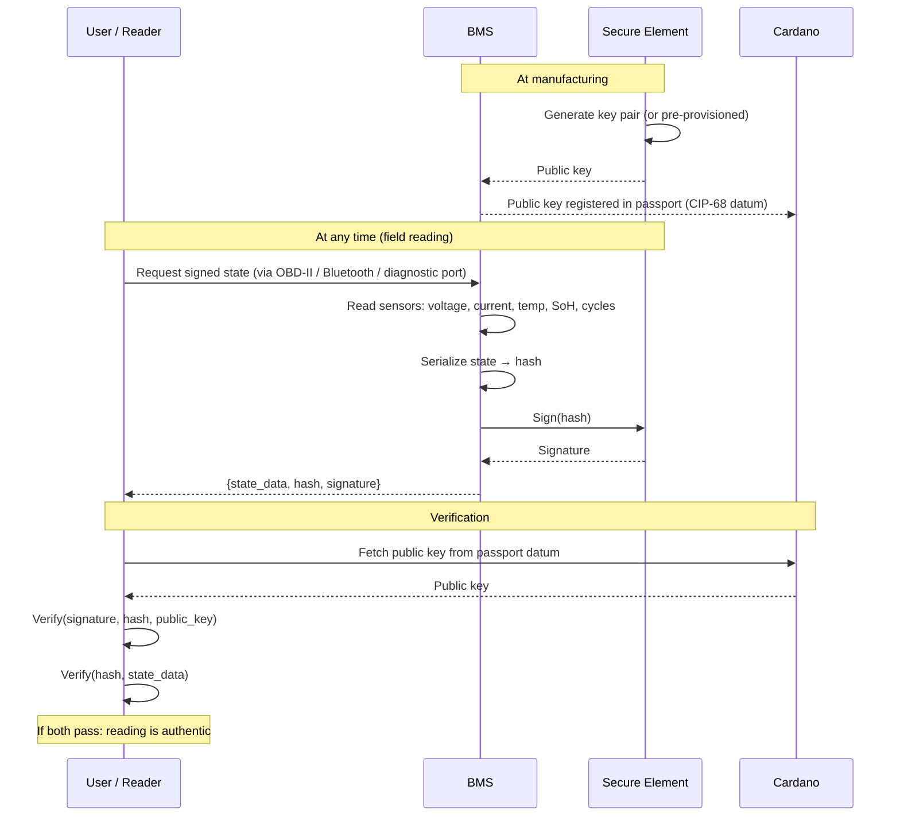
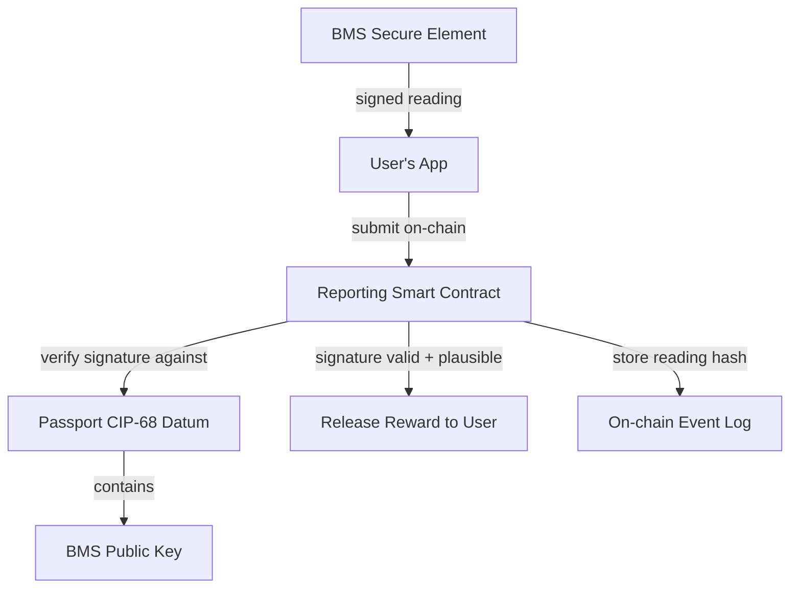
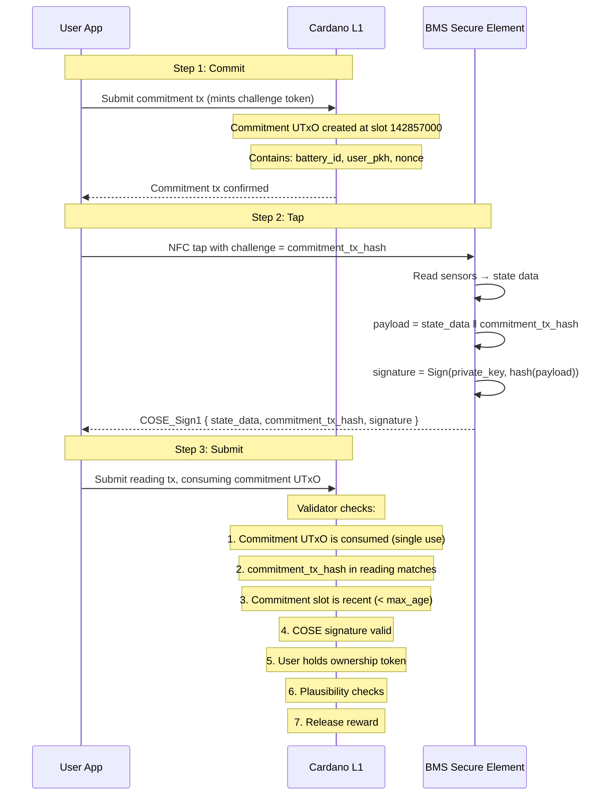
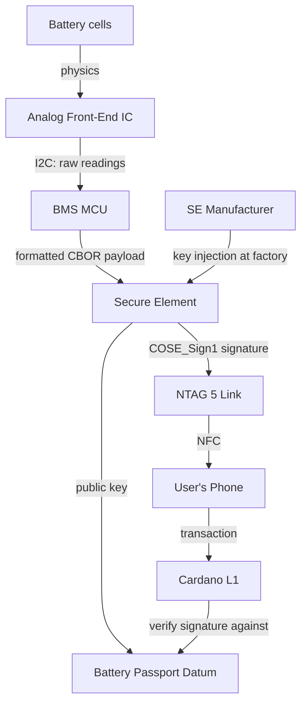

# Signed BMS Readings

## The idea

Every BMS contains a secure element with a private key that never leaves the chip. Anyone with physical access can request a **signed hash of the current battery state**. The signature proves the reading came from that specific BMS hardware, not from a human or a software system.

## Protocol



## What the signature proves

| Claim | Proven? | Why |
|-------|---------|-----|
| This data came from this specific BMS hardware | Yes | Only this secure element has the private key |
| The data was not modified after leaving the BMS | Yes | Hash mismatch would break the signature |
| The data was produced at the claimed time | Partially | Timestamp is BMS-reported, not independently verified |
| The underlying sensor readings are physically accurate | No | A faulty or manipulated analog front-end still signs garbage |

The secure element proves **authenticity** (this BMS produced this data) and **integrity** (nobody changed it). It does not prove **accuracy** (the sensors might be wrong or tampered with at the analog level). But analog sensor tampering requires physical modification of the BMS board — a much higher bar than software manipulation.

## Hardware cost

The cost of adding this capability is negligible for automotive BMS:

| Component | Cost at 100k volume |
|-----------|-------------------|
| Secure element ([ATECC608B](../../references.md#atecc608b) / [OPTIGA Trust M](../../references.md#optiga-trust-m)) | ~$0.50-0.70 |
| Passives (caps, resistors) | $0.01 |
| **Total BOM addition** | **$0.51-0.71** |

| Application | BMS cost | Signing cost | Impact |
|------------|----------|-------------|--------|
| EV battery | $150-400 ([BatPaC](../../references.md#batpac)) | $0.55 | 0.1-0.4% |
| Industrial ESS | $200-2,000 | $0.55 | 0.03-0.3% |
| E-bike (mid-range) | $20-60 | $0.55 | 1-3% |

Modern automotive MCUs ([NXP S32K3](../../references.md#nxp-s32k3), [Infineon AURIX TC3xx](../../references.md#aurix-tc3xx)) already include hardware security modules. For new BMS designs using these MCUs, the crypto capability is already present — it just needs firmware to use it.

One-time NRE (firmware + PCB): $20k-60k, amortized to $0.20-0.60/unit at 100k volume.

Pre-provisioned secure elements ([Microchip Trust&GO](../../references.md#trust-and-go)) come with keys injected at the factory — zero PKI infrastructure needed.

## Signed reading format

A BMS signed reading could follow a simple structure:

```json
{
  "battery_id": "urn:eudpp:battery:de:example:2024:001",
  "bms_public_key": "0x04a1b2c3...",
  "timestamp": 1735689600,
  "state": {
    "soh_percent": 88,
    "soc_percent": 72,
    "cycle_count": 1247,
    "capacity_ah": 352,
    "nominal_capacity_ah": 400,
    "voltage_v": 389.2,
    "current_a": 0.0,
    "temp_min_c": 22,
    "temp_max_c": 25,
    "energy_throughput_kwh": 48750
  },
  "hash": "0x5bd2e1f4...",
  "signature": "0x304502210..."
}
```

The hash covers the serialized `state` object. The signature is ECDSA over the hash, produced by the secure element's private key.

## Who can request a signed reading

Anyone with physical access to the BMS interface:

| Actor | Access method | Use case |
|-------|-------------|----------|
| Vehicle owner | OBD-II adapter + app | Routine reporting for incentive rewards |
| Used battery buyer | OBD-II adapter at point of sale | Verify seller's SoH claims before purchase |
| Service center | Diagnostic tool | Maintenance records with authenticated state |
| Repurposing operator | Direct BMS connection | Assess second-life viability |
| Recycler | Direct BMS connection | Document end-of-life condition |
| Market surveillance | Diagnostic tool | Compliance audit |

No internet connection required. No manufacturer backend in the loop. The reading is self-contained and independently verifiable against the public key in the on-chain passport.

## Integration with Cardano

The signed reading feeds into the [incentive reporting model](incentives.md):



The smart contract can verify the BMS signature on-chain (or more practically, a verifier off-chain submits a proof). This means:

- The manufacturer doesn't need to trust the user — the BMS signed it
- The user doesn't need to trust the manufacturer — the reward is guaranteed by the contract
- Third parties don't need to trust either — the signature is publicly verifiable

## Challenge-response: blockchain as trusted clock

The BMS has no trusted clock. Its internal RTC can drift or be set to a wrong value. But we don't need to trust the BMS's clock — **the blockchain provides the timestamp**.

### The problem with BMS timestamps

A signed reading with a BMS-reported timestamp proves nothing about *when* the reading was taken. A dishonest actor could:

- Request a reading when the battery is in good condition
- Store the signed result
- Replay it months later when the battery has degraded, to fake a higher SoH

### Challenge-response protocol with on-chain commitment

Simply reading the current slot number is not enough — anyone can read a slot retroactively. A dishonest user could:

1. Tap the battery today (SoH 85%)
2. Store the signed reading
3. Months later, read the current slot, claim that was the challenge
4. Submit the old reading as if it were fresh

The fix: the user **commits the challenge on-chain first** by minting a commitment UTxO. This creates an unforgeable timestamp — the commitment transaction has a definite slot, and the reading must reference that exact commitment.



### Why the commitment matters

The commitment transaction is the key innovation. It creates an on-chain proof that the user **declared their intent to read at a specific moment**.

| Attack | Without commitment | With commitment |
|--------|-------------------|-----------------|
| **Replay old reading** | Possible — just use a current slot as challenge | **Blocked** — no matching commitment UTxO exists |
| **Stockpile readings** | Take many readings, submit the best one later | **Blocked** — each commitment is consumed (single use) |
| **Backdate a reading** | Claim any past slot as your challenge | **Blocked** — commitment tx has an immutable slot |
| **Forge a commitment** | N/A | **Impossible** — it's a confirmed on-chain transaction |

The commitment UTxO is **consumed** when the reading is submitted — it can't be reused. One commitment = one reading. This prevents stockpiling.

### The challenge value

Using the **commitment transaction hash** as the challenge (instead of a slot number) is stronger:

- The tx hash is unpredictable before the commitment is submitted
- The BMS signs over it, binding the reading to that exact commitment
- The validator can look up the commitment UTxO by its tx hash and verify it exists, is recent, and belongs to this user

### Cost

The commitment is a small transaction:

| Step | Cost |
|------|------|
| Commitment tx (mint challenge token) | ~0.2 ADA |
| Reading submission tx (consume commitment + submit reading) | ~0.3 ADA |
| **Total per reading** | **~0.5 ADA** |

The reward must exceed this cost to incentivize reporting. At current prices (~$0.25/ADA), the total cost per reading is ~$0.13.

### What the commitment proves

| Claim | Proven? |
|-------|---------|
| User intended to read at this moment | Yes — commitment tx has an immutable slot |
| Reading was produced after the commitment | Yes — reading contains commitment_tx_hash, which didn't exist before |
| Reading was submitted promptly | Yes — max_age between commitment slot and submission slot |
| No reading was stockpiled or cherry-picked | Yes — each commitment is consumed once |
| The challenge is unforgeable | Yes — it's a transaction hash on a consensus-secured chain |

### Why this needs a blockchain

This is a genuine blockchain value-add:

- **The commitment is a confirmed transaction** — no party can forge, backdate, or alter it
- **The slot is consensus-derived** — neither the user, the manufacturer, nor a server controls it
- **Single-use consumption** — the eUTxO model naturally enforces one-reading-per-commitment (the UTxO is spent)
- **The challenge (tx hash) is unpredictable** — determined by the transaction content and the ledger state at submission time

A centralized server could issue challenges too, but then you trust the server operator not to issue backdated challenges. The blockchain makes the entire protocol **trustless**.

### Signed reading format (with challenge)

```json
{
  "battery_id": "urn:eudpp:battery:de:example:2024:001",
  "challenge": 142857000,
  "state": {
    "soh_percent": 88,
    "soc_percent": 72,
    "cycle_count": 1247,
    "capacity_ah": 352,
    "voltage_v": 389.2,
    "current_a": 0.0,
    "temp_min_c": 22,
    "temp_max_c": 25,
    "monotonic_counter": 4891
  },
  "hash": "0x5bd2e1f4...",
  "signature": "0x304502210..."
}

```

The `monotonic_counter` is a strictly increasing value maintained by the secure element. Even without a trusted clock, it guarantees ordering: reading 4891 came after reading 4890. Combined with the on-chain slot timestamps of each submission, this produces a trustworthy timeline.

## On-chain signature verification

ECDSA signature verification is possible in Plutus (Cardano supports [`verifyEcdsaSecp256k1Signature`](../../references.md#plutus-builtins) as a built-in, added via [CIP-49](https://cips.cardano.org/cip/CIP-0049)). If the BMS uses secp256k1 (like Bitcoin/Ethereum) or ed25519 (like Cardano native), the signature can be verified directly in the smart contract validator.

```
CommitmentValidator:
  -- Minting policy for challenge tokens
  Validation (mint):
    - Exactly one token minted
    - Token name = hash(battery_id ‖ user_pkh ‖ current_slot)
    - Output UTxO contains: battery_id, user_pkh, slot

  Validation (burn / consume):
    - Must be consumed by a valid reading submission

ReportingValidator:
  Datum:
    batteryId     : ByteString
    bmsPublicKey  : ByteString     -- registered at manufacturing
    lastCounter   : Integer        -- monotonic counter from last accepted reading
    rewardPerRead : Integer
    maxAgeSlots   : Integer        -- e.g., 200 slots (~1 hour)

  Redeemer: SubmitSignedReading
    coseSign1  : ByteString      -- full COSE_Sign1 object from BMS

  Validation:
    - A commitment UTxO is consumed in this transaction
    - commitment.battery_id matches datum.batteryId
    - commitment.user_pkh matches the submitter
    - commitment.slot + maxAgeSlots ≥ current_slot (commitment is recent)
    - Extract commitment_tx_hash from COSE payload challenge field
    - commitment_tx_hash matches the consumed commitment UTxO's tx hash
    - Verify COSE_Sign1 signature against datum.bmsPublicKey
    - Extract monotonic_counter: must be > lastCounter
    - Plausibility checks (SoH ≤ previous, cycles ≥ previous)
    - Submitter holds the ownership token for this battery
    - Update lastCounter in output datum
    - Release reward to submitter
```

This is a significant upgrade over unsigned user reports — the smart contract doesn't just check that a user submitted something plausible, it verifies that the BMS hardware itself produced the data, recently, in response to a committed challenge that was minted on-chain before the reading.

## What this changes

| Without signed BMS | With signed BMS |
|-------------------|-----------------|
| User self-reports readings — low trust | BMS signs readings — hardware-level trust |
| Manufacturer could fake data | Manufacturer can't forge BMS signatures (no private key access after provisioning) |
| Plausibility checks only (SoH can't increase) | Cryptographic verification + plausibility |
| Trust requires multiple independent sources | Single reading is independently verifiable |
| Buyer must trust seller's claims | Buyer requests fresh signed reading at point of sale |

## Trust chain

The full chain of trust from physical measurement to on-chain verification:



| Link | Trust basis | Weakness |
|------|------------|----------|
| Cells → AFE | Physics (voltage, current, temperature) | Sensor failure or physical tampering |
| AFE → MCU | I2C bus on PCB | Compromised MCU firmware could substitute readings |
| MCU → SE | I2C, CBOR schema validation | SE signs whatever the MCU gives it |
| SE → signature | Private key never leaves chip | Key extraction attacks (expensive, destructive) |
| SE factory → public key | Pre-provisioned by chip vendor (e.g., Microchip Trust&GO) | Vendor compromise (extremely unlikely) |
| Public key → passport datum | Registered at manufacturing by economic operator | Operator must correctly register the right key |
| Signature → on-chain verification | Plutus built-in ECDSA/EdDSA | Correctness of validator code |

**Root of trust**: the secure element vendor's provisioning process. For pre-provisioned chips (Microchip Trust&GO, Infineon OPTIGA Trust M Express), the vendor generates the key pair in their secure facility and provides a device certificate signed by their CA. The manufacturer registers the public key in the battery passport datum at production time.

**Weakest link**: the MCU → SE boundary. The secure element cannot verify that the CBOR payload it signs corresponds to real sensor readings. This is mitigated by:

- CBOR schema validation (contract rejects malformed payloads)
- Plausibility checks (SoH can't increase, cycles can't decrease)
- Cross-referencing with independent measurements (workshop EIS, charging session data)
- Physical tamper-evidence of the BMS board itself

## Open questions

1. **Standardization**: No standard exists for BMS signed readings. A CIP (Cardano Improvement Proposal) or an industry standard (SAE, ISO) would be needed to define the format, key algorithm, and serialization.
2. **Key lifecycle**: What happens when a BMS module is replaced? The new module has a different key. The passport must be updated to register the new public key.
3. **Timestamp trust**: Solved by the challenge-response protocol — the blockchain provides the trusted clock, not the BMS. The monotonic counter provides ordering within the BMS.
4. **Analog front-end trust**: The secure element signs whatever the BMS firmware gives it. If the analog measurement ICs are tampered with (replaced with a device that outputs false voltage readings), the signature is valid but the data is wrong. This requires physical board modification — a much higher bar than software tampering, but not impossible.
5. **Regulatory adoption**: The EU Battery Regulation does not currently require signed BMS readings. A delegated act or implementing act could mandate this, especially as the BMS-to-passport data gap becomes more apparent.
