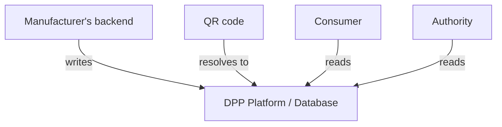
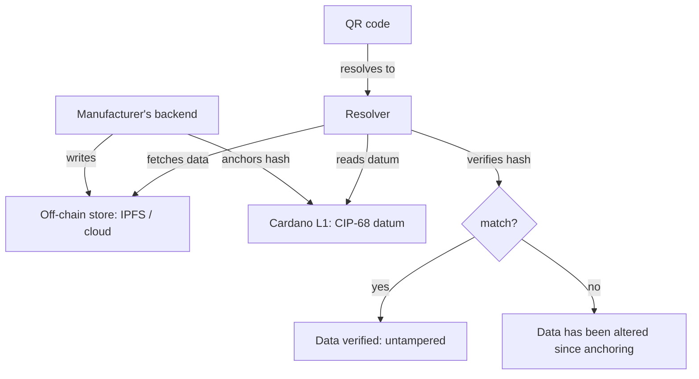

# Passport State

## What is the state?

The battery passport state is the complete set of data fields defined in [Annex XIII](../references.md#bat-annex-xiii) of [Regulation 2023/1542](../references.md#reg-battery). It divides into:

| Category | Examples | Changes? | Source |
|----------|----------|----------|--------|
| **Product identity** | Manufacturer, model, chemistry, serial number | Never | Manufacturer (at production) |
| **Carbon footprint** | kgCO2e/kWh, performance class, LCA study | Once (declared) | Manufacturer (LCA process) |
| **Recycled content** | % cobalt, lithium, nickel, lead from recycled sources | Once (declared) | Manufacturer (supply chain) |
| **Material composition** | Hazardous substances, critical raw materials | Never | Manufacturer (at production) |
| **Performance specs** | Rated capacity, voltage, energy density | Never | Manufacturer (at production) |
| **Dynamic performance** | SoH, capacity fade, cycle count, energy throughput | **Continuously** | BMS (hardware in the battery) |
| **Status** | Original / Repurposed / Remanufactured / Waste | **On events** | Economic operator (decision) |
| **Due diligence** | Supply chain audit reports | Periodically | Manufacturer / auditor |
| **Conformity** | CE marking, test certificates | Once | Notified body / manufacturer |

Most of the passport is **write-once at manufacturing**. The part that changes is:

1. **BMS-sourced telemetry** → dynamic performance data (SoH, cycles)
2. **Lifecycle events** → status changes, ownership transfers, maintenance, end-of-life

## Who changes the state and how?

### Event 1: Manufacturing (passport creation)

```
Actor:   Manufacturer
Trigger: Battery produced and tested
Data:    All static fields + initial SoH (100%)
```

The manufacturer's production system generates the complete initial passport and assigns the unique identifier. This is the only moment where the bulk of the data is written.

### Event 2: Daily SoH updates (telemetry)

```
Actor:   BMS → Vehicle telematics → Manufacturer's cloud
Trigger: Continuous (aggregated daily per Recital 46)
Data:    SoH, remaining capacity, cycle count, energy throughput
```

**The regulation does not specify how BMS data reaches the passport.**

Article 14 says the BMS must *contain* up-to-date SoH data ("shall be **contained in** the battery management system"). Article 77 says the passport must have this data. But **the bridge between Article 14 and Article 77 is completely unspecified**. No telematics, no internet, no API, no protocol is mandated.

The "at least daily" update frequency (Recital 46) refers to the BMS's internal SoH computation refresh — not to passport updates.

This is a recognized open problem:

!!! warning "Unsolved implementation gap"
    The [Battery Pass consortium](../references.md#battery-pass) states that Annex VII data attributes "urgently require further elaboration and definitions, which are decisive for economic operators to determine system requirements for implementation" (Battery Pass Content Guidance v3, 2024). Industry analyses consistently identify the BMS-to-passport data transfer as the biggest unsolved challenge before the Feb 2027 deadline.

The challenge varies dramatically by battery category:

| Category | Connectivity | BMS-to-passport path |
|----------|-------------|---------------------|
| **New EVs** (Tesla, VW, etc.) | Always-on cellular telematics | Feasible: BMS → ECU → telematics → cloud → passport |
| **Older EVs** | Limited or no telematics | Unknown: may require dealer visit to read BMS |
| **LMT (e-bikes, scooters)** | No internet connectivity | Unknown: BMS is local only, no standard extraction method |
| **Industrial (forklifts, UPS)** | Usually no internet | Unknown: may require on-site diagnostic tool |
| **Stationary storage** | Varies (some have SCADA) | Case-by-case |

For non-connected batteries, the only practical option today may be **manual reads** — a technician connects to the BMS via diagnostic port and extracts data, which is then uploaded to the passport. This could happen at service visits, inspections, or point of sale.

**Who is the actor?** The manufacturer is legally responsible for keeping the passport up-to-date (Art. 77(4)). But the regulation doesn't say how they should get the data from a battery they no longer physically control. This is the fundamental tension.

**Implication for Cardano:** The BMS-to-passport data bridge is an open design space. A Cardano-based solution could define a standard for this: e.g., a signed BMS data dump (read at service or via diagnostic tool) that can be independently verified and anchored on-chain, regardless of whether the battery is internet-connected.

### Event 3: Service / maintenance

```
Actor:   Authorized service provider (delegated by manufacturer)
Trigger: Customer brings battery/vehicle for service
Data:    Maintenance record, parts replaced, diagnostic results
```

The service provider logs the event in the manufacturer's dealer management system, which propagates to the passport backend. The service provider doesn't directly write to the passport — they write to the manufacturer's system, which updates the passport.

### Event 4: Sale / ownership transfer

```
Actor:   Seller and buyer (mediated by manufacturer's system)
Trigger: Battery or vehicle changes hands
Data:    Operator information field updated
```

The regulation requires the passport to reflect the current "economic operator." On a private sale, the new owner registers with the manufacturer (like registering a vehicle). The manufacturer's backend updates the passport.

### Event 5: Repurposing (new passport)

```
Actor:   New economic operator (repurposing company)
Trigger: Battery removed from original application for second-life use
Data:    NEW passport created, linked to original
```

This is the only event where **a different party creates a passport**. The repurposing operator becomes the new economic operator and must:

1. Create a new passport for the repurposed battery
2. Link it to the original passport
3. Take over responsibility for keeping it up-to-date

The original passport is not deleted — it becomes historical.

### Event 6: End of life

```
Actor:   Waste operator / recycler
Trigger: Battery declared waste
Data:    Status → Waste, then material recovery data
```

### Event 7: Recycling (passport cessation)

```
Actor:   Recycler
Trigger: Battery has been recycled
Data:    Passport ceases to exist (Art. 77(6b))
```

## Where is the state stored?

The regulation does not prescribe a storage technology. It requires:

- Accessible via QR code
- Data accurate, complete, up-to-date
- Tiered access (public / restricted / authority)
- Available for the battery's lifetime
- Independent third-party backup (even if manufacturer goes bankrupt)

### Without blockchain



The manufacturer controls the data. They can alter historical records. The third-party backup requirement mitigates this, but doesn't prevent manipulation before backup.

### With Cardano



Cardano adds one thing: **tamper evidence**. The hash anchored on-chain at time T proves the passport data existed in that exact form at time T. If the manufacturer later alters the off-chain data, the hash won't match.

This matters for:

- **Used battery buyers**: verifying that the SoH history hasn't been inflated
- **Authorities**: auditing that data wasn't changed after the fact
- **Insurance**: confirming battery condition at a specific date
- **Disputes**: proving what the passport said at any point in time

## State summary

| Event | Actor | Trigger | Frequency | What changes |
|-------|-------|---------|-----------|-------------|
| Creation | Manufacturer | Production | Once | Everything (initial state) |
| SoH update | Manufacturer backend (from BMS) | Automated | Daily | Dynamic performance |
| Service | Service provider → manufacturer | Per visit | Occasional | Maintenance log |
| Ownership transfer | Seller/buyer → manufacturer | Per sale | Rare | Operator info |
| Repurposing | New operator | Business decision | Once | New passport (linked) |
| End of life | Waste operator | Declaration | Once | Status → Waste |
| Recycling | Recycler | Completion | Once | Passport ceases |

**The manufacturer's backend is the single writer for the entire first life.** Other actors (service providers, BMS) feed data into the manufacturer's system, which is the sole entity that assembles and publishes the passport state. The blockchain anchor is downstream — it doesn't change who writes, it adds a verifiable timestamp to what was written.
