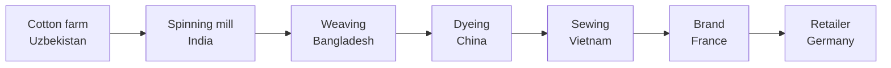
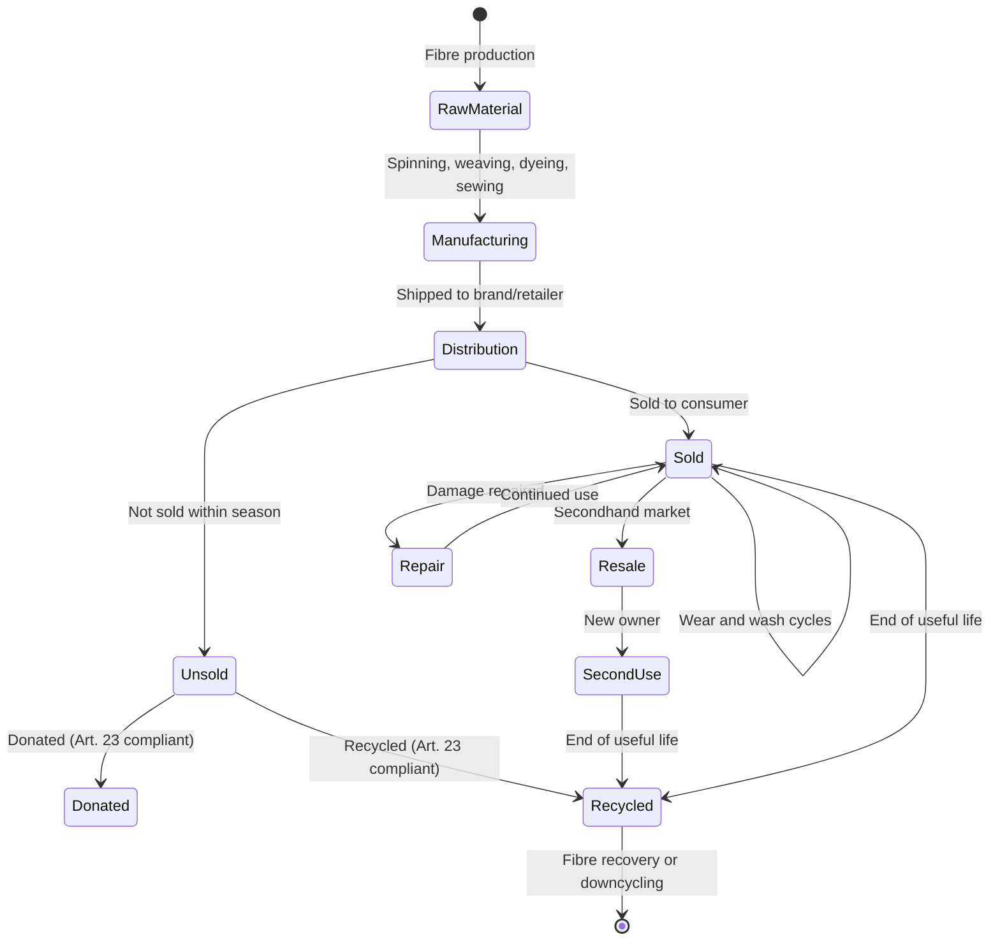
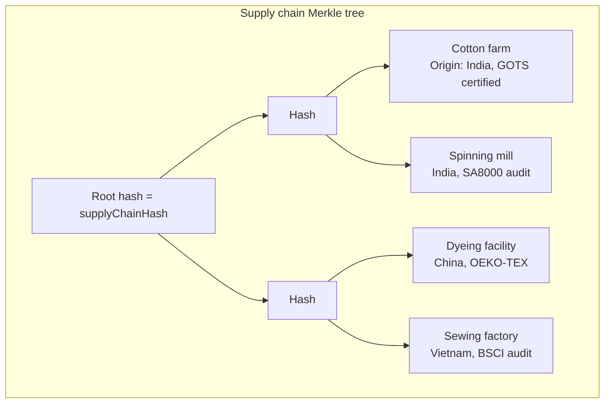

# Textiles

**Regulation**: [ESPR (EU) 2024/1781](../../references.md#reg-espr) delegated act — expected ~2025-2026 ([Working Plan 2025-2030](../../references.md#espr-working-plan)).

**Deadline**: Compliance ~2027-2028 (18-24 months after delegated act, per [ESPR Art. 9](../../references.md#espr-art9)).

**Granularity**: Batch or model level ([ESPR Art. 9(2)(d)](../../references.md#espr-art9-2d)). Individual garments do not have unique serials. Item-level is not needed — all policy drivers operate at batch or model level.

**Volume**: ~100k-1M DPPs/year at batch/model level — trivially within Cardano L1 capacity.

## Why the EU wants to trace textiles

Textiles are the **4th highest-pressure category** for primary raw materials and water use, and **5th for GHG emissions** in the EU. The [EU Strategy for Sustainable and Circular Textiles](../../references.md#eu-textile-strategy) (COM(2022) 141) identified textiles as a priority sector. Six policy streams converge:

### 1. Waste crisis — near-zero fibre-to-fibre recycling

The EU generates approximately **5.8 million tonnes of textile waste per year**. Europeans consume ~26 kg of textiles per capita annually and discard ~11 kg.

| Destination | Share | Problem |
|------------|-------|---------|
| Reused (mostly exported to Global South) | ~50-60% of collected | Quality declining; receiving countries increasingly refusing |
| Downcycled (rags, insulation) | ~15-20% of collected | Low-value, not circular |
| Fibre-to-fibre recycled | **< 1%** | Blended fabrics, lack of composition data |
| Incinerated or landfilled | ~87% of total waste globally | Ellen MacArthur Foundation estimate |

The barrier to fibre-to-fibre recycling is **lack of composition data at the point of sorting**. NIR sorting can identify fibre types but struggles with blends and multi-layer garments. The DPP provides machine-readable composition data that enables automated sorting.

**Separate collection mandate**: the Waste Framework Directive (as amended by Directive 2018/851) required all EU Member States to set up separate collection of textiles by **1 January 2025**. This creates a flood of collected textiles that need sorting infrastructure — and DPPs are the data layer for that infrastructure.

### 2. Human rights — forced labour and unsafe factories

- **Xinjiang cotton**: approximately 20% of global cotton comes from China's Xinjiang region. Reports from the Australian Strategic Policy Institute (ASPI) and Sheffield Hallam University ("In Broad Daylight", 2021) documented forced labour of Uyghurs in cotton harvesting and textile manufacturing.
- **Rana Plaza**: the collapse of the Rana Plaza garment factory in Dhaka on 24 April 2013 killed 1,134 workers — the deadliest garment factory disaster in history. It led to the Bangladesh Accord on Fire and Building Safety.
- **CSDDD**: the Corporate Sustainability Due Diligence Directive ([Directive (EU) 2024/1760](https://eur-lex.europa.eu/eli/dir/2024/1760)) requires large companies to identify, prevent, and mitigate human rights and environmental adverse impacts across their value chains. Textiles are a high-risk sector.

The DPP carries **product-level evidence** of due diligence: which factory, which country, which audit results, which certifications. CSDDD requires the process; the DPP carries the proof.

### 3. Greenwashing — unsubstantiated sustainability claims

The Commission's 2020 screening found that **53.3% of environmental claims in the EU were vague, misleading, or unfounded** and 40% were entirely unsubstantiated. The Empowering Consumers Directive (EU) 2024/825 bans vague green claims ("eco-friendly", "sustainable") without substantiation.

The DPP replaces self-declared labels with **machine-readable, auditable data** on actual environmental performance — carbon footprint, water footprint, recycled content, chemical use — verifiable against the on-chain anchor.

### 4. Destruction of unsold goods — the Amazon/Burberry trigger

Investigative reporting revealed that Amazon was destroying millions of unsold items in UK warehouses (ITV News, 2021). Burberry disclosed in its 2018 annual report that it had destroyed **£28.6 million worth of unsold stock** to protect brand exclusivity.

Public backlash led to France's AGEC law (2020) — banning destruction of unsold non-food goods — and then [ESPR Art. 23](../../references.md#espr-art23) extended the principle EU-wide:

- **19 July 2026**: destruction ban for unsold textiles and footwear (large enterprises)
- **19 July 2030**: extended to medium enterprises

Companies must disclose quantities of unsold products destroyed (transparency obligation) and ultimately cannot destroy them at all. The DPP provides the **tamper-evident audit trail** proving what happened to each batch.

### 5. Environmental impact — water, carbon, microplastics, chemicals

| Impact | Scale |
|--------|-------|
| Water consumption | ~79 billion m³/year globally; cotton = ~10,000 litres/kg |
| Water pollution | Textile dyeing is the **2nd largest industrial water polluter** globally |
| Carbon emissions | Fashion industry = **8-10% of global CO2** (UNEP) |
| Microplastic fibres | Synthetic textiles release ~700,000 fibres per wash; ~35% of marine microplastics (IUCN) |
| Chemical use | >15,000 chemicals used in textile production; imports often contain restricted substances |

The ESPR delegated act is expected to require disclosure of carbon footprint (PEF methodology), water footprint, and microfibre shedding rates via the DPP. REACH (EC 1907/2006) restricts substances of very high concern, but enforcement on imports is difficult — DPPs declaring substances of concern (ESPR Art. 9(d)) make chemical compliance verifiable at product level.

### 6. EPR eco-modulation — DPP as the data substrate

The proposed revision of the Waste Framework Directive (COM(2023) 420) introduces **mandatory Extended Producer Responsibility (EPR) for textiles** across all Member States. France already operates textile EPR via Refashion (since 2007).

EPR fees would be modulated by environmental characteristics: more durable, recyclable, lower-impact products pay lower fees (**eco-modulation**). Without product-level DPP data on durability, recyclability, and environmental footprint, eco-modulation is impossible. The DPP is the **data substrate** for EPR fee differentiation.

## Supply chain traceability

The textile supply chain is notoriously opaque and geographically fragmented:



Each step involves a different company in a different jurisdiction. The DPP must capture provenance across the entire chain. This is where blockchain adds genuine value: **no single party in the chain can retroactively alter their claims** about origin, labour conditions, or chemical use.

## Regulatory landscape

| Regulation | Scope | Textile DPP relevance |
|-----------|-------|----------------------|
| [**ESPR (EU) 2024/1781**](../../references.md#reg-espr) | DPP requirements via delegated act | Primary vehicle for textile DPP |
| [**ESPR Art. 23**](../../references.md#espr-art23) | Destruction ban for unsold textiles | DPP tracks batch destiny (sold/donated/recycled) |
| [**Textile Labelling Reg. (EU) 1007/2011**](../../references.md#reg-textile-label) | Fibre composition labels | Existing data; DPP extends it |
| [**EU Textile Strategy**](../../references.md#eu-textile-strategy) COM(2022) 141 | Policy framework | Defines DPP scope and goals |
| **CSDDD (EU) 2024/1760** | Supply chain due diligence | DPP carries product-level evidence |
| **Empowering Consumers Dir. (EU) 2024/825** | Bans unsubstantiated green claims | DPP provides verifiable data |
| **REACH (EC) 1907/2006** | Chemical restrictions | DPP declares substances of concern |
| [**EUDR (EU) 2023/1115**](../../references.md#reg-eudr) | Deforestation-free sourcing | DPP carries raw material traceability (if cotton included) |
| **Waste Framework Dir. 2008/98/EC** | Separate textile collection (Jan 2025) | DPP enables automated sorting |
| **WFD revision COM(2023) 420** | Mandatory textile EPR | DPP data substrate for eco-modulation |

## Expected data model

| Category | Examples | Source | Policy driver |
|----------|----------|--------|--------------|
| Product identity | Brand, model, SKU, production batch | Manufacturer | All |
| Fibre composition | % cotton, polyester, elastane | Manufacturer (already mandatory under 1007/2011) | Recycling/sorting, EPR |
| Country of manufacture | Per production step (spinning, weaving, dyeing, sewing) | Supply chain | CSDDD, human rights |
| Durability | Pilling resistance, colour fastness, seam strength | Type testing | EPR eco-modulation |
| Repairability | Repair instructions, spare parts availability | Manufacturer | Right to Repair |
| Carbon footprint | kgCO2e per garment (PEF methodology) | LCA | Climate, EPR |
| Water footprint | Litres per garment (dyeing, finishing) | LCA | Environmental impact |
| Microfibre shedding | mg/wash or fibres/wash | Testing (method TBD) | Microplastics |
| Chemical use | REACH compliance, restricted substances, SVHC presence | Manufacturer | REACH enforcement |
| Recycled content | % recycled polyester, % recycled cotton | Manufacturer | Circular economy |
| Recyclability | Mono-material %, disassembly instructions | Design assessment | Recycling/sorting |
| Supply chain | Country of origin per stage, social audit results, certifications | Due diligence | CSDDD, greenwashing |

## Textile lifecycle



## Cardano architecture for textiles

Same MPFS pattern as [batteries](../batteries/architecture.md) and [tyres](../tyres/index.md): one [Merkle Patricia Trie](../../references.md#mpfs) per brand. Each product model or production batch is a leaf. One on-chain UTxO per brand holds the root hash.

### Leaf value structure

```
TextileLeaf {
  productId         : ByteString    -- GTIN or SKU
  granularity       : Level         -- Batch | Model
  status            : Status        -- InProduction | OnSale | Sold | Unsold | Donated | Recycled
  fibreComposition  : [FibreEntry]  -- per Reg. 1007/2011
  microfibreShed    : Maybe Integer -- mg/wash (when test method available)
  countryOfOrigin   : [StageOrigin] -- per production step
  carbonFootprint   : Integer       -- kgCO2e per garment (PEF)
  waterFootprint    : Integer       -- litres per garment
  recycledContent   : RecycledData  -- % recycled polyester, cotton
  recyclability     : Integer       -- mono-material percentage
  chemicalProfile   : ChemData      -- SVHC presence, REACH compliance
  supplyChainHash   : ByteString    -- Merkle root of supply chain attestation tree
}
```

### Supply chain attestation tree

Each step in the supply chain produces an attestation (certification, audit, declaration of origin) hashed into a Merkle tree. The root is stored in the leaf's `supplyChainHash` field. Selective disclosure via Merkle proofs — a verifier can check one step without seeing others.



### Destruction ban compliance

The MPT leaf `status` field tracks the destiny of each batch. Transitions are anchored on-chain with timestamps:

| Status | Meaning | Art. 23 relevance |
|--------|---------|-------------------|
| `OnSale` | In retail/warehouse | Inventory |
| `Sold` | Purchased by consumer | Compliant |
| `Unsold` | Not sold within season | **Must not be destroyed** |
| `Donated` | Donated to charity | Compliant — on-chain proof |
| `Recycled` | Sent to fibre recycling | Compliant — on-chain proof |

Market surveillance authorities can verify the full history of any batch via Merkle proofs against the brand's MPT root. A brand cannot claim a batch was "donated" if the on-chain transition was never recorded.

### Anti-counterfeiting

For luxury textiles, the DPP doubles as an anti-counterfeiting measure. QR code or NFC tag on the garment → Merkle proof against the brand's MPT root. Counterfeits cannot reproduce the on-chain anchor.

This is the strongest Cardano value proposition for textiles — **provenance authentication** rather than dynamic condition tracking.

## Open questions

1. **Delegated act scope** — which data fields, which sub-sectors (apparel, footwear, home textiles)?
2. **Microfibre shedding test method** — not yet standardized; DPP field depends on this
3. **Supply chain privacy** — selective disclosure via Merkle proofs enables partial transparency, but brands may resist even hashed attestations on a public chain
4. **EPR fee calculation** — how will EPR schemes use DPP data for eco-modulation? France (Refashion) may provide the template
5. **EUDR scope** — whether cotton is formally included as a covered commodity affects supply chain traceability requirements
