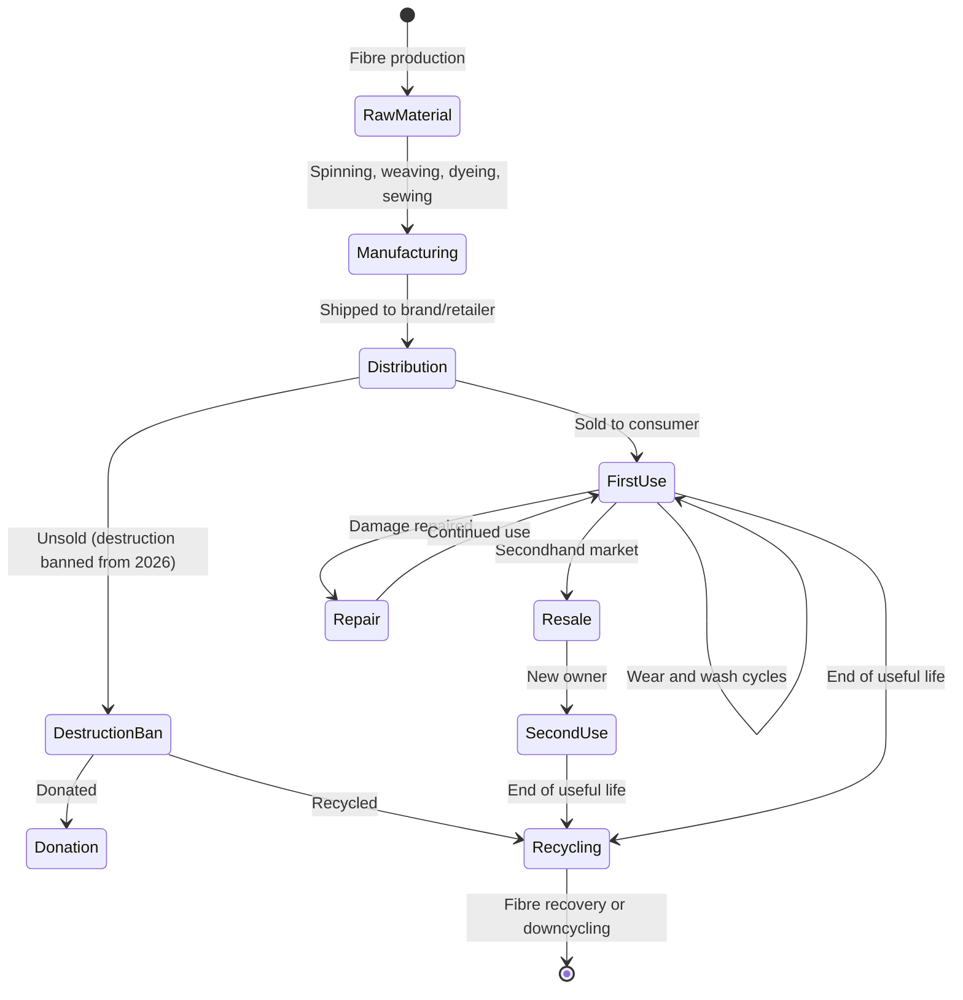
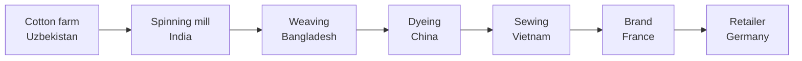

# Textiles

**Regulation**: [ESPR (EU) 2024/1781](../references.md#reg-espr) delegated act — expected ~2025-2026 ([Working Plan 2025-2028](../references.md#espr-working-plan)).

**Deadline**: Compliance ~2027-2028 (18-24 months after delegated act, per [ESPR Art. 9](../references.md#espr-art9)).

**Granularity**: Likely batch or model level ([ESPR Art. 9(2)(d)](../references.md#espr-art9-2d)). Individual t-shirts do not have unique serials.

**Volume**: ~100k-1M DPPs/year at batch/model level — trivially within Cardano L1 capacity.

## Regulatory landscape

Textiles are a high-priority ESPR product group. Multiple EU regulations converge on this sector:

| Regulation | Scope | Status |
|-----------|-------|--------|
| [**ESPR (EU) 2024/1781**](../references.md#reg-espr) | DPP requirements (via delegated act) | Delegated act pending |
| [**ESPR Art. 23**](../references.md#espr-art23) | Ban on destruction of unsold textiles (large enterprises from July 2026) | In force |
| [**Textile Labelling Regulation (EU) 1007/2011**](../references.md#reg-textile-label) | Fibre composition labels | In force |
| [**EU Strategy for Sustainable and Circular Textiles**](../references.md#eu-textile-strategy) (March 2022) | Policy framework for textile DPP | Communication |
| [**EUDR**](../references.md#reg-eudr) | Deforestation-free sourcing (cotton?) | Delayed |

The unsold goods destruction ban (Art. 23 ESPR) is particularly significant — companies must prove they are not destroying unsold stock. A DPP with lifecycle tracking could provide this evidence.

## Expected data model

Based on the EU Textile Strategy and ESPR priorities:

| Category | Examples | Source |
|----------|----------|--------|
| Product identity | Brand, model, SKU, production batch | Manufacturer |
| Fibre composition | % cotton, polyester, elastane (already mandatory under 1007/2011) | Manufacturer |
| Country of manufacture | Each production step (spinning, weaving, dyeing, sewing) | Supply chain |
| Durability | Tested pilling resistance, colour fastness, seam strength | Type testing |
| Repairability | Repair instructions, spare parts availability | Manufacturer |
| Carbon footprint | kgCO2e per garment (manufacturing + transport) | LCA |
| Water footprint | Litres per garment (dyeing, finishing) | LCA |
| Chemical use | REACH compliance, restricted substances | Manufacturer |
| Recycled content | % recycled polyester, % recycled cotton | Manufacturer |
| Recyclability | Mono-material %, disassembly instructions | Design assessment |
| Supply chain | Country of origin per stage, social audit results | Due diligence |

## Textile lifecycle

### Key differences from batteries

| Aspect | Batteries | Textiles |
|--------|-----------|---------|
| Granularity | Item (each battery unique) | Batch/model (1000 identical t-shirts) |
| Dynamic data | SoH changes continuously | Mostly static after production |
| Data source | BMS hardware | Supply chain documentation |
| Primary concern | Performance degradation | Supply chain transparency |
| Repurposing | Second life (different application) | Resale (same application) |
| Destruction | Recycling ends passport | Destruction ban — passport proves compliance |

## Supply chain traceability

The textile supply chain is notoriously opaque and geographically fragmented:

Each step involves a different company in a different jurisdiction. The DPP must capture provenance across the entire chain.

**Blockchain value**: Hashing supply chain attestations on-chain creates a tamper-evident record. No single party in the chain can retroactively alter their claims about origin, labour conditions, or chemical use.

### EUDR overlap

If cotton falls under the EU Deforestation Regulation (currently under debate), textile DPPs would need to include geolocation data for raw material sourcing. This overlaps with the DPP supply chain traceability requirement and could be anchored on-chain.

## Resale and circular economy

The secondhand textile market is growing rapidly (ThredUp, Vinted, Depop). A DPP enables:

- **Authenticity verification** — QR scan proves the garment is genuine (anti-counterfeiting)
- **Composition verification** — buyer knows the real fibre content (useful for allergies, preferences)
- **Care and repair history** — provenance for premium resale
- **Destruction ban compliance** — unsold stock traced to donation or recycling, not landfill

Unlike batteries, there is no "condition" to track dynamically. The passport is primarily a **provenance and composition certificate**.

## Cardano architecture for textiles

The static data model simplifies the architecture:

- **L1 batched minting** — one transaction per batch/model, ~30 products per tx
- **CIP-68 datum** stores hash anchor (same as batteries, but updated less frequently)
- **No Hydra needed** — no real-time updates
- **No signed hardware readings** — no embedded sensor equivalent
- **Supply chain Merkle trees** — each supply chain step hashes its attestation into a tree; root anchored on-chain
- **Verifiable Credentials** — W3C VCs for supply chain certifications (organic cotton, fair trade, OEKO-TEX)

### Anti-counterfeiting

For luxury textiles, the DPP doubles as an anti-counterfeiting measure. A QR code or NFC tag on the garment links to the on-chain record. Counterfeits cannot reproduce the on-chain anchor.

This is the strongest Cardano value proposition for textiles — **provenance authentication** rather than dynamic condition tracking.

## Open questions

1. **Delegated act scope** — which data fields, which sub-sectors (apparel, footwear, home textiles)?
2. **Granularity** — model level (one DPP per design) or batch level (one per production run)?
3. **Supply chain data sharing** — how much supply chain data is the brand willing to put on-chain vs keep private?
4. **Destruction ban evidence** — can the DPP serve as proof that unsold goods were donated/recycled?
5. **NFC tags on garments** — durability through washing? Cost per garment?
6. **Resale integration** — can platforms like Vinted/ThredUp scan the DPP QR?
