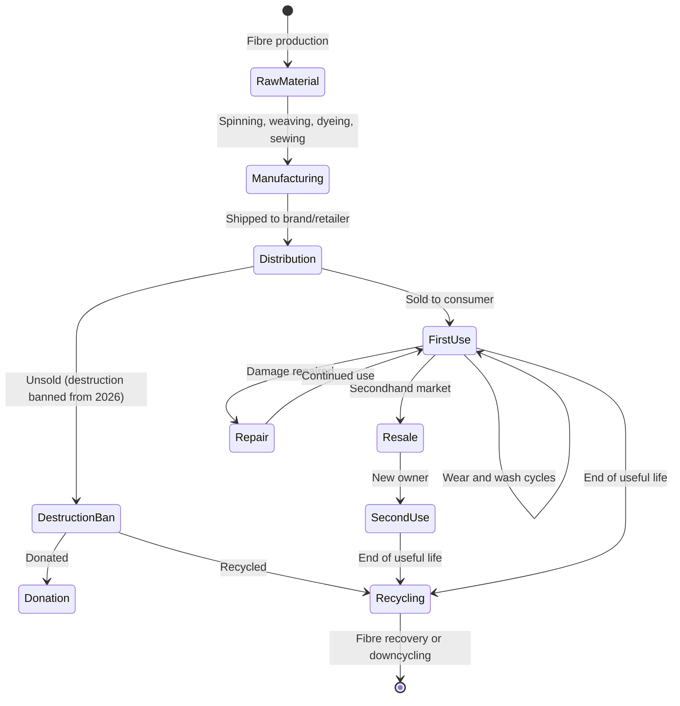
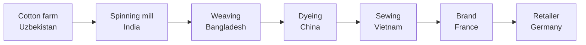
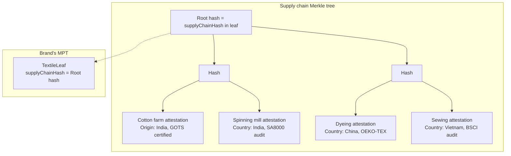

# Textiles

**Regulation**: [ESPR (EU) 2024/1781](../../references.md#reg-espr) delegated act — expected ~2025-2026 ([Working Plan 2025-2028](../../references.md#espr-working-plan)).

**Deadline**: Compliance ~2027-2028 (18-24 months after delegated act, per [ESPR Art. 9](../../references.md#espr-art9)).

**Granularity**: Likely batch or model level ([ESPR Art. 9(2)(d)](../../references.md#espr-art9-2d)). Individual t-shirts do not have unique serials.

**Volume**: ~100k-1M DPPs/year at batch/model level — trivially within Cardano L1 capacity.

## Regulatory landscape

Textiles are a high-priority ESPR product group. Multiple EU regulations converge on this sector:

| Regulation | Scope | Status |
|-----------|-------|--------|
| [**ESPR (EU) 2024/1781**](../../references.md#reg-espr) | DPP requirements (via delegated act) | Delegated act pending |
| [**ESPR Art. 23**](../../references.md#espr-art23) | Ban on destruction of unsold textiles (large enterprises from July 2026) | In force |
| [**Textile Labelling Regulation (EU) 1007/2011**](../../references.md#reg-textile-label) | Fibre composition labels | In force |
| [**EU Strategy for Sustainable and Circular Textiles**](../../references.md#eu-textile-strategy) (March 2022) | Policy framework for textile DPP | Communication |
| [**EUDR**](../../references.md#reg-eudr) | Deforestation-free sourcing (cotton?) | Delayed |

The unsold goods destruction ban (Art. 23 ESPR) is particularly significant — companies must prove they are not destroying unsold stock. A DPP with lifecycle tracking could provide this evidence.

## Expected data model

Based on the EU Textile Strategy and ESPR priorities:

| Category | Examples | Source |
|----------|----------|--------|
| Product identity | Brand, model, SKU, production batch | Manufacturer |
| Fibre composition | % cotton, polyester, elastane (already mandatory under 1007/2011) | Manufacturer |
| Country of manufacture | Each production step (spinning, weaving, dyeing, sewing) | Supply chain |
| Durability | Tested pilling resistance, colour fastness, seam strength | Type testing |
| Repairability | Repair instructions, spare parts availability | Manufacturer |
| Carbon footprint | kgCO2e per garment (manufacturing + transport) | LCA |
| Water footprint | Litres per garment (dyeing, finishing) | LCA |
| Chemical use | REACH compliance, restricted substances | Manufacturer |
| Recycled content | % recycled polyester, % recycled cotton | Manufacturer |
| Recyclability | Mono-material %, disassembly instructions | Design assessment |
| Supply chain | Country of origin per stage, social audit results | Due diligence |

## Textile lifecycle



### Key differences from batteries

| Aspect | Batteries | Textiles |
|--------|-----------|---------|
| Granularity | Item (each battery unique) | Batch/model (1000 identical t-shirts) |
| Dynamic data | SoH changes continuously | Mostly static after production |
| Data source | BMS hardware | Supply chain documentation |
| Primary concern | Performance degradation | Supply chain transparency |
| Repurposing | Second life (different application) | Resale (same application) |
| Destruction | Recycling ends passport | Destruction ban — passport proves compliance |

## Supply chain traceability

The textile supply chain is notoriously opaque and geographically fragmented:



Each step involves a different company in a different jurisdiction. The DPP must capture provenance across the entire chain.

**Blockchain value**: Hashing supply chain attestations on-chain creates a tamper-evident record. No single party in the chain can retroactively alter their claims about origin, labour conditions, or chemical use.

### EUDR overlap

If cotton falls under the EU Deforestation Regulation (currently under debate), textile DPPs would need to include geolocation data for raw material sourcing. This overlaps with the DPP supply chain traceability requirement and could be anchored on-chain.

## Resale and circular economy

The secondhand textile market is growing rapidly (ThredUp, Vinted, Depop). A DPP enables:

- **Authenticity verification** — QR scan proves the garment is genuine (anti-counterfeiting)
- **Composition verification** — buyer knows the real fibre content (useful for allergies, preferences)
- **Care and repair history** — provenance for premium resale
- **Destruction ban compliance** — unsold stock traced to donation or recycling, not landfill

Unlike batteries, there is no "condition" to track dynamically. The passport is primarily a **provenance and composition certificate**.

## Cardano architecture for textiles

Same MPFS pattern as [batteries](../batteries/architecture.md) and [tyres](../tyres/index.md): one [Merkle Patricia Trie](../../references.md#mpfs) per brand/manufacturer. Each product model or production batch is a leaf. One on-chain UTxO per brand holds the root hash.

### Leaf value structure

```
TextileLeaf {
  productId         : ByteString    -- GTIN or SKU
  granularity       : Level         -- Batch | Model
  status            : Status        -- InProduction | OnSale | Unsold | Donated | Recycled
  fibreComposition  : [FibreEntry]  -- per Reg. 1007/2011 (already mandatory)
  countryOfOrigin   : [StageOrigin] -- per production step (spinning, weaving, dyeing, sewing)
  carbonFootprint   : Integer       -- kgCO2e per garment
  waterFootprint    : Integer       -- litres per garment
  recycledContent   : RecycledData  -- % recycled polyester, % recycled cotton
  recyclability     : Integer       -- mono-material percentage
  supplyChainHash  : ByteString    -- Merkle root of supply chain attestation tree
  ...                               -- other fields per delegated act
}
```

### Supply chain attestation tree

The textile supply chain is multi-step and multi-jurisdiction. Each step produces an attestation (certification, audit, declaration of origin) that is hashed into a supply chain Merkle tree. The root of this tree is stored in the leaf's `supplyChainHash` field.



A verifier can request a Merkle proof for any step in the chain without revealing the others — selective disclosure for supply chain transparency.

### Destruction ban compliance

The [unsold goods destruction ban](../../references.md#espr-art23) (ESPR Art. 23, July 2026 for large enterprises) requires brands to prove they are not destroying unsold stock. The MPT leaf status field tracks the destiny of each batch:

| Status | Meaning | Destruction ban relevance |
|--------|---------|--------------------------|
| `OnSale` | In retail/warehouse | Inventory |
| `Sold` | Purchased by consumer | No issue |
| `Unsold` | Not sold within season | **Must not be destroyed** |
| `Donated` | Donated to charity/social enterprise | Compliant |
| `Recycled` | Sent to fibre recycling | Compliant |
| `Destroyed` | **Illegal** for textiles from July 2026 | Non-compliant — on-chain evidence |

The MPT creates a tamper-evident audit trail. A brand that transitions a batch from `Unsold` to `Donated` has that transition anchored on-chain with a timestamp. Market surveillance authorities can verify the full history of any batch via Merkle proofs.

### Anti-counterfeiting

For luxury textiles, the DPP doubles as an anti-counterfeiting measure. A QR code or NFC tag on the garment links to the on-chain record. Counterfeits cannot reproduce the on-chain anchor — verifying the product requires a Merkle proof against the brand's MPT root.

This is the strongest Cardano value proposition for textiles — **provenance authentication** rather than dynamic condition tracking.

### Why simpler than batteries

| Aspect | Batteries | Textiles |
|--------|-----------|---------|
| Dynamic data | SoH changes continuously | None — static after production |
| Updates | Daily (BMS data) | Only on lifecycle events (sale, donation, recycling) |
| User interaction | Signed BMS readings with rewards | None |
| Supply chain | Single manufacturer | Multi-step chain → supply chain attestation tree per leaf |
| On-chain cost | ~73 ADA/year per operator | **< 10 ADA/year** per brand (very rare updates) |

## Open questions

1. **Delegated act scope** — which data fields, which sub-sectors (apparel, footwear, home textiles)?
2. **Granularity** — model level (one leaf per design) or batch level (one leaf per production run)?
3. **Supply chain privacy** — selective disclosure via Merkle proofs solves partial transparency, but brands may resist putting even hashed attestations on a public chain
4. **Destruction ban evidence** — the MPT model supports it, but will regulators accept on-chain proofs as compliance evidence?
