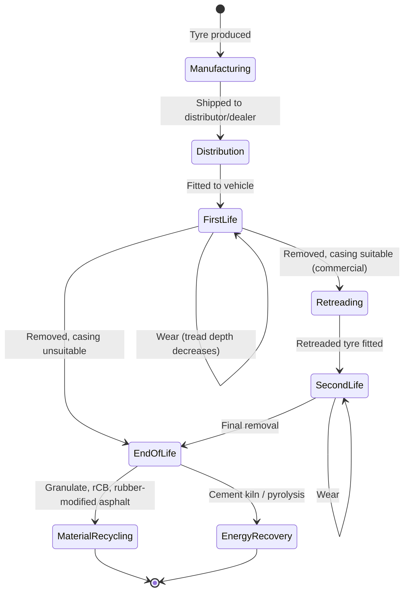
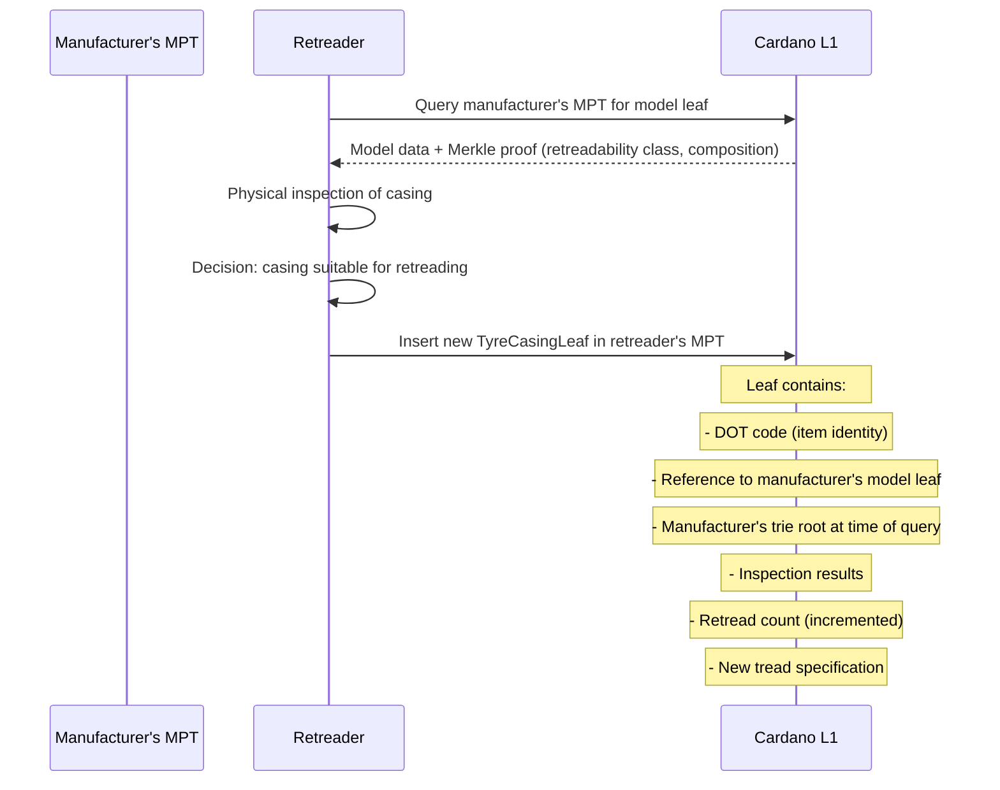
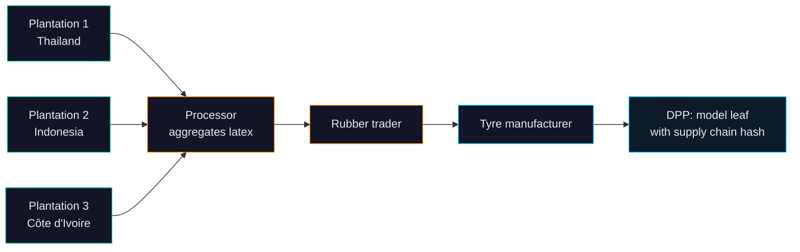

# Tyres

**Regulation**: [ESPR (EU) 2024/1781](../../references.md#reg-espr) delegated act — expected ~2026 ([Working Plan 2025-2030](../../references.md#espr-working-plan)).

**Deadline**: Compliance ~2027 (18-24 months after delegated act, per [ESPR Art. 9](../../references.md#espr-art9)).

**Granularity**: Unknown — delegated act will specify ([ESPR Art. 9(2)(d)](../../references.md#espr-art9-2d)). Analysis below suggests model/batch level for most policy goals, with item-level only needed for retreading of commercial tyres.

**Volume**: EU tyre market is ~300M replacement + OE units/year ([ETRMA](../../references.md#etrma)). At model level the number of DPPs is trivial (~thousands of distinct models).

## Why the EU wants to trace tyres

Tyres sit at the intersection of six EU policy streams. The DPP is the single data infrastructure meant to serve all of them:

### 1. Microplastics — tyres are source #1

Tyre and road wear particles (TRWP) are the **largest source of microplastics** entering the EU environment — estimated ~500,000 tonnes/year ([EEA](https://www.eea.europa.eu/publications/microplastics-from-textiles-towards-a)). This dwarfs textile fibres, pellet spills, and all other sources. TRWP enter waterways via road runoff and carry toxic additives.

The Commission's [Zero Pollution Action Plan](../../references.md#zero-pollution) (COM(2021) 400) targets a 30% reduction in microplastics by 2030. Tyre abrasion is the primary lever. The DPP would carry **abrasion rate data** per tyre model, enabling regulators to set and enforce minimum abrasion performance.

!!! note "Abrasion measurement"
    A standardized tyre abrasion test method is being developed by the UNECE Informal Working Group on Tyres (GRBP), based on internal drum testing. [Euro 7](../../references.md#euro7) (Regulation (EU) 2024/1257) mandates **measurement and reporting** of abrasion rates but does not yet set limits — that will come via the ESPR delegated act. DPP carries the test data.

### 2. 6PPD-quinone — emerging chemical crisis

6PPD is an antiozonant used in virtually all tyres worldwide. Its environmental transformation product, 6PPD-quinone, is **acutely lethal to coho salmon** (LC50 < 1 µg/L) and likely toxic to other aquatic species. ECHA has been assessing 6PPD under the REACH Substance Evaluation process, with a restriction proposal expected.

The DPP would track:

- Whether a tyre contains 6PPD and at what concentration
- What alternative antiozonants are used (if any)
- Chemical composition relevant for end-of-life handling (rubber granulate from 6PPD-containing tyres on sports pitches is a concern)

### 3. Retreading collapse — circular economy failure

Truck tyre retreading in Europe has fallen from ~50% in the 1990s to ~25-30% today. Passenger car tyre retreading is essentially dead. Causes:

- **No casing quality data** — retreaders cannot assess casing condition without expensive physical inspection
- **Cheap Asian imports** making new tyres cheaper than retreads
- **Liability concerns** without traceability — if a retread fails, who is responsible?
- **Design resistance** — some manufacturers allegedly design casings to resist retreading

The DPP directly addresses the data gap: a tyre passport with casing history, load/mileage data, and material specifications enables retreaders to assess casings digitally. The [Circular Economy Action Plan](../../references.md#ceap) (COM(2020) 98) explicitly identifies retreading as an underexploited circular strategy.

!!! warning "Retreading is the only use case that genuinely needs item-level identity"
    Abrasion data, chemical composition, carbon footprint, EUDR compliance — all of these are properties of the tyre **model or batch**, not individual units. Only retreading needs to know the history of a specific casing. And retreading is relevant only for commercial tyres (truck/bus), not passenger cars.

### 4. Deforestation — natural rubber is a listed EUDR commodity

Tyres consume ~70% of global natural rubber. The [EU Deforestation Regulation (2023/1115)](../../references.md#reg-eudr) lists rubber as one of seven covered commodities. Operators must prove rubber was not produced on land deforested after 31 December 2020.

The DPP carries EUDR compliance data, linking the tyre to rubber plantation geolocation via supply chain traceability. This is a per-batch property — all tyres in a production run use the same rubber supply.

### 5. Consumer durability transparency

Commission preparatory studies (JRC) found massive variance in tyre mileage — budget tyres lasting 15,000 km vs premium tyres at 50,000+ km — with no consumer visibility. The existing tyre label (Reg. 2020/740) covers rolling resistance, wet grip, and noise, but **not durability or mileage**.

The ESPR delegated act is expected to set **minimum mileage/durability requirements** and require disclosure via the DPP. This is a per-model property.

### 6. End-of-life routing — composition data for recyclers

~3.5 million tonnes of end-of-life tyres (ELT) generated annually in the EU:

| Destination | Share | Issue |
|------------|-------|-------|
| Energy recovery (cement kilns, power plants) | ~40% | Waste hierarchy says this should be last resort |
| Material recycling (granulate for surfaces, asphalt) | ~35-40% | Low-value applications; could be higher with better sorting |
| Retreading | ~10-15% | Declining — see above |
| Export | ~5-10% | Often to uncertain destinations |
| Landfill | Banned since 2006 | [Landfill Directive 1999/31/EC](../../references.md#landfill-dir) Art. 5(3) |

The waste hierarchy demands prioritizing reuse (retreading) and material recycling over energy recovery. Composition data in the DPP — rubber compounds, reinforcement materials, chemical additives — enables better sorting and higher-value recycling. This is especially relevant for pyrolysis-derived carbon black (rCB), where knowing the input compound matters for output quality.

## Granularity analysis

Given the six policy drivers above:

| Driver | Needs item-level? | Granularity that suffices |
|--------|------------------|--------------------------|
| Microplastics / abrasion | No — test result per type approval | Model |
| 6PPD chemicals | No — same formulation for entire production | Batch |
| Retreading (commercial tyres) | **Yes** — each casing has unique wear history | Item (truck/bus only) |
| EUDR (rubber origin) | No — same plantation/batch for a production run | Batch |
| Durability / mileage | No — rated per model | Model |
| End-of-life recycling | No — composition per model | Model |

**Conclusion**: the DPP is most likely **model or batch level** for the vast majority of data. Item-level tracking is only justified for commercial tyre casings where retreading is economically relevant. The delegated act may define a split: model-level for passenger tyres, item-level for C3 (truck/bus) tyres.

## Regulatory landscape

| Regulation | Scope | Tyre DPP relevance |
|-----------|-------|-------------------|
| [**ESPR (EU) 2024/1781**](../../references.md#reg-espr) | DPP requirements via delegated act | Primary vehicle for tyre DPP |
| [**Tyre Labelling Regulation (EU) 2020/740**](../../references.md#reg-tyre-label) | Energy label (rolling resistance, wet grip, noise) | Existing data in [EPREL](../../references.md#eprel); DPP extends it |
| [**Euro 7 (EU) 2024/1257**](../../references.md#euro7) | Measurement of tyre abrasion; minimum durability | DPP carries the abrasion test data |
| [**EUDR (EU) 2023/1115**](../../references.md#reg-eudr) | Deforestation-free natural rubber | DPP carries supply chain traceability |
| **REACH (EC) 1907/2006** | Chemical restrictions (PAHs restricted; 6PPD under evaluation) | DPP carries chemical composition |
| **ELV Regulation** | Environmental Vehicle Passport | May reference tyre DPP data |
| **Landfill Directive 1999/31/EC** | Bans whole and shredded tyre landfilling | DPP supports end-of-life routing |
| **UNECE R117 Rev.4** | Type-approval test standard (rolling resistance, noise, abrasion) | DPP carries test results |

### What the existing label doesn't cover

The tyre label (Reg. 2020/740) is a **point-of-sale consumer tool**. The DPP is a **lifecycle data carrier** for retreaders, recyclers, customs authorities, and market surveillance.

| Gap in current label | DPP fills it |
|---------------------|-------------|
| Abrasion / wear rate | Yes — Euro 7 test data |
| Materials composition | Yes — rubber compounds, additives, 6PPD presence |
| Carbon footprint | Yes — per-model LCA |
| Recycled content % | Yes — recycled rubber, recycled steel |
| Retreadability information | Yes — casing design, recommended max retreads |
| Casing history (for retreading) | Yes — item-level for commercial tyres |
| EUDR compliance (rubber origin) | Yes — supply chain traceability |
| End-of-life handling instructions | Yes — composition-based routing |

## Expected data model

| Category | Examples | Source | Granularity |
|----------|----------|--------|-------------|
| Product identity | Manufacturer, model, DOT code, size designation | Manufacturer | Model (+ item for commercial) |
| Energy performance | Rolling resistance (A-E), wet grip (A-E), noise (dB) | Type approval (UNECE R117) | Model |
| Abrasion rate | mg/km or g/1000km (test method TBD) | Euro 7 type approval | Model |
| Material composition | Natural rubber %, synthetic rubber %, carbon black, silica, 6PPD content | Manufacturer | Batch |
| Recycled content | % recycled rubber, % recycled steel | Manufacturer | Batch |
| Durability | Expected mileage, treadwear rating, speed rating | Manufacturer / type testing | Model |
| Carbon footprint | kgCO2e per tyre (manufacturing + raw materials) | LCA (PEF methodology) | Model |
| Supply chain | Natural rubber origin, EUDR geolocation, deforestation-free certification | Due diligence | Batch |
| Retreadability | Casing design class, recommended max retreads, dismount instructions | Manufacturer | Model |
| End of life | Recycling instructions, composition-based routing guidance | Manufacturer | Model |
| **Casing history** (commercial only) | Load history, mileage, retread count, inspection results | **Item-level tracking** | **Item** |

## Tyre lifecycle



## Cardano architecture for tyres

Same MPFS pattern as [batteries](../batteries/architecture.md): one [Merkle Patricia Trie](../../references.md#mpfs) per tyre manufacturer. The key difference: most data is per-model/batch (static), with item-level tracking only for commercial tyre casings.

### Two-tier leaf structure

```
-- Model-level leaf (all tyres)
TyreModelLeaf {
  modelId           : ByteString    -- GTIN or type-approval number
  labelClass        : LabelData     -- rolling resistance, wet grip, noise (Reg. 2020/740)
  abrasionRate      : Integer       -- mg/km per Euro 7 test
  carbonFootprint   : Integer       -- kgCO2e per tyre (PEF)
  recycledContent   : RecycledData  -- % recycled rubber, % recycled steel
  chemicalProfile   : ChemData      -- 6PPD content, PAH compliance, PFAS presence
  materialOrigin    : OriginData    -- natural rubber source, EUDR geolocation
  retreadability    : RetreadClass  -- casing design class, max recommended retreads
  durabilityRating  : Integer       -- expected mileage
  endOfLifeRouting  : ByteString    -- composition-based recycling guidance
}

-- Item-level leaf (commercial tyres only, for retreading)
TyreCasingLeaf {
  dotCode           : ByteString    -- unique DOT serial (item identity)
  modelRef          : ByteString    -- points to TyreModelLeaf key
  status            : Status        -- InUse | Retreaded | EndOfLife
  retreatCount      : Integer       -- 0 for new, incremented on retreading
  casingCondition   : Maybe ConditionData  -- inspection results at retreading
}
```

The model leaf is write-once. The casing leaf (commercial tyres only) transitions on retreading and end-of-life events. Total on-chain cost for a tyre manufacturer: **< 10 ADA/year** — model leaves are inserted once, casing leaves transition rarely.

### Retreading = new leaf in retreader's MPT

Same pattern as battery repurposing. The retreader becomes a new economic operator, creates a new casing leaf in their own MPT referencing the original manufacturer's trie root + proof path for provenance.

## What each operator must do

### Tyre manufacturer (Continental, Michelin, Bridgestone, etc.)

Creates **one leaf per model** in their MPT. Almost entirely write-once — a manufacturer with 500 models publishes 500 leaves.

| Field | Source | Regulation | Updates? |
|-------|--------|-----------|----------|
| Rolling resistance (A-E) | UNECE R117 type approval | [Reg. 2020/740](../../references.md#reg-tyre-label) | Never (per model) |
| Wet grip (A-E) | Type approval | Reg. 2020/740 | Never |
| Noise (dB) | Type approval | Reg. 2020/740 | Never |
| **Abrasion rate (mg/km)** | Euro 7 test | [Euro 7 (EU) 2024/1257](../../references.md#euro7) | Never |
| **Chemical profile** | Manufacturer | REACH (6PPD, PAH, PFAS) | Never (per batch) |
| **Material composition** | Manufacturer | ESPR delegated act | Never |
| **Recycled content %** | Manufacturer | ESPR delegated act | Per batch |
| **Carbon footprint (kgCO2e)** | LCA (PEF methodology) | ESPR delegated act | Per model |
| **Natural rubber origin** | Supply chain | [EUDR (EU) 2023/1115](../../references.md#reg-eudr) | Per batch |
| Durability / mileage | Manufacturer testing | ESPR delegated act | Per model |
| Retreadability class | Manufacturer | ESPR delegated act | Per model |
| End-of-life routing | Manufacturer | ESPR delegated act | Per model |

**On-chain cost**: < $10/year. Model leaves are inserted once. Batch-level fields (recycled content, rubber origin) may require periodic updates but affect the same leaf.

### Retreader (commercial truck/bus tyres)

The retreader is the tyre equivalent of a battery repurposer — they take a used casing, inspect it, apply a new tread, and create what the regulation considers a **new product**. They are the most interesting operator from a Cardano perspective.

**What they need to do:**

1. Look up the original manufacturer's model leaf (composition, retreadability class) — **cross-operator Merkle proof**
2. Inspect the casing and record condition data
3. Create a new **item-level casing leaf** in their own MPT
4. Link back to the original manufacturer's trie root + proof path for provenance



**This solves retreading's core data problem**: today a retreader cannot know a casing's history — how many times it's been retreaded, what loads it carried, whether the casing design supports another retread. With the DPP, the retreader looks up the DOT code, finds the original model data and any previous retread records, and makes an informed decision.

### Recycler

Reads the chemical profile and composition data to route end-of-life tyres correctly:

| Composition data needed | Why | Source |
|------------------------|-----|--------|
| 6PPD content | Granulate from 6PPD tyres may be restricted on sports pitches | Chemical profile in model leaf |
| Natural vs synthetic rubber ratio | Affects pyrolysis yield and rCB quality | Composition in model leaf |
| Steel reinforcement type | Determines separation process | Composition in model leaf |
| Silica vs carbon black | Affects granulate properties | Composition in model leaf |
| Previous chemical treatments | Retreaded tyres may have additional chemicals | Casing leaf (if commercial) |

The recycler doesn't need to write to the tyre's DPP — they only read. Their own operations (material recovery rates, rCB output quality) may feed into their own DPP obligations if recycled content tracking becomes mandatory.

## EUDR traceability: the supply chain challenge

Natural rubber is the most complex supply chain element. A single tyre contains rubber from multiple plantations, processed through multiple intermediaries:



EUDR requires the tyre manufacturer to prove that **every batch of natural rubber** was sourced from land not deforested after 31 December 2020. This means:

- Plantation geolocation coordinates
- Satellite imagery confirmation (deforestation-free)
- Due diligence audit trail through each intermediary

Each step in the chain produces an attestation. On Cardano:

- Each supply chain actor (plantation, processor, trader, manufacturer) has their own MPT
- Each attestation is a leaf in the attesting party's trie
- The manufacturer's model/batch leaf contains a `supplyChainHash` — a Merkle root over all upstream attestations
- A verifier (customs, market surveillance) can request selective disclosure via Merkle proofs — checking one supplier without seeing others

**This is where Cardano adds value over a centralized system**: multiple independent parties each contribute attestations to the supply chain record. No single party controls the full chain. The on-chain Merkle roots ensure no party can retroactively alter their attestation after the fact.

## Why Cardano for tyres — honest assessment

| Use case | Blockchain needed? | Why / why not |
|----------|-------------------|---------------|
| Model-level static data | **No** — a database works fine | Write-once, single author (manufacturer), rarely queried |
| EUDR supply chain traceability | **Yes** | Multiple independent parties, none should control the full chain, tamper-evident attestations |
| Retreading provenance chain | **Yes** | Cross-manufacturer data (retreader reads manufacturer's data), verifiable handover, casing history |
| Cross-manufacturer interop | **Yes** | A retreader works with casings from 50+ manufacturers — one system beats 50 API integrations |
| Chemical composition claims | **Marginal** | Tamper-evidence is nice but a certified database with audit logs may suffice |
| Consumer label data | **No** | Already in EPREL (EU product registry) |

**Bottom line**: for passenger car tyres (no retreading, static data), Cardano adds little over a centralized DPP platform. The value is in **commercial tyres** (retreading provenance) and **EUDR compliance** (multi-party supply chain attestation). These are also the use cases where the delegated act is most likely to require item-level or batch-level traceability.

## Open questions

1. **Delegated act** — the specific data fields, granularity split (model vs item for commercial), and compliance timeline are all pending
2. **Abrasion test method** — UNECE harmonized method still under validation; DPP abrasion field depends on this
3. **6PPD restriction timeline** — ECHA assessment ongoing; DPP chemical profile field must accommodate evolving restrictions
4. **DOT code as MPT key** — for item-level commercial tyres, the DOT code is a natural key. But DOT code format varies by manufacturer and is not globally standardized beyond the basic structure
