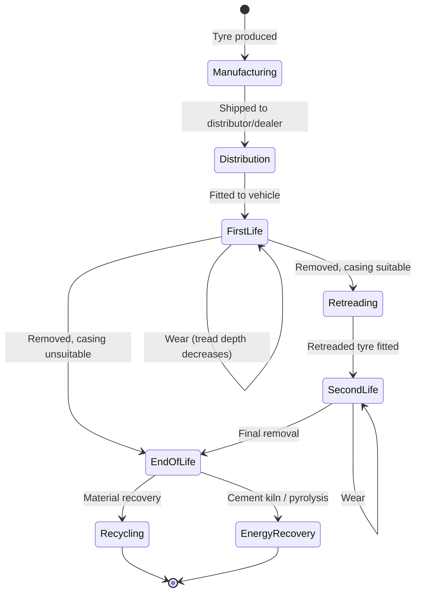

# Tyres

**Regulation**: [ESPR (EU) 2024/1781](../../references.md#reg-espr) delegated act — expected ~2026 ([Working Plan 2025-2028](../../references.md#espr-working-plan)).

**Deadline**: Compliance ~2027 (18-24 months after delegated act, per [ESPR Art. 9](../../references.md#espr-art9)).

**Granularity**: Unknown. DOT codes provide item-level identification, but the delegated act may specify batch or model level ([ESPR Art. 9(2)(d)](../../references.md#espr-art9-2d)).

**Volume**: Depends on granularity. EU tyre market is ~300M replacement + OE units/year ([ETRMA](../../references.md#etrma)). At model level: trivial. At item level: requires batching or Hydra.

## Regulatory landscape

Tyres are in the ESPR priority product group (Working Plan 2025-2030). Two EU regulations are relevant:

| Regulation | Scope | Status |
|-----------|-------|--------|
| [**ESPR (EU) 2024/1781**](../../references.md#reg-espr) | DPP requirements (via delegated act) | Delegated act pending |
| [**Tyre Labelling Regulation (EU) 2020/740**](../../references.md#reg-tyre-label) | Energy label (rolling resistance, wet grip, noise) | In force since May 2021 |

The tyre labelling regulation already mandates a product fiche in [EPREL](../../references.md#eprel) (EU Product Registry for Energy Labelling). The DPP delegated act will likely extend this with lifecycle and circularity data.

### End-of-Life Vehicles Regulation

The ELV Regulation includes provisions for tyres as vehicle components. The Environmental Vehicle Passport may reference tyre DPP data.

## Expected data model

Based on the existing tyre labelling regulation and ESPR priorities:

| Category | Examples | Source |
|----------|----------|--------|
| Product identity | Manufacturer, model, DOT code, size designation | Manufacturer |
| Energy performance | Rolling resistance class (A-E), wet grip class (A-E), noise level (dB) | Type approval testing |
| Material composition | Natural rubber %, synthetic rubber %, carbon black, silica | Manufacturer |
| Recycled content | % recycled rubber, % recycled steel | Manufacturer |
| Durability | Expected mileage, treadwear rating, speed rating | Manufacturer |
| Carbon footprint | kgCO2e per tyre (manufacturing + raw materials) | LCA |
| End of life | Retreading suitability, recycling instructions | Manufacturer |
| Supply chain | Natural rubber origin, deforestation-free certification | Due diligence |

## Tyre lifecycle



### Key differences from batteries

| Aspect | Batteries | Tyres |
|--------|-----------|-------|
| Dynamic data | SoH changes continuously (BMS) | Tread depth decreases (no embedded sensor in most tyres) |
| Data source | BMS hardware with secure element | Manual measurement or TPMS (pressure only) |
| Repurposing | Battery second life (new passport) | Retreading (may or may not need new passport) |
| Connectivity | Some have telematics | TPMS is pressure/temp only, no tread data |
| Lifetime | 8-15 years | 3-6 years |

## Wear monitoring

Unlike batteries, most tyres have no embedded intelligence. Tread depth — the key wear metric — is measured manually or by workshop equipment.

| Method | Equipment | Accuracy | Frequency |
|--------|-----------|----------|-----------|
| Manual gauge | €5 depth gauge | ±0.5mm | Per inspection |
| Workshop laser | €2k-10k equipment | ±0.1mm | Per service visit |
| Tyre hotel systems | Automated storage scanners | ±0.1mm | Per seasonal swap |
| **Embedded tread sensors** | Chip in tyre + RFID/BLE | ±0.2mm | Continuous |
| **TPMS + inference** | Existing TPMS data + ML model | Low | Continuous |

Embedded tread sensors (e.g. [Bridgestone iTrack](../../references.md#bridgestone-itrack), [Continental ContiConnect](../../references.md#continental-conticonnect)) exist but are expensive and limited to commercial fleets. Consumer tyres do not have them.

**Opportunity for Cardano**: A user-reporting model similar to the battery incentive scheme — users report tread depth measurements (photo + depth gauge reading) for rewards. Less hardware-secure than BMS signed readings, but follows the same smart contract pattern.

## Retreading as repurposing

Tyre retreading is economically significant for truck/bus tyres (retread rate ~30-40% in Europe, per [ETRMA](../../references.md#etrma) industry data). A retreaded tyre is functionally a new product with a new tread on an old casing.

Parallels with battery repurposing:

- The original tyre passport should record the casing's history
- A retreaded tyre may need a new or updated passport
- The retreader becomes the new economic operator
- Casing quality assessment at retreading is analogous to battery SoH at repurposing

## Cardano architecture for tyres

Same MPFS pattern as [batteries](../batteries/architecture.md): one [Merkle Patricia Trie](../../references.md#mpfs) per tyre manufacturer. Each tyre (or batch/model, depending on delegated act) is a leaf. One on-chain UTxO per manufacturer holds the root hash.

### Leaf value structure

```
TyreLeaf {
  tyreId            : ByteString    -- DOT code or GTIN
  granularity       : Level         -- Item | Batch | Model
  status            : Status        -- InProduction | InUse | Retreaded | EndOfLife
  labelClass        : LabelData     -- rolling resistance, wet grip, noise (Reg. 2020/740)
  carbonFootprint   : Integer       -- kgCO2e per tyre
  recycledContent   : RecycledData  -- % recycled rubber, % recycled steel
  materialOrigin    : ByteString    -- natural rubber origin (EUDR if applicable)
  retreatCount      : Integer       -- 0 for new, incremented on retreading
  ...                               -- other fields per delegated act
}
```

### Why simpler than batteries

| Aspect | Batteries | Tyres |
|--------|-----------|-------|
| Dynamic data | SoH changes continuously → signed readings, rewards, commitment protocol | Mostly static after production |
| Updates | Daily (BMS data) | Rare (retreading, end-of-life) |
| User interaction | Users submit signed BMS readings for rewards | None needed |
| On-chain cost | ~73 ADA/year per operator (daily root updates) | **< 10 ADA/year** per operator (lifecycle events only) |

The tyre MPT is essentially write-once-at-manufacturing with rare lifecycle transitions. No reward pool, no commitment protocol, no reading rights.

### Retreading = new leaf in retreader's MPT

Same pattern as battery repurposing. The retreader becomes a new economic operator, creates a new leaf in their own MPT, and references the original manufacturer's trie root + proof path for casing provenance.

## Open questions

1. **Delegated act scope** — what data fields will be required, at what granularity?
2. **DOT code as MPT key** — the DOT code is already a unique serial on every tyre. It could serve directly as the MPT leaf key.
3. **Retreading passport rules** — new leaf in retreader's MPT, or updated leaf in original manufacturer's MPT?
4. **EUDR overlap** — if natural rubber falls under the deforestation regulation, the leaf needs geolocation data for raw material sourcing
